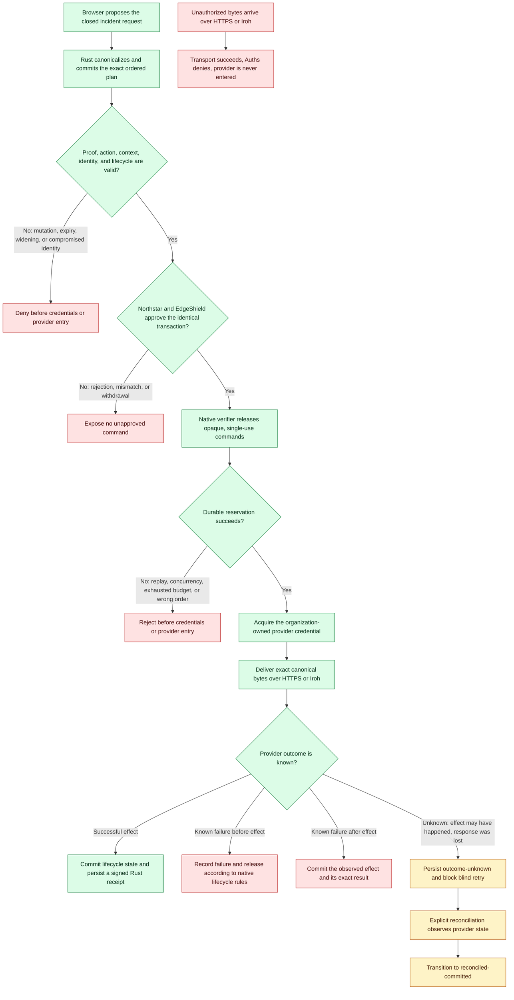

# Auths cross-company incident response

This production-shaped demo proves that Northstar Commerce and EdgeShield can
resolve one shared outage without sharing an identity provider or granting an
agent broad infrastructure credentials.

## Run locally

From the repository root:

```sh
demos/cross-company-incident-response/scripts/launch-local.sh
```

Open <http://localhost:7100>. The launcher generates disposable local
client-certificate material, creates isolated temporary state for each
service, builds the TypeScript assets, and starts:

- control room: `http://localhost:7100`
- Northstar OIDC and provider service: `http://localhost:7101`
- EdgeShield client-certificate, key, provider, and Iroh service: `http://localhost:7102`
- Python agent/orchestration service: `http://localhost:7103`

No Fly, Vercel, GitHub, or other cloud credential is needed. `Ctrl-C` stops the
stack and removes its disposable local state. Docker users may alternatively
run:

```sh
AUTHS_INCIDENT_SERVICE_TOKEN="$(openssl rand -hex 24)" \
  docker compose -f demos/cross-company-incident-response/infrastructure/compose.yaml up --build
```

## Deployment targets

- control room: <https://auths-incident-demo-control-room.vercel.app>
- Northstar: <https://auths-incident-demo-northstar.fly.dev>
- EdgeShield: <https://auths-incident-demo-edgeshield.fly.dev>
- agent/orchestrator: <https://auths-incident-demo-agent.fly.dev>

The Fly services use one auto-stopping shared-CPU machine apiece and no
persistent volume. Redeploy the exact revision under review before treating
these URLs as evidence for this implementation.

## Happy path

1. Inspect the Northstar P-256/OIDC humans, EdgeShield Ed25519/client-
   certificate human, distinct diagnostic/remediation agents, and compromised
   attack actor.
2. Inspect the diagnostic agent's bounded read-only metrics/log evidence. It
   proposes remediation but has no execution authority.
3. Select **Review & execute plan**. The browser sends only the closed incident
   request; it does not authorize an effect or hold a native command.
4. The trusted Python service asks Rust to canonicalize two `auths.edge/1`
   actions, commit their exact order, and create bounded ten-minute authority.
5. Auths threshold approval runs a real local OIDC authorization-code + PKCE
   flow for Northstar and verifies an Ed25519-signed response from EdgeShield.
   Both approve the identical native transaction and plan commitment.
6. Only native authorization produces opaque, in-process commands. The gateway
   transactionally reserves each member before acquiring a provider credential.
   The firewall operation uses HTTPS; the cache member's exact canonical bytes
   cross a real Iroh connection before the gated provider call.
7. Inspect both Rust-owned signed receipts. They bind the proof, canonical
   action, context, plan position, idempotency key, provider result, and outcome.

### Happy path and fail-closed branches



Green follows the happy path to a signed receipt. Red paths stop safely or
record a known non-success outcome. Amber is deliberately blocked until
explicit reconciliation resolves whether the effect happened. Browser state,
approval alone, possession of a provider credential, transport success, and an
old receipt are never treated as authorization.

## Attack lab

Run every control at the bottom of the control room. The panel reports the
typed stage/code and concrete evidence:

- all-region child authority: native child planning returns
  `authority/delegation-expanded` with zero signer calls;
- changed action byte: Python and TypeScript verifier bindings both deny;
- replay and concurrent execution: durable reservation permits one owner and
  records no second credential acquisition or provider call;
- expired grant and compromised approver: runtime/lifecycle gates stop before
  credentials or provider entry;
- EdgeShield key rotation: the old Ed25519 principal becomes `superseded` and
  the new principal becomes `active`;
- unauthorized Iroh: delivery succeeds under the exact ALPN while Auths denies
  and EdgeShield provider state does not change;
- provider failure before, after, and unknown: runtime transitions respectively
  release, commit, or retain `outcome-unknown`; the live ambiguous case applies
  an effect, loses the response, blocks retry, and reconciles to
  `reconciled-committed`;
- approval withdrawal: the first step is reported complete and the second
  remains unresolved after the bounded plan session is disposed.

## Trust boundaries

Northstar owns its OIDC issuer, P-256 key, actor mapping, outage data, and
firewall state. EdgeShield owns its Ed25519 approval key, certificate adapter,
cache state, and Iroh endpoint. The Python service holds process-scoped demo
authority and receipt custody, durable replay/execution state, and the only
effect-capable native handles. The browser holds none of them. There is no
shared user table, organization signing key, or provider credential.

The Rust `auths-iroh` adapter carries bounded opaque bytes. It records ALPN,
path, and endpoint observations but has no Auths decision API. Python and
TypeScript independently evaluate the same P-256/WebAuthn artifact and the
same Rust-generated decision/execution receipt projections. The live effect
path uses the packaged Ed25519 raw-key authority workflow.

See [architecture](docs/architecture.md), [threat model](docs/threat-model.md),
and [feature evidence](docs/feature-matrix.md).

## Validation

Run the focused local suite:

```sh
demos/cross-company-incident-response/scripts/test-local.sh
```

It covers Python SDK unit/adversarial tests, service integration, all browser
controls, a real Iroh exchange, TypeScript compilation, and Rust tests. The
repository-wide authoritative gate remains GitHub CI on the exact pushed
revision, per `AGENTS.md`.

## Deployment

Every cloud object uses the `auths-incident-demo` prefix. Fly configuration for
the three independently deployed services and Vercel configuration for the
control room are contained in this directory. `scripts/deploy.sh` refuses to
touch an existing same-named Fly app or Vercel project. It creates shared-CPU
machines with auto-stop, uses isolated
ephemeral hosted state (the local stack retains deterministic persistence), and
sets random secrets that are never written to the repository. It does not
create paid persistent volumes.

## Implementation specification

The executable parity, effect-boundary, receipt, replay, and reconciliation
criteria are tracked in
[the implementation specification](docs/implementation-gap-analysis.md).
