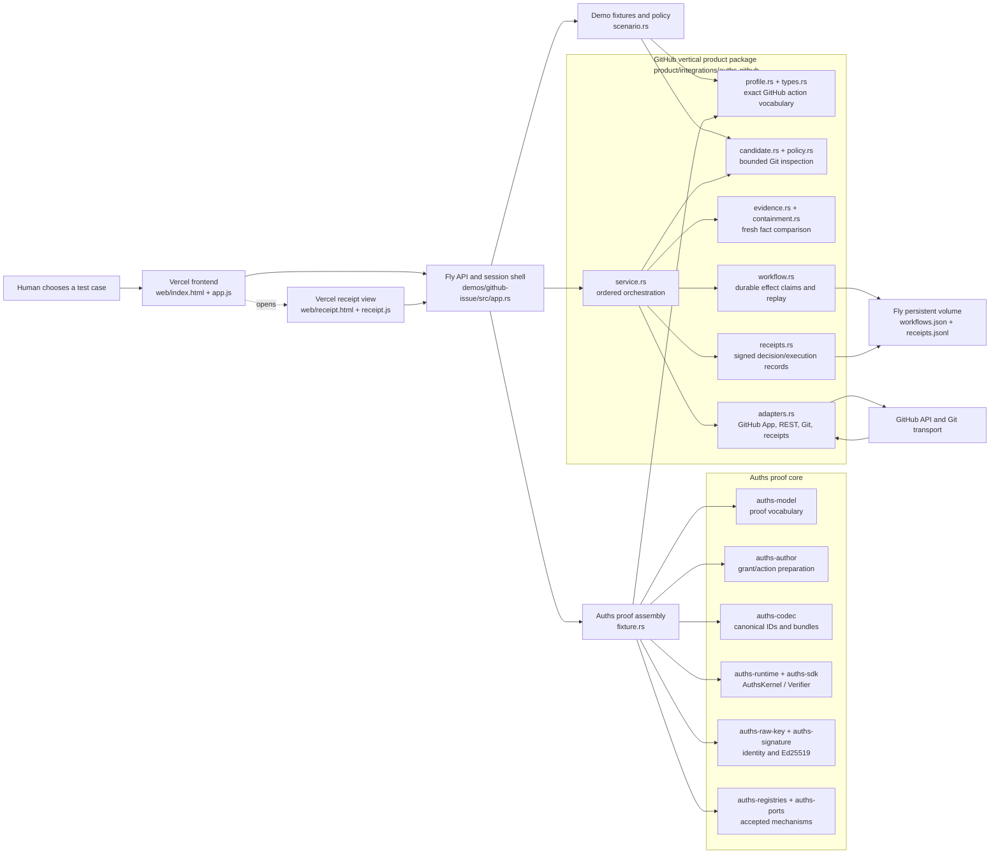

# GitHub Issue Workflow Demo Architecture



## Architectural boundary

The demo is intentionally split into three layers:

1. Auths core is domain-neutral. It knows about grants, actions, proof bundles, trust context, authorization plans, signatures, budgets, and verification. It does not know what a GitHub issue, branch, or pull request is.
2. `product/integrations/auths-github` is one vertical product package. It owns the complete GitHub issue-workflow vocabulary and the security-sensitive sequence from candidate inspection through execution receipts. GitHub concepts should remain cohesive here rather than being dispersed through generic product folders.
3. `demos/github-issue` is the runnable demonstration. It owns public test fixtures, HTTP sessions, deployment configuration, presentation, and the concrete assembly of core and GitHub-product dependencies.

The dependency direction is one way:

```text
demos/github-issue
    -> product/integrations/auths-github
        -> Auths core/profile APIs

Auths core never imports the demo or GitHub integration.
```

## How Auths core maps into the demo

| Auths component | Role in the demo | Concrete use |
| --- | --- | --- |
| `auths-model` | Defines the protocol objects the verifier reasons about. | `fixture.rs` constructs grants, signed actions, authorization plans, evidence objects, trust anchors, assurance policy, and verifier context. |
| `auths-author` | Safely prepares grants and actions before they are signed. | `fixture.rs` uses `prepare_grant`, `plan_child_grant`, and `prepare_action` for the human → workflow → agent authority chain. |
| `auths-codec` | Produces canonical identifiers and proof-bundle bytes. | `fixture.rs` derives action, evidence, grant, and plan identifiers and encodes the proof bundle. |
| `auths-profile-api` | Lets a domain define canonical action bytes, permissions, resources, and budgets. | `auths-github::GitHubIssueProfile` maps a sealed GitHub action into the generic Auths verification interface. |
| `auths-runtime` | Runs the configured Auths kernel. | `fixture.rs` builds the `AuthsKernel` from accepted registries and trusted adapters. |
| `auths-sdk` | Exposes the verifier and the closed authorized/denied/indeterminate result. | `EphemeralAuthsAuthorizer` calls `Verifier::verify` over the real proof and exact canonical GitHub action. |
| `auths-ports` | Defines trusted extension boundaries. | Raw-key principal resolution and Ed25519 signature verification are installed through core ports. |
| `auths-registries` | Pins accepted mechanism registries. | The demo loads the target registry manifest into the verifier context. |
| `auths-raw-key` | Supplies the demo's self-certifying identity method. | Human, workflow, and agent identities use raw Ed25519 public-key descriptors. |
| `auths-signature` | Supplies the Ed25519 verification suite. | Every grant and action signature in the Auths proof chain is verified by the core kernel. |

`fixture.rs` is not a replacement verifier. It is an adapter that constructs a complete proof fixture and submits it to the real core verifier. The final authorization result comes from `AuthsKernel` through `Verifier`, not from frontend logic or a demo-only Boolean.

## The GitHub vertical package

`product/integrations/auths-github` keeps one product workflow cohesive:

- `types.rs` defines closed, validated GitHub resource identities, revisions, ref names, grants, policies, exact actions, and verifier configuration.
- `profile.rs` maps exact branch and draft-PR actions to Auths profile semantics.
- `candidate.rs` treats the submitted Git bundle as hostile input and inspects it in quarantine.
- `policy.rs` evaluates allowed and denied paths and other Git-specific containment limits.
- `evidence.rs` models fresh repository, issue, base-ref, branch, and pull-request observations.
- `containment.rs` compares the human grant, inspected candidate, current GitHub evidence, and executor configuration.
- `ports.rs` defines explicit boundaries for Git inspection, evidence reads, Auths proof authorization, claims, credentials, writes, receipts, and time.
- `workflow.rs` persists state transitions and atomically claims each external effect.
- `executor.rs` seals verified commands so write adapters cannot accept arbitrary unverified values.
- `service.rs` enforces the order of operations and derives deterministic branch and pull-request actions.
- `adapters.rs` implements Git CLI inspection, GitHub App token minting, REST reads and writes, persistent workflow state, and signed JSONL receipts.
- `receipts.rs` separates pre-effect authorization decisions from post-effect execution observations.

This package is reusable product code. The demo crate supplies its concrete configuration and the temporary authorities needed to exhibit it publicly.

## End-to-end execution

### 1. Session and human constraints

The browser creates a 15-minute session. The native service reads the current `main` revision from GitHub and builds a `WorkflowGrant` that binds:

- immutable repository and issue identifiers;
- exact base ref and base revision;
- one executor-derived target branch;
- allowed and explicitly denied paths;
- file, byte, Git-object, and commit limits;
- one branch and one draft pull-request budget;
- executor audience;
- required verifier configuration;
- issuance and expiry times.

The browser displays both the required configuration digest and the configuration loaded by the executor. A mismatch is a denial before credentials.

### 2. Candidate construction and inspection

`scenario.rs` creates a server-owned Git bundle for the selected experiment. This stands in for an agent-produced candidate while keeping the public demo bounded.

`GitCandidateInspector` parses the bundle without checking out or executing candidate code. It confirms ancestry, commit count, object types, paths, modes, byte limits, tree digest, bundle digest, and declared candidate revision. The malformed experiment uses a fixed 17-byte regression seed.

The demo also performs a credential-disabled dry-run push. Its expected result is authentication rejection, proving that the candidate-building agent boundary does not possess the GitHub credential.

### 3. Fresh GitHub evidence

The service obtains current repository, issue, base-ref, target-ref, and matching-PR evidence. Evidence reads use a repository-scoped GitHub App installation token with read-only permissions. This avoids anonymous shared-egress rate limits without granting mutation authority to the agent.

The negative experiments replace exactly one evidence fact after the real read:

- prohibited path;
- declared candidate revision changed;
- repository identity changed;
- issue identity changed;
- base revision advanced;
- malformed bundle.

### 4. Product containment

The GitHub package compares the grant, inspected candidate, fresh evidence, and both verifier configurations. A proven mismatch becomes a typed denial receipt. Missing, stale, or ambiguous evidence does not become authorization.

### 5. Auths authorization

Only an exact GitHub action that passes product containment reaches `EphemeralAuthsAuthorizer`.

The authorizer creates a real, signed authority chain:

```text
human authority
    -> workflow authority
        -> exact agent action
```

The exact action digest is used as the request challenge. The proof bundle, trusted context, canonical action bytes, audience, permissions, resources, budgets, assurance requirements, and signatures are evaluated by the Auths verifier. The result must be `Authorized`; denied and indeterminate remain non-authorizing.

### 6. Claim before credential

For each external effect, the service:

1. derives the exact action;
2. creates and persists a decision receipt;
3. atomically claims that action in `PersistentWorkflowStore`;
4. only then asks the GitHub App credential broker for a mutation token;
5. executes the sealed command;
6. reads the postcondition back from GitHub;
7. appends a signed execution receipt;
8. marks the claim complete.

Branch publication and draft-PR creation are separately authorized, claimed, executed, and receipted. A replay returns the existing receipt commitment and requests no credential.

### 7. Ambiguous outcomes and reconciliation

A successful GitHub mutation may not be immediately visible through a following read. The write adapter performs bounded postcondition polling. If it still cannot prove success or failure, it records a reconciliation-required state instead of repeating the mutation.

Reconciliation observes the exact postcondition without issuing a second write. It either commits the observed result or remains explicitly unresolved.

### 8. Receipts

The live session endpoint exposes a convenient projection for the interactive page. Public links placed in pull-request bodies use the durable receipt endpoint.

Signed receipt envelopes are appended to `/data/github/receipts.jsonl` on the Fly volume. The durable reader:

- imposes hard file and envelope size limits;
- parses the closed receipt schema;
- checks the configured signer public key;
- verifies every Ed25519 signature;
- selects decision receipts for the requested workflow;
- includes execution receipts only when they commit to one of those decisions;
- fails closed for malformed or tampered logs.

This makes a pull-request receipt link independent of the 15-minute browser session and resilient to service restarts.

## Runtime state

| State | Location | Lifetime | Purpose |
| --- | --- | --- | --- |
| Browser UI state | Browser memory | Page lifetime | Selected experiment and current presentation. |
| Demo session | Fly process memory | 15 minutes or restart | Temporary keys, candidate selection, and interactive response projections. |
| Workflow claims | `/data/github/workflows.json` | Persistent volume | Replay protection and effect state machine. |
| Signed receipts | `/data/github/receipts.jsonl` | Persistent volume | Durable decision and execution evidence. |
| Daily publication quota | `/data/github/publication-quota.json` | Persistent volume | Bounds public-demo mutation volume. |
| GitHub branches and PRs | GitHub | External/durable | Real observed effects. |

The Fly deployment is intentionally a single writer in one region because the JSON/JSONL state adapters use local filesystem serialization. Running multiple writers against this storage model would be incorrect.

## HTTP surface

| Method | Path | Purpose |
| --- | --- | --- |
| `GET` | `/healthz` | Deployment mode, region, release, and health. |
| `GET` | `/v1/demo/scenario` | Public repository, issue, policy, experiments, and budgets. |
| `POST` | `/v1/demo/sessions` | Create one bounded workflow session from the current base. |
| `GET` | `/v1/demo/sessions/{id}` | Read the live session projection. |
| `POST` | `/v1/demo/sessions/{id}/candidate` | Build and inspect one server-owned candidate variant. |
| `POST` | `/v1/demo/sessions/{id}/execute` | Execute or deny the selected workflow. |
| `POST` | `/v1/demo/sessions/{id}/replay` | Demonstrate replay without additional mutation. |
| `POST` | `/v1/demo/sessions/{id}/reconcile` | Resolve a previously ambiguous claimed effect. |
| `GET` | `/v1/demo/sessions/{id}/receipts` | Read the short-lived interactive receipt projection. |
| `GET` | `/v1/demo/receipts/{id}` | Read verified persistent signed envelopes by session or workflow ID. |

All request bodies have a hard size limit. CORS allows only the configured Vercel origin.

## Deployment topology

- Vercel serves static HTML, CSS, and JavaScript.
- Fly runs the native Rust service, owns the GitHub App key, and mounts the persistent volume.
- GitHub receives read-only evidence requests and the two separately authorized mutations.
- The browser never receives the GitHub App private key or installation token.
- The agent/candidate sandbox never receives a GitHub credential.

The Content Security Policy permits the frontend to connect only to itself and the configured Fly service. Vercel rewrites `/receipts/:workflow` to the dedicated receipt document so links work when opened directly.

