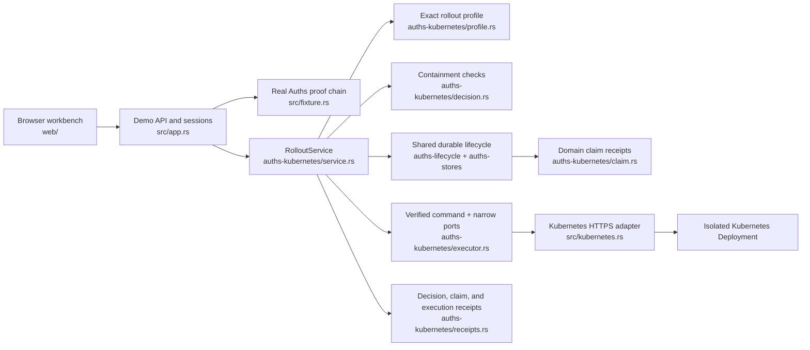
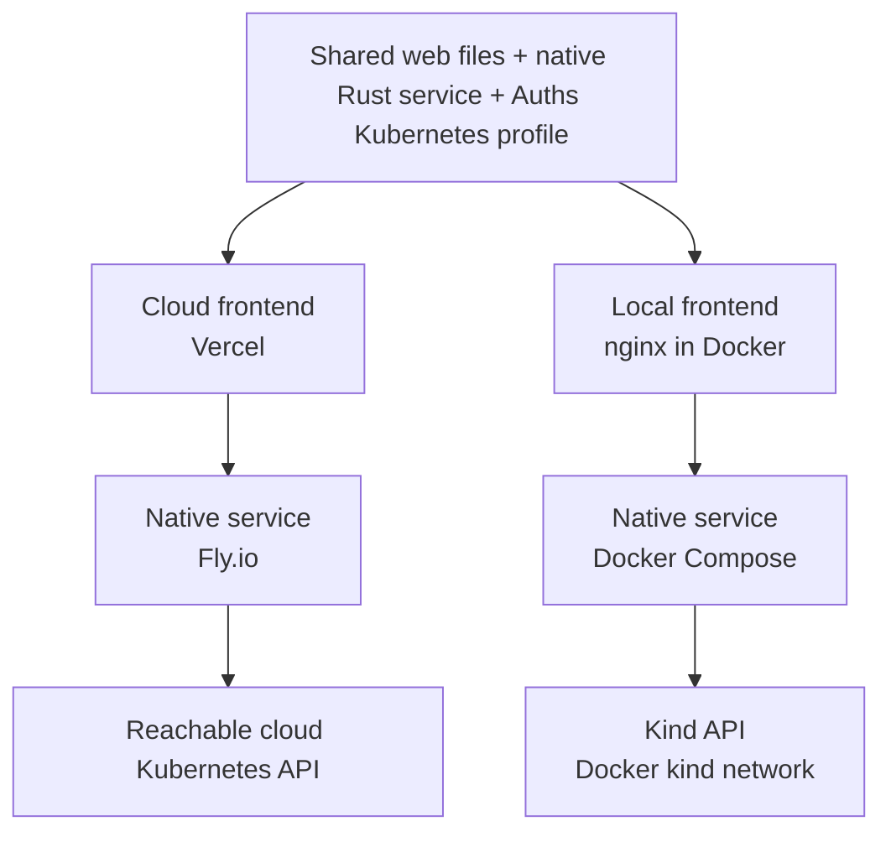

# Architecture

The vertical product package is `product/integrations/auths-kubernetes`. It owns
the Kubernetes vocabulary, canonical action, verifier configuration, evidence,
containment rules, lifecycle projection, effect ports, reconciliation, and
receipt schemas. Shared packages own only the domain-independent durable
transition and reservation mechanisms. The Kubernetes package does not own
HTTP routes, demo sessions, cluster credentials, or browser presentation.

The demo package is `demos/kubernetes-rollout`. It assembles a real Auths proof,
reads fresh cluster evidence, exposes the bounded public API, supplies the
credential and Kubernetes adapters, and renders the interactive workbench.

## Deployment topology

The application supports cloud and local deployment without maintaining two
implementations:

`web/vercel.json` and `fly.toml` configure the cloud edges.
`compose.local.yaml`, `web/nginx.local.conf`, and `scripts/local-up.sh`
configure the local edges. In both cases the browser uses same-origin `/api/*`
requests, the native service starts from the same required environment
contract, shared lifecycle records live on persistent storage, and the
Kubernetes backend must identify itself as `live-kubernetes`.

## Execution order

The native service always follows this sequence:

1. Compare the required and executed verifier configurations.
2. Validate the exact canonical patch and fresh Kubernetes evidence.
3. Verify the real Auths proof against those exact action bytes.
4. Persist the decision, reserve the Deployment scope, and record the exact
   execution intent in the shared crash-persistent lifecycle store.
5. Durably authorize and then request the rollout-only ServiceAccount
   credential.
6. Persist provider-attempt and call-entry records, then submit one
   server-side apply patch with strict field validation.
7. Read the Deployment until the exact image, generation, and replica state are
   persisted and available.
8. Commit, release, or retain outcome-unknown; reconcile ambiguous delivery
   from fresh observation without blind resubmission.
9. Project Kubernetes claim receipts from the acknowledged lifecycle and append
   the domain execution receipts.

A denial in steps 1–3 cannot obtain the mutation credential or call the
Kubernetes mutation adapter. A replay stops at step 4.

## Credential boundaries

The browser and synthetic agent receive no Kubernetes credential.

The native service has two scoped identities:

- The evidence identity can read the target objects and perform server-side
  dry-run. Kubernetes RBAC requires `patch` for dry-run, so a fail-closed
  ValidatingAdmissionPolicy rejects any non-dry-run request from this identity.
- The executor identity can get and patch only the named Deployment. The
application requests this token only after verification and the durable
credential-authorization transition.

The API server CA, exact cluster audience, namespace UID, Deployment UID, and
resourceVersion are committed into evidence or the action. A same-named
workload recreated under a new UID does not inherit an earlier authorization.

## Browser API

- `GET /healthz` reports process liveness.
- `GET /readyz` reports configured live-cluster mode.
- `GET /api/v1/scenarios` returns the repository-owned experiments.
- `POST /api/v1/sessions` reads the current Deployment, performs server-side
  dry-run, creates a short-lived signed authorization, and returns its projected
  variants.
- `POST /api/v1/sessions/{id}/execute` runs one selected variant through the
  native verifier and protected executor.
- `GET /api/v1/receipts/{id}` exposes the bounded, credential-free receipt view.

Production startup requires a live Kubernetes API and fails closed if any
cluster setting is absent. The deterministic adapter is compiled for tests and
is never a production fallback.
