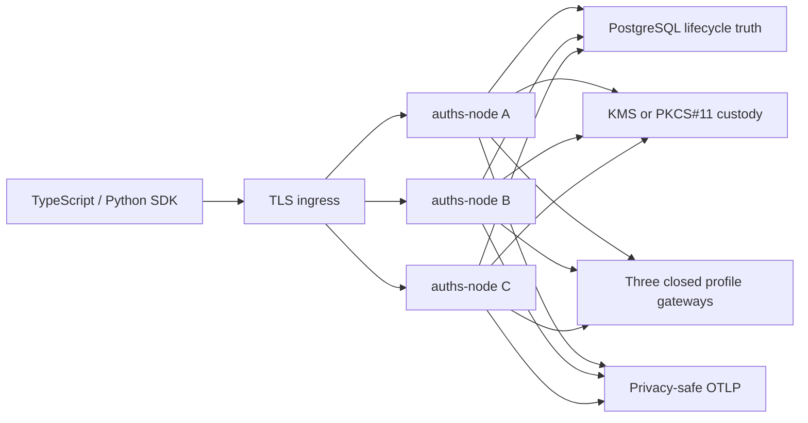

# Auths open production reference

This is the reviewable deployment shape for Auths open core. It keeps the five
SDK verbs at the edge while making lifecycle state, custody, profile gateways,
telemetry, and recovery explicit behind that surface.

The checked-in local stack is a bounded evaluator. It runs the shipping
`auths-node` image three times, a TLS PostgreSQL service, a SoftHSM
qualification container, an OpenTelemetry collector, Prometheus, and Grafana.
The node's local effect gateways are deterministic sandboxes. Production mode
refuses those gateways and software custody; an operator must compose the
`auths-node` library with the qualified PostgreSQL, KMS or PKCS#11, and exact
provider ports for its environment.

## Fifteen-minute path

1. Copy `config/local.toml` and provide `AUTHS_LOCAL_SEED` as 32 random bytes in
   unpadded base64url.
2. Create trusted local TLS certificates as described in
   `runbooks/local-tls.md`.
3. Start the stack:

   ```text
   docker compose -f demos/open-production-reference/compose/compose.yaml up --build --wait
   ```

4. Check configuration and dependencies:

   ```text
   docker compose -f demos/open-production-reference/compose/compose.yaml exec auths-1 auths-node /etc/auths/local.toml doctor
   ```

5. Run `tests/installed-sdk-e2e.mjs` or the matching Python test against the TLS
   ingress. The test creates authority, delegates it, executes one exact
   sandbox action, verifies the receipt, exercises recovery, and proves replay
   and widening fail.

## Architecture



There is no generic operation endpoint and no plugin host. GitHub,
PostgreSQL, and OpenTofu each have a fixed route and an independently
configured gateway. A successful network request never becomes authorization.

## Production overlays

The Kubernetes base is deliberately plain Kustomize. `overlays/local` selects
PKCS#11 references for a private evaluator. `overlays/aws-kms` selects workload
identity and an AWS KMS key reference. Both preserve three replicas, topology
spread, a disruption budget, read-only filesystems, no Linux capabilities,
and default-deny network policy.

Read `runbooks/limitations.md` before using the deployment as evidence. The
open reference stack is not a hosted tenant control plane, fleet manager,
enterprise audit portal, or substitute for independent security review.
