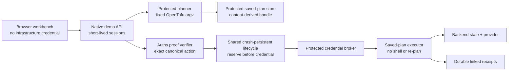

# Architecture

`product/integrations/auths-opentofu` owns the provider-neutral OpenTofu
vocabulary: bounded source bundles, the canonical saved-plan action, sanitized
plan projection, verifier configuration, state evidence, proof profile,
OpenTofu-to-shared-lifecycle projection, protected ports, orchestration, and
receipt schemas. Shared policy and lifecycle crates see only canonical
commitments and provider-independent transitions; no core crate depends on
OpenTofu or its provider adapter.

`demos/opentofu-plan` supplies the native OpenTofu process adapter, a real Auths
proof, an HTTP session boundary, a Cloudflare DNS sandbox template, the browser
workbench, and deployment configuration. Deterministic fixture mode is only for
offline tests and is reported explicitly by `/readyz`.

## Invariants

The linear service path is:

1. Canonically compare required and executed verifier configuration.
2. Validate the plan projection, backend, workspace, state, dependency locks,
   input-variable commitment, lifetime, and executor audience.
3. Verify the Auths proof against the exact canonical action.
4. Project the authorized decision into the closed shared lifecycle contract,
   record it, and atomically reserve the backend/workspace/prior-state scope.
5. Resolve the protected plan handle and hash the resulting bytes.
6. Record durable execution intent and credential authorization, then acquire
   the provider/backend environment.
7. Recheck backend identity, workspace, lineage, serial, and state digest with
   a stage-sealed preparation command.
8. Persist provider-call entry and invoke the pinned OpenTofu binary as
   `apply <saved-plan>` with a stage-sealed command, fixed
   argument vector, scrubbed environment, bounded output, and timeout.
9. Read state back, classify convergence, commit or reconcile the shared
   lifecycle, and append the existing linked OpenTofu receipts.

The local backend stores every non-default workspace below the durable
`/data/auths-opentofu/workspaces` directory. OpenTofu initialization metadata
inside the container is disposable: before planning, state recheck, apply, or
reconciliation, the adapter re-initializes the backend and selects the
action-bound workspace. A process-wide lock prevents session adapters from
racing through OpenTofu's mutable working-directory metadata.

Every denial before step 4 leaves no lifecycle record or reservation. Artifact,
state-recheck, and other definite pre-effect failures release capacity. Every
stop before step 6 proves the credential provider was not called. An ambiguous
process outcome remains durably `outcome-unknown`; only a distinct
reconciliation authorization and command may observe it, and the saved plan is
never blindly resubmitted.

The recovery contract recreates the API container while preserving only the
mounted data volume. A lifecycle record in `outcome-unknown` may resume only
through reconciliation. A released, committed, or reconciled record cannot
execute again. Because this is a prelaunch direct cutover, startup rejects the
obsolete `claims.json` format rather than migrating or dual-reading it.

## Artifact and secret boundaries

The public action carries an opaque handle and SHA-256 commitments, never saved
plan bytes, raw `show -json`, variable values, backend configuration, or
credentials. Production plan artifacts, shared lifecycle databases, and JSONL
receipts live below `AUTHS_OPENTOFU_STATE_DIR`; the deployment must place this
directory on an encrypted volume and restrict it to the service identity.

The one secret `AUTHS_OPENTOFU_CREDENTIAL_JSON` is parsed into a closed
uppercase environment map. `PATH`, `HOME`, shell configuration, CLI argument
overrides, data-directory overrides, and empty values are rejected. Only
`TF_VAR_*` entries enter the variable commitment; provider credentials do not
appear in actions or receipts.

## Public API

- `GET /healthz` reports process liveness.
- `GET /readyz` executes the pinned binary version probe in live mode.
- `GET /api/v1/credential-probe` demonstrates that the public API cannot obtain
  or delegate the protected credential.
- `POST /api/v1/sessions` creates the saved plan, sanitizes its projection,
  stores its bytes, and issues an exact short-lived proof.
- `POST /api/v1/sessions/{id}/execute` runs one repository-owned experiment.
- `GET /api/v1/receipts/{id}` returns the credential-free native receipt view.

The Vercel frontend uses only these routes. The designed `/receipts/{id}` page
loads the real receipt API and fails closed for malformed or missing IDs.
