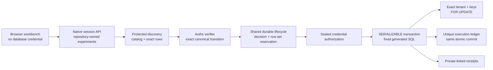

# Architecture

`product/integrations/auths-postgresql` owns the database-specific security
contract: typed values, canonical mutation intent, catalog evidence, verifier
configuration, Auths action profile, trusted SQL compiler, lifecycle
projection, protected ports, transaction orchestration, ledger migration,
reconciliation, and receipt schemas. Shared product crates own only the
provider-independent lifecycle and exclusive-reservation mechanisms. Core
crates remain independent of PostgreSQL.

`demos/postgresql-data-change` supplies the native TLS driver, fixed discovery
queries for the synthetic relation, real Auths proof material, HTTP session
boundary, responsive workbench, database bootstrap/reset files, and
Fly/Vercel delivery configuration.

## Ordered invariants

The service path is deliberately linear:

1. Canonically compare required and executed verifier configuration.
2. Check lifetime, audience, database, relation, schema, RLS policy, trigger
   inventory, executor role, tenant, row set, before state, assignment domain,
   cardinality, recomputed after-state commitment, and generated-statement
   commitment.
3. Verify the real Auths proof against the exact canonical action.
4. Persist the decision and atomically reserve the committed database,
   relation, tenant, and row-set scope in the shared lifecycle store.
5. Persist the exact transaction intent, durably authorize credential
   acquisition, and acquire the mutation credential from the protected broker.
6. Persist provider-attempt and call-entry records, then open a new TLS
   connection and start a read-write `SERIALIZABLE` transaction.
7. Set the fixed executor role, `search_path`, tenant RLS context, application
   name, statement timeout, and lock timeout.
8. Recheck catalog, role, RLS, schema, policy, and trigger facts in-transaction.
9. Insert the unique uncommitted ledger row.
10. Select the committed tenant and exact primary keys `FOR UPDATE`; recheck
    keys, versions, values, and cardinality.
11. Run only the trusted parameterized `UPDATE`, validate `RETURNING`, finalize
    the ledger, and commit.
12. Commit or release the shared lifecycle only after the transaction result
    is classified.
13. On an ambiguous commit, retain the reservation and use a fresh connection
    to inspect the ledger without resubmitting the update.

The first durable decision receipt is appended before lifecycle creation and
credential acquisition. If persistence fails, execution stops with no
lifecycle, credential, transaction, mutation, or ledger reservation.
Credential and transaction ports require sealed authorizations derived from
newly acknowledged lifecycle transitions. A committed or ambiguous
transaction is accepted only after a fresh connection reads both the ledger
and the exact tenant/primary-key rows and validates assigned values and
versions.

A configuration denial occurs before proof, lifecycle, credential, or database
ports. A proof denial occurs before lifecycle persistence. The transaction and
ledger roll back together on any definite failure. Obsolete prelaunch
`claims.json` state is rejected instead of migrated.

## SQL and value boundary

The public action has no SQL, predicate, operator, function, ordering,
returning expression, identifier string, transaction setting, or credential
field. PostgreSQL identifiers use a validated lowercase ASCII identifier type.
The compiler quotes only those trusted identifiers and emits a closed grammar.
Every tenant, key, row version, and assignment value travels through protocol
parameters.

Typed values distinguish boolean, signed 64-bit integer, NFC text, UUID,
fixed-scale decimal, fixed-precision UTC timestamp, enum text, and typed null.
Text that looks like SQL remains a parameter value.

## Public API

- `GET /healthz` reports process liveness without database access.
- `GET /readyz` performs a non-destructive database read in live mode.
- `GET /api/v1/credential-probe` proves that the public surface has no
  credential delegation operation.
- `POST /api/v1/sessions` resolves protected evidence and issues an exact proof.
- `POST /api/v1/sessions/{id}/execute` executes one repository-owned variant.
- `GET /api/v1/receipts/{id}` returns the privacy-safe native receipt bundle.

The designed `/receipts/{id}` page loads the native receipt API and fails
closed for malformed or unavailable identifiers.
