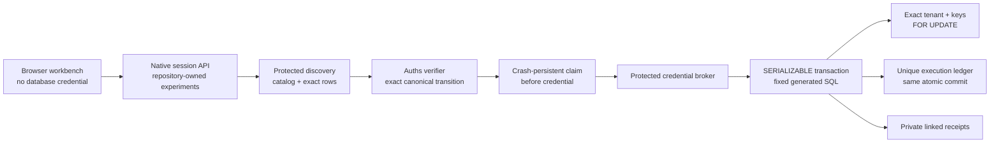

# Architecture

`product/integrations/auths-postgresql` owns the database-specific security
contract: typed values, canonical mutation intent, catalog evidence, verifier
configuration, Auths action profile, trusted SQL compiler, claim state,
protected ports, orchestration, ledger migration, and receipt schemas. Core
crates remain independent of PostgreSQL.

`demos/postgresql-data-change` supplies the native TLS driver, fixed discovery
queries for the synthetic relation, real Auths proof material, HTTP session
boundary, responsive workbench, database bootstrap/reset files, and
Fly/Vercel delivery configuration.

## Ordered invariants

The service path is deliberately linear:

1. Canonically compare required and executed verifier configuration.
2. Check lifetime, audience, database, relation, schema, RLS policy, trigger
   inventory, executor role, tenant, row set, before state, assignment domain,
   cardinality, and generated-statement commitment.
3. Verify the real Auths proof against the exact canonical action.
4. Atomically claim the action digest in durable external state.
5. Acquire the mutation credential from the protected broker.
6. Open a new TLS connection and start a read-write `SERIALIZABLE` transaction.
7. Set the fixed executor role, `search_path`, tenant RLS context, application
   name, statement timeout, and lock timeout.
8. Recheck catalog, role, RLS, schema, policy, and trigger facts in-transaction.
9. Insert the unique uncommitted ledger row.
10. Select the committed tenant and exact primary keys `FOR UPDATE`; recheck
    keys, versions, values, and cardinality.
11. Run only the trusted parameterized `UPDATE`, validate `RETURNING`, finalize
    the ledger, and commit.
12. On an ambiguous commit, use a fresh connection to inspect the ledger.

A configuration denial occurs before proof, claim, credential, or database
ports. A proof denial occurs before claim. The transaction and ledger roll back
together on any mismatch.

## SQL and value boundary

The public action has no SQL, predicate, operator, function, ordering,
returning expression, identifier string, transaction setting, or credential
field. PostgreSQL identifiers use a validated lowercase ASCII identifier type.
The compiler quotes only those trusted identifiers and emits a closed grammar.
Every tenant, key, row version, and assignment value travels through protocol
parameters.

Typed values distinguish boolean, signed 64-bit integer, NFC text, UUID,
fixed-scale decimal, fixed-precision UTC timestamp, enum text, and typed null.
Text that looks like SQL remains a parameter value.

## Public API

- `GET /healthz` reports process liveness without database access.
- `GET /readyz` performs a non-destructive database read in live mode.
- `GET /api/v1/credential-probe` proves that the public surface has no
  credential delegation operation.
- `POST /api/v1/sessions` resolves protected evidence and issues an exact proof.
- `POST /api/v1/sessions/{id}/execute` executes one repository-owned variant.
- `GET /api/v1/receipts/{id}` returns the privacy-safe native receipt bundle.

The designed `/receipts/{id}` page loads the native receipt API and fails
closed for malformed or unavailable identifiers.
