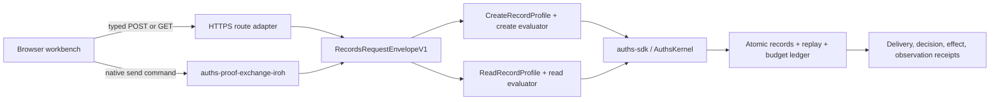

# Records API demo architecture

The implementation deliberately has one records-domain product package and one
demo package:

- `product/integrations/auths-records-api` owns the semantic contract:
  identifiers, create and read actions, two Auths profiles, bounded policy,
  required and executed verifier configuration, presenter verification,
  separate create and read evaluators, durable transitions, and receipt
  meanings.
- `demos/rest-api-authorization` owns delivery and presentation: Axum routes,
  the repository Iroh exchange adapter, the short-lived demo issuer, browser
  sessions, the native CLI, deployment configuration, and the frontend.
- Core continues to own proof verification, attenuation, composition, and the
  three-valued result. It knows nothing about HTTP, Iroh addresses, records,
  budgets, or mutable storage.

The HTTP adapter maps only `POST /v1/records` and
`GET /v1/records/{record_id}`. There is no arbitrary method, URL, header, or
JSON executor. The Iroh adapter accepts the closed
`auths.records-iroh-message/1` message and uses the repository's existing
framing, challenge, and peer-observation implementation.

Both adapters reconstruct the same `RecordsRequestEnvelopeV1`. The semantic
executor audience stays constant when delivery changes. An authenticated Iroh
connection or HTTPS connection is delivery evidence, not authorization.

The public client receives a short-lived exact proof and presenter-bound
presentation. It never receives a reusable API key, OAuth access token,
database credential, or session cookie. The opaque session ID locates
repository-owned demo materials; it cannot authorize a request without the
matching proof and presentation.

The ledger commits records, aggregate create/read capacity, replay state, and
effect evidence through canonical JSON and atomic file replacement. A process
restart therefore cannot make a completed action executable again. Repeating
the exact action through the other transport returns replay rather than
creating a second effect.
