# Records API demo architecture

```mermaid
flowchart LR
    Browser["Browser workbench"] -->|typed POST or GET| HTTP["HTTPS route adapter"]
    Browser -->|native send command| Iroh["auths-proof-exchange-iroh"]
    HTTP --> Envelope["RecordsRequestEnvelopeV1"]
    Iroh --> Envelope
    Envelope --> Create["CreateRecordProfile + create evaluator"]
    Envelope --> Read["ReadRecordProfile + read evaluator"]
    Create --> Kernel["auths-proof-sdk / AuthsKernel"]
    Read --> Kernel
    Kernel --> Projection["Records-owned shared commitment projection"]
    Projection --> Lifecycle["Shared durable lifecycle + additive capacity"]
    Lifecycle --> Seal["Execution + provider-call seals"]
    Seal --> Ledger["Atomic records + disclosure ledger"]
    Ledger --> Receipts["Delivery, immutable decision, effect, observation receipts"]
```

The implementation deliberately has one records-domain product package and one
demo package:

- `product/integrations/auths-records-api` owns the semantic contract:
  identifiers, create and read actions, two Auths profiles, bounded policy,
  required and executed verifier configuration, presenter verification,
  separate create and read evaluators, shared-contract projections,
  profile-specific sealed provider commands, protected-store transitions,
  reconciliation, and receipt meanings.
- `demos/rest-api-authorization` owns delivery and presentation: Axum routes,
  the repository Iroh exchange adapter, the short-lived demo issuer, browser
  sessions, the native CLI, deployment configuration, and the frontend.
- Core continues to own proof verification, attenuation, composition, and the
  three-valued result. It knows nothing about HTTP, Iroh addresses, records,
  budgets, or mutable storage.

The HTTP adapter maps only `POST /v1/records` and
`GET /v1/records/{record_id}`. There is no arbitrary method, URL, header, or
JSON executor. The Iroh adapter accepts the closed
`auths.records-iroh-message/1` message and uses the repository's existing
framing, challenge, and peer-observation implementation.

Both adapters reconstruct the same `RecordsRequestEnvelopeV1`. The semantic
executor audience stays constant when delivery changes. An authenticated Iroh
connection or HTTPS connection is delivery evidence, not authorization.

The product model uses a typed `CustomerRecordV1` rather than an opaque value.
The successful API outcome serializes the protected projection under
`response`, producing a conventional application response such as a customer
with `name`, `age`, and `occupation`. The adjacent Auths receipt does not replace
that business response: it commits to the projection and records the
authorization, delivery, effect, and observation facts.

The public client receives a short-lived exact proof and presenter-bound
presentation. It never receives a reusable API key, OAuth access token,
database credential, or session cookie. The opaque session ID locates
repository-owned demo materials; it cannot authorize a request without the
matching proof and presentation.

One shared lifecycle store per policy digest atomically enforces create units,
canonical created bytes, and read units across HTTPS and Iroh. Actual disclosed
bytes remain records-domain semantics and are checked in the same atomic
transaction that constructs the protected projection. The provider accepts
only a profile-specific command carrying exact Auths authorization plus
durable credential and provider-call seals.

The V2 records ledger atomically commits records, disclosure accounting, exact
completed actions, and effect evidence. If execution stops after provider-call
entry, restart queries that ledger instead of resubmitting the provider call:
matching completion reconciles to effect, canonical absence reconciles to
non-effect, and unavailable evidence keeps shared capacity held as
outcome-unknown. Obsolete prelaunch V1 state is rejected without migration.
