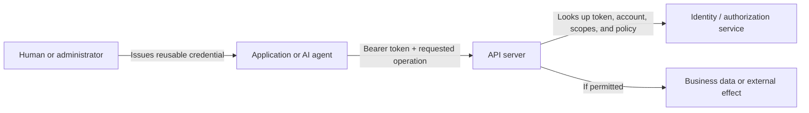

# So what does this demo prove?

This demo shows a different way to let software use an API. Instead of giving
the caller a reusable credential and trusting it to stay within broad
permissions, Auths Proof lets the caller carry authorization for one precisely
described action.

The distinction matters most for AI agents. An agent can be allowed to perform
a useful operation without receiving the standing credentials normally needed
to perform every other operation available through the same account.

## How traditional API requests are managed

An API is a structured way for one program to ask another program to read or
change data. For example, an application might send:

```http
POST /v1/records
Authorization: Bearer <secret>

{"name":"Bob","age":25,"occupation":"Sales"}
```

The bearer token is a reusable secret. The API looks up what that token's
account or application is allowed to do, then decides whether to accept the
request.



This model is practical, but possession of the token is usually what grants
access. Anyone who copies it may be able to make requests until it expires or
is revoked. A token can be scoped, but its scope commonly covers a category of
operations rather than one exact request.

That becomes a serious problem with agents:

- The agent may need enough access to complete an open-ended task.
- A prompt injection, tool bug, or compromised dependency can misuse every
  capability available through the credential.
- The credential can leak through logs, traces, shell history, generated code,
  subprocesses, or third-party tools.
- The service often learns who the caller is and what broad scope it has, but
  not what exact action a human intended to authorize.
- Revoking a credential limits future use; it does not explain which past
  effects were actually authorized.

The result is an awkward choice: give the agent a powerful reusable secret, or
keep a human in the loop for every API call.

## What Auths Proof changes

Auths Proof moves the important authorization decision before the protected
effect. A proof describes bounded authority, and a short-lived presentation
binds that authority to an exact canonical action and execution context.

In this demo, the protected service verifies commitments including:

- the operation, such as creating or reading one record;
- the exact record identifier and canonical request body;
- the intended executor audience;
- the required verifier configuration;
- the policy limits and validity window;
- a challenge, nonce, and presentation expiry.

Only after verification and an atomic replay claim does the service perform
the read or write. It then emits receipts that distinguish the authorization
decision, the attempted effect, and the observed result.

```mermaid
flowchart LR
    H["Human, policy owner, or trusted issuer"] -->|"Authorizes bounded authority"| P["Auths proof"]
    AGENT["Application or AI agent"] -->|"Exact proposed action"| PRES["Short-lived presentation"]
    P --> PRES
    PRES -->|"Proof + exact action; no reusable API key"| API["Protected records API"]
    API --> V["Local Auths verifier"]
    V -->|"Denied or indeterminate"| STOP["No protected effect"]
    V -->|"Authorized"| CLAIM["Atomic one-time claim"]
    CLAIM -->|"First valid execution only"| DATA["Read or write the exact record"]
    DATA --> R["Decision, effect, and observation receipts"]
```



The agent does not receive a general-purpose records API key. The bytes it
carries cannot legitimately authorize a different route, body, record,
audience, verifier configuration, or later operation. Transport only delivers
the proof: the same authorization meaning can be carried over HTTPS or Iroh.

This produces a much smaller failure boundary:

| If an attacker steals... | Typical result |
| --- | --- |
| A conventional bearer token | They may exercise every operation covered by its scope until expiry or revocation. |
| Only the demo's `Auths-Proof` header | It is insufficient without the matching session, presentation, and exact request. |
| The demo's complete request envelope before use | They may race to perform that one exact action during its short validity window. Atomic replay protection prevents a second effect. |

The last row is important. Auths Proof does not replace TLS, and the current
demo is not yet immune to theft of the complete ready-to-submit request. Its
present claim is narrower: it demonstrates exact-action authorization,
configuration binding, bounded validity, transport independence, replay
protection, and machine-verifiable receipts without giving the agent a reusable
API credential.

That is already a substantial change in the security model. Compromising the
agent no longer automatically exposes all of the authority associated with a
long-lived account credential. The authority visible to the agent can be
limited to the work it was actually asked to perform.

## Next steps

The next security milestone is theft-resistant proof-of-possession.

The presenter should retain a private key and sign a fresh, request-bound
message at submission time. That signature should cover the method, canonical
route, canonical action digest, executor audience, server challenge, expiry,
and a unique one-time identifier. The verifier should atomically consume the
challenge and identifier before allowing the protected effect.

With that design, copying the proof, presentation, headers, and body would no
longer be enough. The attacker would also need the presenter's private key to
answer a fresh challenge. Stronger deployments could additionally bind the
presentation to mTLS or the active TLS channel and encrypt sensitive responses
to the presenter's key.

The demo should eventually make the distinction visible through three
experiments:

1. A copied proof header fails because the rest of its commitments are absent.
2. A copied complete bearer-style envelope demonstrates today's first-use race
   and once-only replay protection.
3. A sender-constrained envelope fails when replayed by a party that does not
   possess the presenter key.

The detailed engineering work, failure model, and acceptance criteria belong
in the associated GitHub issue. The important outcome is simple: exact-action
authorization limits *what* may happen, while proof-of-possession also limits
*who can submit it successfully*.
