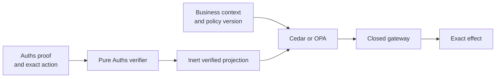

# Auths with Cedar and Open Policy Agent

**Integration status:** composition guidance; Auths does not embed Cedar,
Rego, or a generic policy-engine client in the proof kernel.

Cedar and OPA decide policy over supplied facts. Auths carries and verifies
bounded authority. A safe integration keeps the policy decision explicit and
prevents either layer from silently widening the other.

## Recommended boundary

Cedar evaluates a request containing principal, action, resource, and context
against policies and entities. OPA evaluates structured input with Rego and
deliberately separates policy decision from enforcement. [Cedar authorization](https://docs.cedarpolicy.com/auth/authorization.html),
[OPA documentation](https://www.openpolicyagent.org/docs)

## Ownership

| Concern | Owner |
| --- | --- |
| Delegation proof and attenuation | Auths |
| Principal-control evidence | Auths adapter |
| Exact action commitment | Auths profile |
| Organization/business policy | Cedar or OPA |
| Policy data freshness and distribution | Application/policy control plane |
| Enforcement ordering | Closed gateway |
| Replay, reservation, execution, receipts | Auths runtime/profile |

## Supported composition orders

### Policy before authoring

Use policy to determine whether an issuer may author a proposed grant or plan.
The resulting Auths authority must still be a bounded value in its own right.
Later verification must not depend on remembering an uncommitted policy result.

Choose this when policy constrains issuance and offline verification is valuable.

### Auths before effect policy

Verify Auths first, project only inert decision facts, then ask Cedar or OPA
whether current business context permits execution. The gateway requires both
results before consuming the command.

Choose this when organizational policy changes more quickly than delegated
authority or requires online application state.

### Policy evidence committed into context

For high-consequence operations, commit the policy engine, policy/model
version, decision identifier, request projection, relevant consistency or data
snapshot, and observation time into trusted context. This prevents a decision
for one policy input from being substituted into another execution.

## Input projection

The policy input should contain stable, bounded fields such as:

- verified actor and authority root identifiers;
- Auths proof, action, context, and plan commitments;
- exact profile, capability, resource, audience, and requested budget;
- satisfied assurance roles;
- policy/model identity and current business context; and
- approval and reservation state required by the gateway.

Do not send an effect-capable `VerifiedAction` through a JSON policy boundary.
Use an inert projection for policy and retain the opaque native handle inside
the trusted gateway process.

## Decision composition

| Auths | Policy | Gateway result |
| --- | --- | --- |
| Authorized | Permit/allow | Eligible for reservation and execution |
| Authorized | Forbid/deny | Do not execute |
| Authorized | Error or missing required data | Indeterminate; do not execute |
| Denied | Any | Do not execute; policy cannot widen |
| Indeterminate | Any | Do not execute; policy cannot supply missing Auths facts |

## Failure behavior

- Policy-engine unavailability is indeterminate when policy is required.
- A policy deny remains a deny even when Auths authorizes.
- A policy allow cannot repair an invalid signature, widened delegation, or
  mismatched action commitment.
- Policy changes between decision and execution require a bound snapshot,
  bounded validity window, or a fresh decision according to the profile.
- Decision logs are useful audit material, but they are not provider execution
  receipts. OPA documents decision logging separately from enforcement.
  [OPA decision logs](https://www.openpolicyagent.org/docs/management-decision-logs)

## Do not

- embed Rego or Cedar in the Auths verifier;
- translate arbitrary policy strings into Auths permissions at runtime;
- allow policy output to construct or modify the provider request;
- serialize an opaque authorized command for the policy engine;
- omit the policy version from high-consequence decision evidence; or
- call a policy allow an Auths authorization receipt.

## Interoperability fixture

For [`bounded-operation-v1`](../../fixtures/interoperability/bounded-operation-v1),
the Cedar and OPA fixtures should receive identical inert facts. The widened
delegation and payload-substitution cases must remain Auths denials regardless
of policy output. Missing policy data should remain indeterminate, while replay
is rejected by runtime state rather than by reconstructing it as policy.

## Primary sources

- [Cedar authorization](https://docs.cedarpolicy.com/auth/authorization.html)
- [Cedar formal specification](https://github.com/cedar-policy/cedar-spec)
- [OPA documentation](https://www.openpolicyagent.org/docs)
- [OPA management](https://www.openpolicyagent.org/docs/management-introduction)
