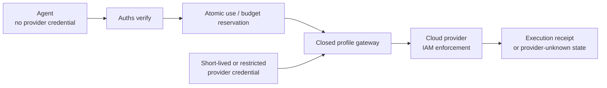

# Auths with cloud IAM and restricted provider credentials

**Integration status:** maintained Auths profiles use closed gateways, but
there is no generic cloud-IAM adapter that makes every provider operation safe.

Cloud IAM remains the provider's final enforcement system. Auths adds portable,
cross-boundary authority for the exact operation presented to a qualified
gateway. The gateway must satisfy both systems.

## Recommended boundary

AWS IAM combines identity policies, resource policies, permissions boundaries,
session policies, organization controls, and explicit denies. Google Cloud can
issue short-lived service-account credentials and supports credential access
boundaries for documented services such as Cloud Storage. These controls are
provider-native security, not legacy machinery for Auths to bypass. [AWS IAM policy evaluation](https://docs.aws.amazon.com/IAM/latest/UserGuide/reference_policies_evaluation-logic.html),
[Google Cloud downscoped credentials](https://cloud.google.com/iam/docs/downscoping-short-lived-credentials)

## Ownership

| Concern | Owner |
| --- | --- |
| Cloud account, resource, role, and organization policy | Cloud IAM |
| Credential issuance, expiry, and provider signature | Cloud provider/custody layer |
| Cross-company delegation and exact action | Auths |
| Approval commitment | Auths profile |
| Provider request compilation | Qualified Auths profile gateway |
| Atomic use and budget reservation | Auths runtime store |
| Provider idempotency and reconciliation | Profile gateway |
| Native enforcement and audit | Cloud provider |

## Integration flow

1. Keep provider credentials out of the agent and proof.
2. Verify the Auths proof against the exact profile action.
3. Obtain every required approval for the same action commitment.
4. Reserve replay, use, and budget state atomically.
5. Convert the opaque authorized command into one provider request through the
   profile-owned compiler.
6. Acquire or select the narrowest short-lived provider credential available.
7. Submit one idempotent provider operation.
8. Record the provider request identity and observed result in an execution
   receipt without exposing the credential or sensitive payload.
9. Reconcile provider state before retrying any unknown result.

## Least privilege is still required

Auths does not justify an administrator credential. The gateway credential
should be constrained by provider resource, action, region, account/project,
session policy, expiry, network conditions, and any provider-native request
conditions available.

The provider credential may still authorize a broader class than the Auths
command. The closed gateway and exact compiler are what prevent ordinary
application code from spending that ambient provider authority arbitrarily.

## Outcome model

| Observation | Auths execution state |
| --- | --- |
| Provider rejects before effect | Failed/denied with provider evidence |
| Provider confirms the exact effect | Succeeded/committed |
| Request not sent | Not attempted; reservation handled by profile policy |
| Connection lost before send is provable | Retryable under profile policy |
| Connection lost after send or response is ambiguous | Provider unknown; reconcile before retry |

An authorization receipt proves a decision. It does not prove the provider
effect occurred. An execution receipt records the observed execution state and
must preserve uncertainty.

## Do not

- give provider credentials to the delegated agent;
- call a cloud role or temporary credential an Auths proof;
- use one generic action shape for unrelated cloud APIs;
- compile the provider request before exact approval when compilation can
  change effect semantics;
- release a reservation merely because the client timed out;
- retry provider-unknown operations blindly; or
- include secrets, tokens, signed request headers, or sensitive provider output
  in public receipts.

## Interoperability fixture

The synthetic provider in
[`bounded-operation-v1`](../../fixtures/interoperability/bounded-operation-v1)
must implement success and connection-lost-after-send outcomes. The cloud-IAM
mapping should demonstrate that the same restricted credential can remain
valid while Auths rejects payload substitution, widening, replay, and approval
substitution.

Live cloud validation belongs in opt-in ephemeral CI, not authoritative Auths
protocol CI.

## Primary sources

- [AWS IAM policy evaluation](https://docs.aws.amazon.com/IAM/latest/UserGuide/reference_policies_evaluation-logic.html)
- [AWS session policies](https://docs.aws.amazon.com/IAM/latest/UserGuide/access_policies.html#policies_session)
- [Google Cloud short-lived delegated credentials](https://cloud.google.com/iam/docs/create-short-lived-credentials-delegated)
- [Google Cloud Credential Access Boundaries](https://cloud.google.com/iam/docs/downscoping-short-lived-credentials)
