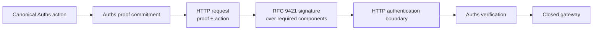

# Auths with HTTP Message Signatures

**Integration status:** composition guidance; no general HTTP-signature
middleware or universal HTTP canonicalization profile is maintained here.

HTTP Message Signatures authenticate selected HTTP components. Auths proves
bounded authority for an exact application action. Use both when the transport
message and application effect need independently explicit integrity.

## Recommended boundary

RFC 9421 lets an application select HTTP derived components and fields for a
signature base. It requires the application profile to decide which components,
key material, algorithms, time bounds, and nonces are appropriate. Body
integrity requires a covered content digest; signing method and URI alone is
not enough. HTTP signatures also do not provide confidentiality or replace
TLS. [HTTP Message Signatures](https://www.rfc-editor.org/rfc/rfc9421.html),
[Digest Fields](https://www.rfc-editor.org/rfc/rfc9530.html)

## Ownership

| Concern | Owner |
| --- | --- |
| HTTP component integrity and signer authentication | RFC 9421 application profile |
| Confidentiality and channel security | TLS/application deployment |
| Delegated authority and attenuation | Auths |
| Exact semantic action | Auths profile |
| HTTP-to-action mapping | Versioned integration profile |
| Replay, reservation, provider execution | Auths runtime/profile |

## Required application profile

Do not accept arbitrary signer-selected coverage. A versioned profile should
require at least the components needed to prevent request substitution, such as:

- `@method`;
- `@authority`;
- `@target-uri` or a deliberately equivalent path/query selection;
- `content-type`;
- `content-digest` for requests with content;
- an Auths proof/action commitment field;
- idempotency key when the operation uses one;
- signature creation/expiry parameters; and
- nonce or challenge where replay policy requires it.

The exact set depends on proxy normalization and deployment. Sign the values
that the verifier and gateway will actually interpret.

## Two composition patterns

### Auths action as the semantic source of truth

The request carries canonical Auths action bytes and proof bytes. RFC 9421
protects their HTTP presentation. After HTTP authentication, the application
passes the original bounded bytes—not reconstructed objects—to Auths.

This is the preferred pattern when an Auths profile already defines the effect.

### Signed HTTP request as profile input

A specialized Auths profile may commit the exact RFC 9421 signature base or an
unambiguous projection of it. This requires a closed mapping and independent
fixtures for proxy, header, query, and content-digest behavior. Do not place a
generic HTTP canonicalizer in the proof kernel.

## Verification order

1. Enforce transport size and parsing limits.
2. Validate the required RFC 9421 signature profile over the received message.
3. Preserve the received Auths action/proof bytes exactly.
4. Verify Auths authority and action commitment.
5. Obtain or validate exact approval and runtime reservation.
6. Execute only through the qualified gateway.

HTTP verification and Auths verification are independent gates. Either may run
first when no effect-capable value is exposed, but the gateway must require both
before execution.

## Failure behavior

- A valid HTTP signature with invalid Auths authority does not execute.
- Valid Auths authority in an invalid or replayed HTTP presentation does not
  execute when the HTTP signature profile is required.
- Missing required signature components deny HTTP authentication.
- Unavailable key or nonce state is indeterminate rather than authenticated.
- Provider-unknown execution remains an Auths profile state; HTTP success or
  failure cannot infer whether the provider committed the effect.

## Do not

- let clients choose the signed component set;
- trust a body not covered by a verified content digest;
- parse and reserialize action bytes between signature and Auths verification;
- treat a valid message signature as delegated authority;
- include authorization headers, private keys, or bearer credentials in public
  receipts;
- assume intermediaries preserve unsigned routing fields; or
- replace TLS with message signatures.

## Interoperability fixture

For [`bounded-operation-v1`](../../fixtures/interoperability/bounded-operation-v1),
sign the exact payload, Auths commitment, destination, and idempotency key. The
payload-substitution case must fail both the content digest/signature profile
and the Auths action commitment. The replay case must demonstrate that message
freshness and one-use execution state are separate controls.

## Primary sources

- [HTTP Message Signatures, RFC 9421](https://www.rfc-editor.org/rfc/rfc9421.html)
- [Digest Fields, RFC 9530](https://www.rfc-editor.org/rfc/rfc9530.html)
- [HTTP Semantics, RFC 9110](https://www.rfc-editor.org/rfc/rfc9110.html)
