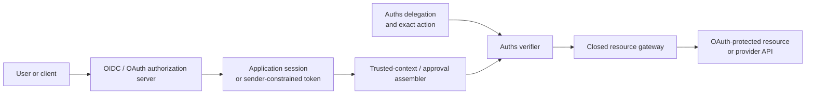

# Auths with OAuth and OpenID Connect

**Integration status:** composition guidance; no generic OAuth/OIDC principal
adapter is currently maintained in this repository.

Use OpenID Connect for authentication and user sessions. Use OAuth for client
access and consent. Use Auths only when an exact effect needs portable,
attenuable authority and a closed execution lifecycle.

## Recommended boundary

OpenID Connect defines an identity layer over OAuth and uses an ID Token to
carry claims about an authentication event and end user. The access token is a
separate credential for a protected resource. [OpenID Connect Core](https://openid.net/specs/openid-connect-core-1_0.html)

OAuth Token Exchange can represent subject and actor tokens for delegation or
impersonation, while DPoP binds an OAuth token to a client key and signs the
HTTP method and URI. DPoP does not provide request-body integrity or application
authorization by itself. [OAuth Token Exchange](https://www.rfc-editor.org/rfc/rfc8693),
[DPoP](https://www.rfc-editor.org/rfc/rfc9449.html)

## Ownership

| Concern | Owner |
| --- | --- |
| Login, federation, account recovery, user session | OIDC provider/application |
| Consent, client authorization, token issuance | OAuth authorization server |
| Sender-constrained API access | OAuth resource server and DPoP profile |
| Exact delegated machine authority | Auths |
| Exact transaction approval | Auths approval profile, potentially using OIDC identity evidence |
| Provider access token or client credential | Closed gateway/custody layer |
| Effect reservation and receipts | Auths runtime/profile |

## Safe composition patterns

### OIDC-authenticated approval

1. Authenticate the approver through the existing OIDC flow.
2. Validate issuer, audience, signature, nonce, time, and application-required
   authentication properties outside the Auths kernel.
3. Bind the stable issuer/subject pair, authentication observation, approval
   policy, and exact action commitment into approval evidence.
4. Never convert an ID Token directly into delegated authority.

The approval must refer to the exact Auths commitment. An authenticated person
clicking “approve” is insufficient if application code can later substitute
the action bytes.

### OAuth-protected transport

Use OAuth or DPoP to authenticate access to the endpoint carrying an Auths
request. The endpoint still verifies Auths authority independently. Transport
success cannot become an authorization result.

### Token acquisition behind a gateway

The public agent receives an Auths proof, not a broad provider token. After
authorization and durable reservation, the closed gateway may exchange or
acquire the narrowest suitable OAuth credential and call the protected
resource. Do not put the access token in the proof or receipt.

## Failure behavior

- Invalid OIDC/OAuth evidence is denied by the owning identity or resource
  boundary, before it becomes trusted Auths context.
- Unavailable issuer keys, introspection, or required freshness information
  must not be upgraded to authenticated or approved.
- A valid ID Token or access token without an Auths grant proves no Auths
  authority.
- A valid Auths command without the provider credential remains authorized but
  unexecuted; the gateway reports the exact operational state.
- A provider timeout after submission becomes provider-unknown and requires
  reconciliation before retry.

## Do not

- use an OAuth scope string as an Auths permission without a versioned mapping;
- place bearer tokens, refresh tokens, or client secrets in proof material;
- treat DPoP as body or effect commitment;
- let the OIDC display name identify an Auths principal;
- make Auths replace login, consent, or token rotation; or
- let token exchange widen the Auths authority chain.

## Interoperability fixture

Map [`bounded-operation-v1`](../../fixtures/interoperability/bounded-operation-v1)
into two independent layers:

- OAuth/DPoP protects the transport or provider credential; and
- Auths binds the exact firewall operation, approvals, use count, budget, and
  execution lifecycle.

The payload-substitution case must fail even when its OAuth token and DPoP
proof are valid. The replay case should distinguish token validity from Auths
runtime reservation.

## Primary sources

- [OAuth 2.0](https://www.rfc-editor.org/rfc/rfc6749)
- [OpenID Connect Core](https://openid.net/specs/openid-connect-core-1_0.html)
- [OAuth Token Exchange](https://www.rfc-editor.org/rfc/rfc8693)
- [DPoP](https://www.rfc-editor.org/rfc/rfc9449.html)
