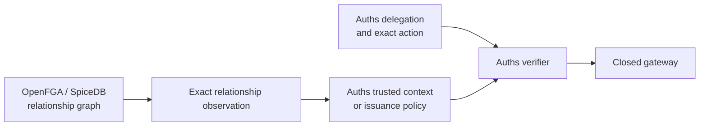

# Auths with relationship-based authorization

**Integration status:** composition guidance; no maintained OpenFGA or SpiceDB
adapter is currently included.

Relationship-based authorization answers questions such as “is this responder
a member of the incident team for this account?” Auths answers whether the
resulting principal holds bounded authority for one exact effect.

## Recommended boundary

OpenFGA evaluates an authorization model and relationship tuples. SpiceDB
checks permissions over relationships and supports caveated conditional
results when required context is missing. [OpenFGA concepts](https://openfga.dev/docs/concepts),
[SpiceDB querying](https://authzed.com/docs/spicedb/concepts/querying-data),
[SpiceDB caveats](https://authzed.com/docs/spicedb/concepts/caveats)

## Ownership

| Concern | Owner |
| --- | --- |
| Organization and resource relationships | ReBAC system |
| Model/schema and tuple lifecycle | ReBAC operator |
| Consistency/freshness selection | Application integration |
| Portable delegated authority | Auths |
| Exact action and approvals | Auths profile |
| Replay and effect lifecycle | Auths runtime/profile |

## Two safe patterns

### Relationship-gated issuance

Check the relationship before authoring a grant. The issued Auths proof then
stands on its own until its explicit expiry or revocation policy says otherwise.
Use short validity when relationship changes must take effect quickly.

This pattern favors offline verification but does not promise immediate graph
revocation.

### Relationship-gated execution

Check the relationship at the gateway after Auths verification and before
reservation/execution. Bind the exact query, model identifier, consistency
token or revision, result, and observation time to the transaction context.

This pattern favors current organization state but adds an online dependency.

## Exact observation shape

An application-owned assembler should preserve at least:

- ReBAC system and endpoint trust identity;
- authorization model/schema identifier;
- subject type and identifier;
- relation or permission;
- object type and identifier;
- caveat/context input commitment;
- result including conditional state;
- consistency token or revision when available;
- observed time and validity bound; and
- the Auths action commitment for which the observation was requested.

Do not copy a mutable role name such as `incident_responder` into an Auths grant
without preserving which graph, model, object, and observation justified it.

## Decision composition

- A positive relationship can satisfy a profile-defined external predicate; it
  does not manufacture Auths authority.
- A negative relationship denies the operation when the predicate is required.
- A conditional result with missing caveat data is indeterminate.
- A stale or unavailable graph result is indeterminate unless the profile
  explicitly accepts a bounded cached observation.
- An Auths denial cannot be widened by a positive relationship check.

SpiceDB consistency tokens and OpenFGA consistency preferences address graph
read behavior; they are not execution idempotency keys or receipts. [SpiceDB consistency](https://authzed.com/docs/spicedb/concepts/consistency),
[OpenFGA consistency](https://openfga.dev/docs/interacting/consistency)

## Do not

- treat a tuple as a portable capability;
- issue long-lived authority from an unversioned relationship check;
- discard caveat or conditional state;
- confuse a consistency token with an Auths action commitment;
- let the ReBAC query service construct the provider effect; or
- duplicate the organization graph inside Auths proof objects.

## Interoperability fixture

For [`bounded-operation-v1`](../../fixtures/interoperability/bounded-operation-v1),
model the EdgeShield agent's membership in the synthetic incident team and the
team's relationship to the Northstar firewall. Run both issuance-gated and
execution-gated variants. The missing-context case should remain conditional or
indeterminate rather than becoming a clean allow.

## Primary sources

- [Zanzibar paper](https://research.google/pubs/zanzibar-googles-consistent-global-authorization-system/)
- [OpenFGA concepts](https://openfga.dev/docs/concepts)
- [SpiceDB querying](https://authzed.com/docs/spicedb/concepts/querying-data)
- [SpiceDB caveats](https://authzed.com/docs/spicedb/concepts/caveats)
- [SpiceDB consistency](https://authzed.com/docs/spicedb/concepts/consistency)
