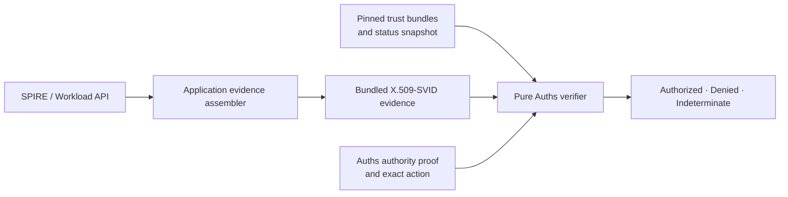

# Auths with SPIFFE and SPIRE

**Integration status:** supported X.509-SVID principal-control adapter; live
Workload API acquisition remains application-owned.

SPIFFE answers which workload is presenting a credential. Auths answers which
bounded action that workload may perform. Keep those responsibilities separate.

## Recommended boundary

The SPIFFE Workload API distributes SVIDs and trust bundles and streams
rotations and revocation-related updates. It is an identity acquisition
service, not an Auths authority service. [SPIFFE Workload API](https://spiffe.io/docs/latest/spiffe-specs/spiffe_workload_api/)

Auths' `auths-spiffe-x509` adapter consumes bounded certificate-chain evidence
and verifier-local trust/status configuration. It verifies the X.509 path,
SPIFFE URI SAN, client-auth EKU, trust domain, validity, supported key suite,
principal binding, and optional local status. See
[`auths-spiffe-x509`](../../core/adapters/auths-spiffe-x509/src/lib.rs).

## Ownership

| Concern | Owner |
| --- | --- |
| Workload attestation and registration | SPIRE or another SPIFFE implementation |
| SVID issuance, rotation, and private-key delivery | SPIFFE Workload API |
| Trust-domain federation | SPIFFE operator |
| SVID and trust-bundle acquisition | Application evidence assembler |
| Bounded offline X.509-SVID verification | `auths-spiffe-x509` |
| Delegated authority and attenuation | Auths |
| Exact application action | Auths profile |
| Replay, budget, reservation, execution, receipts | Auths runtime/profile |

## Integration flow

1. Acquire the workload's current X.509-SVID through the local Workload API.
2. Acquire the exact trust-domain and federated bundles the verifier accepts.
3. Convert the public certificate chain into bounded `SpiffeX509Evidence`.
4. Construct `SpiffeTrustDomain` and, when required, `SpiffeStatusRecord`
   values from locally trusted observations.
5. Include the SPIFFE principal and exact verification-method reference in the
   Auths authority chain.
6. Sign the Auths preimage using the SVID private key without exporting that
   key into Auths evidence or trusted context.
7. Instantiate the adapter explicitly in the verifier registry and commit the
   resulting configuration identity into trusted context.
8. Verify the unchanged Auths proof, exact action bytes, and context.

The Workload API can return private key material to an entitled local workload.
That material must remain in the signing boundary and must never be serialized
into a proof, context, receipt, or diagnostic artifact. [SPIFFE Workload API X.509-SVID profile](https://spiffe.io/docs/latest/spiffe-specs/spiffe_workload_api/#5-x509-svid-profile)

## Failure behavior

- An invalid certificate, path, URI SAN, EKU, suite, or principal binding is
  invalid evidence and must not establish control.
- A missing required trust domain or fresh status record is an unavailable
  external fact and must remain indeterminate.
- A locally active revocation record denies principal control.
- Workload API or SPIRE unavailability occurs before pure verification. Do not
  silently reuse material beyond the verifier's explicit time and status policy.
- A valid SVID proves principal control only. It does not create an Auths grant.

## Do not

- call the Workload API from the Auths kernel or concrete adapter;
- copy arbitrary SVID claims into Auths authority;
- accept the first trust bundle that validates a chain;
- treat mTLS success as authorization for the application effect;
- make SPIFFE path strings carry undocumented permission semantics; or
- include SVID private keys in evidence.

## Validation

The canonical Auths corpus contains valid mixed SPIFFE/raw-key chains, while
the adapter conformance corpus covers missing EKU and other adversarial cases:

- [`core/fixtures/v1/manifest.json`](../../core/fixtures/v1/manifest.json)
- [`core/conformance/v1/adapters/spiffe-x509.json`](../../core/conformance/v1/adapters/spiffe-x509.json)
- [`fixtures/interoperability/bounded-operation-v1`](../../fixtures/interoperability/bounded-operation-v1)

Use the shared bounded-operation fixture to test a SPIFFE-identified delegate.
The authority, approval, replay, and provider-unknown cases must behave the
same when another supported principal method replaces SPIFFE.

## Primary sources

- [SPIFFE specifications](https://spiffe.io/docs/latest/spiffe-specs/)
- [SPIFFE Workload API](https://spiffe.io/docs/latest/spiffe-specs/spiffe_workload_api/)
- [X.509-SVID specification](https://spiffe.io/docs/latest/spiffe-specs/x509-svid/)
