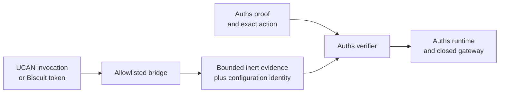

# Auths with UCAN and Biscuit

**Integration status:** research and composition guidance; no maintained UCAN
or Biscuit evidence adapter is currently included.

UCAN and Biscuit are direct capability alternatives, not merely identity
providers. A team should first decide whether either system already solves its
problem without Auths.

## Choose a mode explicitly

### Alternative-only mode

Use UCAN or Biscuit natively when delegated capability invocation or offline
attenuable authorization is the complete requirement. Do not add Auths only to
rename their concepts.

UCAN Invocation binds a command, structured arguments, proofs, nonce, and
expiry into a task. Biscuit supports append-only attenuation and documents
per-request restriction by operation, resource, expiry, selected headers, or a
request-body hash. [UCAN Invocation](https://github.com/ucan-wg/invocation),
[Biscuit per-request attenuation](https://doc.biscuitsec.org/recipes/per-request-attenuation.html)

### Explicit bridge mode

Use a bridge only when an Auths profile requires its own exact action,
approval, runtime, gateway, or receipt lifecycle across systems. The bridge
validates the foreign capability under a pinned mapping and emits bounded inert
evidence. The Auths verifier still evaluates Auths authority independently.

## Mapping requirements

Every bridge version must define an injective mapping for:

- foreign issuer/subject/audience and Auths principal identifiers;
- foreign command/operation and Auths capability;
- foreign resource and Auths resource;
- invocation arguments or request commitment and exact Auths action bytes;
- validity interval;
- delegation chain and attenuation constraints;
- nonce/task/token identity;
- revocation or external status inputs;
- bridge configuration and source version; and
- failure classification.

If two distinct foreign inputs map to the same Auths meaning, the bridge must
either prove that equivalence is intentional or reject the mapping.

## UCAN-specific boundary

UCAN already provides public-key-verifiable delegation and signed structured
invocation. Treat the UCAN task identity, command, arguments, nonce, proof
chain, and executor validation result as foreign protocol evidence. Do not
claim UCAN lacks exact request binding. [UCAN specification](https://github.com/ucan-wg/spec),
[UCAN Delegation](https://github.com/ucan-wg/delegation),
[UCAN Invocation](https://github.com/ucan-wg/invocation)

An Auths bridge must still specify:

- which UCAN command vocabulary is accepted;
- how executor-owned resource facts enter trusted context;
- how UCAN revocation freshness is bounded;
- whether the UCAN invocation is the approved transaction or evidence for it;
  and
- how Auths runtime receipts relate to the UCAN task/result lifecycle.

## Biscuit-specific boundary

Biscuit already provides local verification, Datalog authorization, and
holder-added attenuation. A bridge should execute a fixed authorizer policy
with bounded ambient facts and commit its policy/configuration identity.
[Biscuit specification](https://doc.biscuitsec.org/reference/specifications)

The bridge must state whether exact action bytes are:

- embedded as a token fact;
- checked through a body hash;
- supplied as ambient authorizer data; or
- not bound by the evaluated token.

Token sealing prevents further Biscuit attenuation; it is not the same as an
opaque Auths `VerifiedAction` that gates an effect-capable API.

## Failure behavior

- Invalid foreign signatures, chains, or checks deny the foreign evidence.
- Missing required resource ownership or fresh revocation facts are
  indeterminate when they cannot be established locally.
- A valid foreign capability does not automatically authorize Auths.
- An Auths denial cannot be repaired by a foreign authorizer allow.
- Foreign and Auths replay identities must not be conflated. The runtime must
  define which identifier owns one-use reservation.
- A bridge error must remain typed and fail closed.

## Do not

- parse a UCAN or Biscuit token and copy strings into an Auths grant;
- invent a lowest-common-denominator capability language;
- verify the foreign system twice with subtly different policies;
- describe application-composed properties as missing or impossible;
- expose foreign tokens as effect-capable Auths handles; or
- promise import compatibility before versioned adversarial fixtures exist.

## Interoperability fixture

Map [`bounded-operation-v1`](../../fixtures/interoperability/bounded-operation-v1)
into native UCAN and Biscuit representations in the separate `auths-interop`
repository. Test alternative-only mode first. Add bridge mode only after the
native mapping is reviewed.

At minimum, prove payload substitution, delegation widening, approval
substitution, replay, expiry, missing external context, and provider-unknown
behavior. Report which layer supplies each result.

## Primary sources

- [UCAN specification](https://github.com/ucan-wg/spec)
- [UCAN Delegation](https://github.com/ucan-wg/delegation)
- [UCAN Invocation](https://github.com/ucan-wg/invocation)
- [Biscuit specification](https://doc.biscuitsec.org/reference/specifications)
- [Biscuit cryptography](https://doc.biscuitsec.org/reference/cryptography)
- [Biscuit per-request attenuation](https://doc.biscuitsec.org/recipes/per-request-attenuation.html)
