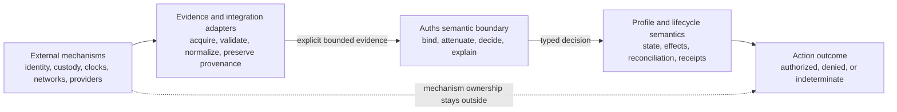

# Auths Semantic Responsibility Boundaries

## Status

This is an architectural and product-direction plan. It defines where Auths should remain implementation-agnostic, where it must define semantics, and which capabilities belong in the protocol, SDK, profiles, integrations, or host environment.

It is not a claim that every recommendation below is implemented. Proposed interfaces must first be reconciled with the current public surface and the target-state plans; this document must not become a reason to invent duplicate abstractions.

## Purpose

Auths is deliberately agnostic about identity systems, key custody, cryptographic algorithms, transports, storage engines, policy authoring surfaces, and service topology. That flexibility is one of its central strengths. A deployment should be able to use a raw Ed25519 key today, a hardware-backed platform key tomorrow, or a different identity and cryptographic system later without replacing the authorization model.

But agnosticism has a boundary.

Auths may delegate the production and maintenance of facts to other systems. It cannot delegate the meaning of those facts once they influence an authorization decision. If a key has rotated, evidence is stale, a delegation has been revoked, or a provider outcome is ambiguous, Auths must say what that means for the proposed action.

The governing principle is:

> Auths does not need to own every mechanism. It does own the authorization consequences of every fact it consumes.

This plan makes that principle concrete. For each theme, it identifies:

- what Auths should not own;
- where Auths cannot remain semantically silent;
- what we should build;
- what we should explicitly avoid building.

## The boundary in one picture

The core should remain deterministic over explicit inputs. Acquisition, network resolution, secret access, and provider calls belong outside it. The boundary is nevertheless strict: adapters cannot turn an unknown or stale fact into an affirmative authorization merely because the underlying mechanism is external.

## A decision test for future work

When deciding whether a concern belongs to Auths, apply these questions in order:

1. **Who creates or maintains the fact?** If it is an identity status, hardware-key property, wall-clock reading, provider response, or network result, another system may own the mechanism.
2. **Can the fact change whether this exact action is authorized?** If yes, Auths must define its representation, validation requirements, and decision consequence.
3. **Does obtaining the fact require I/O, secret access, or mutable state?** If yes, acquisition belongs in a host, product layer, or adapter rather than the deterministic core.
4. **Does the meaning vary by action domain?** If yes, the profile owns the domain semantics. It should not be collapsed into a global operation tag or receipt union.
5. **What happens when the fact is absent, stale, contradictory, or unsupported?** The answer must be explicit. No such condition may silently become authorization.

The result should assign responsibilities by layer:

| Layer | Primary responsibility |
|---|---|
| Protocol and core | Canonical commitments, attenuation, deterministic verification, stable verdicts, and semantic failure reasons |
| SDK | Safe construction, evidence assembly, custody and resolution ports, profile composition, and useful explanations |
| Method adapter | Method-specific parsing and verification without weakening the protocol contract |
| Profile | Exact action vocabulary, policy facts, credential scope, state transitions, effects, and receipts |
| Host and operator | Trust-root distribution, secret custody, networking, storage, deployment policy, and availability |
| External authority or provider | Identity lifecycle facts and real-world effect outcomes |

## Theme 1: principals and identity methods

### What Auths should not own

Auths should not become a universal identity provider, DID method, certificate authority, employee directory, account-recovery service, or identity-proofing business. It should not require one identifier family such as KERI, DIDs, SPIFFE, X.509, or raw public keys.

### Where Auths cannot stay silent

Authorization depends on more than the mathematical fact that some key verified a signature. Auths must bind the authorization to the exact principal, verification method, algorithm, purpose, and evidence interpretation used for the decision. Two identifiers that happen to expose the same key bytes are not automatically the same authority. A method that is valid for authentication is not automatically valid for delegation.

Auths must also distinguish at least:

- evidence that proves control of a principal from evidence that describes a principal;
- current control from historical control at issuance time;
- a supported identity method from an unknown method;
- method resolution failure from an invalid signature;
- explicit equivalence established by policy from accidental equivalence inferred from shared key material.

### What to build

- Preserve a narrow principal-control verification boundary, aligned with the existing `PrincipalControlVerifier` direction, rather than exposing identity-system internals to the core.
- Define bounded, canonical principal evidence with explicit method identity, verification purpose, provenance, and relevant time/status facts.
- Provide maintained adapters and conformance fixtures for a deliberately small initial set of methods. Raw public keys and self-contained identifiers are useful offline baselines; richer methods should prove they can preserve the same semantic contract.
- Return stable, actionable reasons for unsupported methods, unresolved methods, invalid control proofs, contradictory evidence, and unavailable historical state.
- Test that adapters cannot reinterpret the same evidence differently without changing a committed method or version identifier.

### What not to build

- A universal identity resolver inside the authorization core.
- An Auths-owned identity registry that becomes mandatory for verification.
- Automatic fallback from one identity interpretation to another.
- A claim that verifying a signature proves the real-world identity or trustworthiness of its signer.

## Theme 2: key custody, signing, and rotation

### What Auths should not own

Key generation, storage, backup, recovery, hardware isolation, and rotation schedules belong to custody systems and operators. Auths should use vetted cryptographic libraries and platform facilities rather than implement its own key store, secure enclave, HSM, or signature primitive.

### Where Auths cannot stay silent

Auths must define exactly what is signed and how that signature is bound to the principal and authority being exercised. It must say whether a verification method was acceptable for the requested purpose, which algorithms and versions are accepted, and what evidence is needed after rotation.

Rotation and compromise must not be conflated. A routine rotation may preserve authority through an authenticated continuity statement or identity-system history. A compromise may invalidate some or all evidence associated with the old key. The external identity or custody system reports those facts; Auths decides how they affect a grant, delegation chain, approval, or action.

### What to build

- Keep signing and custody behind platform-neutral SDK ports so macOS Secure Enclave and Keychain, Windows facilities, Linux secret stores, HSMs, and headless signers can satisfy the same contract.
- Define capability descriptors for non-exportability, required human presence, user verification, supported algorithms, and attestation availability. Treat these as evidence or local requirements, not marketing labels.
- Specify canonical signing payloads and domain separation for grants, approvals, revocations, and action requests.
- Add rotation fixtures covering continuity, historical verification, unsupported successors, compromised predecessors, and ambiguous histories.
- Keep the protocol usable with externally produced signatures so hosted Auths infrastructure is never required.

### What not to build

- A mandatory Auths wallet, certificate authority, or universal key manager.
- A core signer interface that assumes asynchronous I/O, network access, or one custody implementation.
- Custom cryptographic primitives.
- Silent algorithm fallback or “accept any algorithm supported by the library” behavior.

## Theme 3: revocation and cancellation

Revocation is not one problem. At least three different authorities can withdraw something:

1. an identity system can report that a principal or verification method is no longer valid;
2. an issuing authority can revoke an Auths delegation or capability;
3. a profile can cancel or supersede pending lifecycle work.

These events must not be represented as one vague revoked flag.

### What Auths should not own

Auths does not need to operate every identity-status source or a global online revocation service. It cannot promise instantaneous revocation to a verifier that is disconnected and possesses only an older snapshot.

### Where Auths cannot stay silent

Auths must define:

- whether status is evaluated at issuance, delegation, execution, or more than one of those times;
- which authority is entitled to revoke which object;
- whether revocation is prospective or invalidates historical actions;
- the required freshness and provenance of status evidence;
- whether missing or stale evidence causes denial or an indeterminate result;
- how revocation races with reservation, execution, retry, and reconciliation;
- how cancellation differs from evidence that an external effect never occurred.

Delegation revocation is especially important: an operator must be able to withdraw delegated authority without rotating or destroying the principal's identity key.

### What to build

- Define distinct, versioned status evidence for principal control, delegation validity, and profile lifecycle state.
- Reconcile the existing revocation requirements, principal-status evidence, and `RevocationSnapshotV1` into one documented flow without merging their different meanings.
- Commit the applicable revocation policy and freshness requirement into the decision context or grant, so a verifier cannot quietly substitute a weaker local policy.
- Provide product-level ports for obtaining authenticated status snapshots, while keeping snapshot evaluation deterministic.
- Emit receipts and explanations that identify the status source, checked-at time, relevant version, and whether the decision was denied or indeterminate.
- Test revocation before reservation, between reservation and effect, during ambiguous provider outcomes, and after completed effects.

### What not to build

- A mandatory global revocation ledger.
- A claim of instant or globally consistent revocation in offline deployments.
- Revocation logic that treats identity compromise, delegation withdrawal, and workflow cancellation as interchangeable.
- A retry path that bypasses the same revocation requirements that applied to the original attempt.

## Theme 4: time, freshness, and offline verification

### What Auths should not own

Auths should not pretend to create trustworthy wall-clock time. Clock synchronization, timestamp authorities, and network availability belong to the deployment and its evidence sources.

### Where Auths cannot stay silent

Time influences grant validity, evidence freshness, replay windows, revocation, and historical principal control. Therefore Auths must define which time value is trusted, what it is used for, what maximum ages apply, and what happens when time is unavailable or moves backwards.

Offline verification must have a precise meaning: no live Auths service is required when the verifier is supplied with all required trust configuration and sufficiently fresh, authenticated evidence. It does not mean that a disconnected verifier can learn about a revocation that happened after its latest evidence.

### What to build

- Make verification time an explicit input with documented trust assumptions; do not read ambient time deep inside core evaluation.
- Represent `valid-at`, `observed-at`, `checked-at`, expiry, and maximum age as distinct concepts where their meanings differ.
- Support stapled, authenticated status snapshots and historical proofs for offline use.
- Return one of three stable outcomes: authorized, denied, or indeterminate. Missing freshness evidence must never become authorized.
- Let profiles decide whether an indeterminate result is terminal, may await fresher evidence, or may be retried under a bounded policy.
- Add conformance cases for stale snapshots, future timestamps, clock rollback, boundary instants, expired trust roots, and contradictory time evidence.

### What not to build

- Hidden network calls from the deterministic verifier.
- A Boolean `valid` result that obscures missing freshness or historical evidence.
- Claims that offline verification establishes current global status.
- An unrestricted “fail open when offline” mode. A deployment may explicitly configure reduced requirements only if that weaker policy is visible and committed.

## Theme 5: trust roots, configuration, and assurance

### What Auths should not own

Operators may distribute trust roots through files, configuration management, hardware, enterprise systems, or hosted control planes. Auths should not require a central service to tell every verifier what to trust.

### Where Auths cannot stay silent

A valid signature under an untrusted root is not authorization. Auths must define which configuration is security-relevant, how required configuration is distinguished from local configuration, and what happens when they disagree. Trust-root identity, policy version, algorithm suite, evidence requirements, and relevant profile version must be committed or otherwise unambiguously selected.

### What to build

- Continue the typed trusted-context direction and make construction difficult to misuse.
- Include required and effective local configuration commitments in explanations and receipts where they affect the verdict.
- Define versioned, exportable trust bundles that work locally, on-premises, and in hosted deployments.
- Fail explicitly on missing roots, unknown versions, weaker local requirements, ambiguous precedence, and unsupported extensions.
- Publish an assurance vocabulary that separates mathematical verification, principal-control evidence, freshness, policy satisfaction, lifecycle state, and external effect evidence.

### What not to build

- A mandatory Auths-hosted trust or policy service.
- Undocumented environment-variable overrides of committed security policy.
- A generic “verified” badge that combines different assurance levels.
- Defaults that silently weaken the issuer's requirements.

## Theme 6: evidence acquisition, resolution, and discovery

### What Auths should not own

DNS, HTTP, DID-document fetching, directory queries, certificate retrieval, and other discovery mechanisms should not run inside the pure evaluator. Hosts and adapters own network policy, authentication, caching, availability, and operational limits.

### Where Auths cannot stay silent

Once acquired evidence reaches Auths, its provenance, authority, freshness, scope, and conflicts matter. “The adapter returned it” is not a trust model. Auths must define what the evidence claims, which source may make that claim, and how it is bound to the authorization input.

### What to build

- Define an SDK evidence-assembly layer that can invoke resolvers before deterministic verification.
- Require adapters to preserve source identity, method/version, retrieval or observation time, and authentication facts.
- Bound evidence size, collection count, nesting, redirect behavior, and resolution time before parsing or evaluation.
- Support portable offline evidence bundles with canonical manifests and explicit freshness limits.
- Define deterministic conflict handling. Contradictory authoritative evidence should be denied or indeterminate, never resolved by input order.
- Supply reference resolver policies that address SSRF, unsafe redirects, cache poisoning, and unbounded documents.

### What not to build

- Networking inside the core verifier.
- An adapter contract that returns only `true` or `false` without its evidence basis.
- Trust based solely on transport security or successful retrieval.
- An unbounded plugin system in the first stable SDK surface.

## Theme 7: transport and exchange

### What Auths should not own

Auths should not become an HTTP framework, MCP runtime, peer-to-peer network, message broker, or service mesh. The same authorization model should be usable over REST, iroh, queues, files, local process calls, or future transports.

### Where Auths cannot stay silent

Transport neutrality does not remove the need to bind the action to its intended audience, resource, session or challenge where applicable, canonical payload, and replay context. Transport authentication may contribute evidence, but it must not silently substitute for authority to perform the action.

### What to build

- Define canonical exchange envelopes and detached-digest options that preserve the same authorization meaning across transports.
- Provide thin SDK adapters for important surfaces such as HTTP and MCP, with identical core decision fixtures.
- Make audience, action, resource, request identity, and replay bindings explicit.
- Test that serialization or transport changes do not alter the committed action.

### What not to build

- A required Auths network protocol or gateway.
- Transport-specific authorization semantics hidden in middleware.
- The assumption that an authenticated channel proves the caller has delegated authority.
- A transport-owned success response treated as an Auths receipt without profile validation.

## Theme 8: policy, delegation, and profile semantics

### What Auths should not own

Auths does not need one universal policy language or a single authoring surface. Policies may be coded, produced by an SDK builder, or configured through higher-level tools. Profiles may define different action vocabularies and domain-specific facts.

### Where Auths cannot stay silent

Auths must own the common meaning of authority: what was granted, by whom, to whom, for which audience and action, under which constraints, and whether each delegation attenuates rather than expands authority. The exact action and effect semantics belong to a profile, but they must be cryptographically and canonically bound.

### What to build

- Keep the common core small: grants, delegation chains, attenuation, contextual requirements, decision composition, and stable explanations.
- Let each profile define closed action types, profile-specific evidence, least-privilege credential requests, gateways, state transitions, and receipts.
- Provide an SDK profile kit and conformance suite only after repeated implementations demonstrate a genuinely shared abstraction.
- Make policy commitments travel with the action or be referenced by an immutable, authenticated commitment.
- Preserve the distinction between identity (“who or what is this?”) and authority (“what may it do here?”) throughout APIs and documentation.

### What not to build

- A generic executor that dispatches domain behavior from an operation tag.
- A global receipt union that forces existing profiles to understand new profile variants.
- An unscoped credential provider that erases whether a credential is for collection, authorization, capture, cancellation, or another effect.
- A policy DSL before SDK use cases establish which authoring problems are real.

## Theme 9: mutable state, replay, budgets, and reservations

### What Auths should not own

The protocol core should not require one database, consensus system, or transaction manager. Stateless proof verification alone cannot guarantee exactly-once execution, global budget consumption, or replay prevention across independent hosts.

### Where Auths cannot stay silent

When a profile claims one-shot use, bounded capacity, cancellation, or exactly-once effects, Auths must define the required atomic transition and the consequences of races and partial failure. It must distinguish proof validity from successful reservation, authorized work from attempted work, and attempted work from confirmed external effect.

### What to build

- Keep mutable operations behind explicit, narrow ports with transactional preconditions.
- Define lifecycle state machines for reservation, execution, retry, cancellation, reconciliation, and terminal outcomes.
- Use typed snapshots and version checks to prevent stale decisions from committing effects.
- Add concurrency and fault-injection tests for competing actions, duplicate requests, process crashes, provider timeouts, and reconciliation.
- Emit receipts that state which transition occurred and which claims remain unresolved.

### What not to build

- A mandatory Auths database or global consensus network.
- Claims that a signature or Lean theorem alone provides exactly-once effects.
- Check-then-act flows that separate authorization from the state transition it is meant to guard.
- Generic state-store behavior selected by an untrusted operation tag.

## Theme 10: provider execution, credentials, and reconciliation

### What Auths should not own

Stripe, cloud platforms, databases, and other providers own their availability, acceptance rules, and ultimate external state. Auths cannot guarantee that an authorized action will be accepted or that a timed-out request did not take effect.

### Where Auths cannot stay silent

Auths profiles must define when credentials may be acquired, what minimal credential scope is required, how the authorized command is derived, which failures are safe to retry, and how ambiguous outcomes are reconciled. “Authorized” and “executed” are different claims.

### What to build

- Use closed, profile-specific gateways and credential capabilities instead of a mutation credential selected only by account.
- Acquire effect credentials only after authorization and reservation requirements have passed.
- Bind provider idempotency keys and commands to the authorized action and lifecycle record.
- Model success, known rejection, known no-effect, and ambiguous outcome separately.
- Require reconciliation before retry when a duplicate external effect is possible.
- Keep provider evidence in profile-specific receipts rather than a shared global union.

### What not to build

- A universal provider executor.
- Credentials broad enough for unrelated profile operations merely for integration convenience.
- A receipt that claims an external effect based only on local authorization.
- Automatic retry of ambiguous non-idempotent operations.

## Theme 11: privacy, disclosure, and correlation

### What Auths should not own

Signatures do not provide confidentiality. Auths should not present itself as a universal private-identity, zero-knowledge, secure-messaging, or anonymization system unless and until specific mechanisms and claims are designed and reviewed.

### Where Auths cannot stay silent

Canonical grants, evidence, explanations, and receipts can reveal principals, resources, relationships, and stable correlation identifiers. Auths must specify what is signed, what must be disclosed to a verifier, what may be represented by a digest, and which privacy properties are not provided.

### What to build

- Maintain a disclosure inventory for each protocol object and profile receipt.
- Prefer scoped identifiers and minimal evidence over copying entire identity documents or provider responses.
- Support detached commitments when the verifier needs integrity but not the underlying content, while making availability requirements explicit.
- Let transport adapters add encryption without changing authorization semantics.
- Treat selective-disclosure or zero-knowledge support as a separately specified extension with explicit assurance claims.

### What not to build

- Claims of confidentiality, anonymity, or unlinkability from signatures alone.
- Receipts that expose secrets, bearer credentials, or unnecessary provider payloads.
- Global stable identifiers where profile-scoped identifiers suffice.
- A premature bespoke privacy protocol.

## Theme 12: cryptographic agility and protocol evolution

### What Auths should not own

Auths should not invent signature algorithms, curves, hash functions, or post-quantum constructions. Cryptographic implementation belongs to reviewed libraries and custody systems.

### Where Auths cannot stay silent

Algorithm agnosticism requires more precise versioning, not less. Auths must bind the selected suite, canonical representation, domain separation, key interpretation, and verification rules. It must define upgrade, deprecation, and downgrade behavior so two implementations do not accept different meanings under the same identifier.

### What to build

- Use closed, versioned algorithm and encoding suites with explicit extension rules.
- Make unsupported and deprecated suites visible in verdicts and evidence.
- Add cross-implementation vectors for canonical bytes, signatures, failure cases, and downgrade attempts.
- Keep post-quantum and alternative-curve experiments behind unstable extension identifiers until their protocol and operational consequences are understood.
- Provide migration mechanisms that can bind old and new authority evidence without declaring them equivalent by accident.

### What not to build

- Custom cryptography.
- An open-ended “algorithm” string that dynamically selects any installed implementation.
- Silent downgrade for compatibility.
- A promise that algorithm agility makes migrations automatic or risk-free.

## Theme 13: deployment topology and hosted services

### What Auths should not own

No core authorization decision should require an Auths-hosted service. Headless, on-premises, cross-platform, and offline-capable deployments are product requirements, not secondary modes.

### Where Auths cannot stay silent

Local, hosted, and on-premises deployments must apply the same committed semantics. A hosted product may improve evidence acquisition, policy distribution, observability, and revocation freshness, but it must not privately redefine what a grant or verdict means.

### What to build

- Conformance tests that feed identical explicit inputs to local, on-premises, and hosted evaluators and require identical core verdicts.
- Exportable trust, policy, and evidence bundles with stable schemas.
- Optional hosted services for operational convenience, audit search, status distribution, policy management, or fleet integrations.
- Clear assurance statements showing which facts came from local configuration, a hosted service, or an external authority.

### What not to build

- A hidden server-side source of truth required to interpret protocol objects.
- A hosted-only feature that silently weakens or changes core verification.
- Cloud dependency in protocol conformance tests.
- Marketing that equates the convenience of a control plane with protocol trustworthiness.

## Theme 14: interoperability, governance, and claims

### What Auths should not own

Auths cannot manufacture ecosystem adoption or make itself an internet-wide protocol by declaration. It also should not standardize every possible extension before independent implementations and real deployments expose the useful common ground.

### Where Auths cannot stay silent

A protocol must define canonical representations, version negotiation, extension behavior, stable failure meanings, and conformance. If independent implementations can authorize different actions from the same inputs while both claiming compliance, the protocol boundary is incomplete.

### What to build

- Publish language-independent test vectors and a conformance runner for decisions, evidence, attenuation, and receipts.
- Create a registry and governance process for stable profiles, methods, suites, and extensions.
- Require new stable semantics to include adversarial fixtures, migration rules, and an explicit owner.
- Seek independent implementations and security review before making broad interoperability or assurance claims.
- Maintain a claim ledger that distinguishes implemented behavior, mechanically enforced properties, assumptions, and external operational responsibilities.

### What not to build

- Proprietary behavior hidden behind a standard identifier.
- A compatibility mode that accepts ambiguous or non-canonical inputs.
- An extension registry with no review, ownership, or collision rules.
- Claims of universal, internet-wide, or production security based only on repository maturity.

## Cross-cutting verdict discipline

Every theme converges on the same decision discipline:

| Condition | Core meaning | Typical profile response |
|---|---|---|
| All required evidence is valid, sufficiently fresh, and policy-compliant | Authorized | Continue to reservation or effect boundary |
| Evidence establishes a violated condition or explicit revocation | Denied | Terminal denial unless a new authority state creates a new action |
| Required evidence is absent, stale, unsupported, contradictory, or temporarily unavailable | Indeterminate | Await evidence, reconcile, or terminate according to explicit profile policy |

An indeterminate result is not a softer authorization. It means Auths lacks the facts required to authorize or definitively deny under the committed policy. Profiles may provide operational choices, but none may execute the protected effect while treating indeterminate as authorized.

## Recommended implementation sequence

### Priority 0: semantic inventory and consolidation

Before adding public types, map the existing implementation and target-state documents against every theme in this plan. In particular, reconcile principal-control evidence, revocation requirements, trusted context, required/local configuration, lifecycle snapshots, profile credentials, and receipts.

Deliverables:

- one owned inventory of existing types and their semantic roles;
- identified duplicates, gaps, and misleading names;
- a decision on which target-state document is authoritative for each concept;
- tests proving current fail-closed behavior before refactoring.

Exit gate: no proposed stable interface duplicates an existing concept under a new name.

### Priority 1: offline verification and status contract

Make time, freshness, historical control, evidence provenance, and the authorized/denied/indeterminate distinction precise across the verifier and SDK.

Deliverables:

- normative offline-verification contract;
- explicit verification-time and freshness inputs;
- method-independent status evidence contract;
- conformance fixtures for missing, stale, revoked, and contradictory evidence;
- explanations that expose the exact missing requirement.

Exit gate: no supported offline path can report authorization when required current or historical evidence is absent.

### Priority 2: delegation revocation and lifecycle interaction

Specify authority withdrawal independently from identity-key rotation and connect it to profile state machines.

Deliverables:

- delegation revocation object or authenticated status contract;
- issuer authority and scope rules;
- race semantics for reservation, execution, retry, and reconciliation;
- receipts distinguishing revoked authority, cancelled work, and completed effects.

Exit gate: an operator can withdraw delegated authority without rotating identity credentials, and concurrent tests demonstrate the defined effect boundary.

### Priority 3: custody and rotation reference integrations

Prove that the SDK boundary supports strong custody without making one platform mandatory.

Deliverables:

- macOS hardware-backed reference integration where supported;
- headless or HSM-oriented reference integration;
- documented Windows and Linux paths;
- capability and human-presence policy examples;
- rotation and compromise interoperability fixtures.

Exit gate: the same protocol objects and verifier semantics work across exportable, platform-backed, and remote-custody signers.

### Priority 4: independent interoperability

Turn repository-local semantics into a protocol surface another team can implement without reading the Rust internals.

Deliverables:

- normative wire and canonicalization specification;
- language-independent vectors and conformance runner;
- extension/version governance;
- at least one independent implementation or independently maintained verifier experiment;
- external security and protocol review before strong public claims.

Exit gate: independent implementations agree on both positive and adversarial decisions from the same explicit inputs.

## Review checklist for every new feature

Every spec and PR that crosses one of these boundaries should answer:

- Which mechanism is external, and who owns it?
- Which exact external facts influence authorization?
- How are those facts authenticated, scoped, versioned, and bounded?
- What happens when each fact is absent, stale, contradictory, revoked, or unsupported?
- Is the result authorized, denied, or indeterminate, and why?
- Is acquisition outside the deterministic core?
- Does the profile own domain semantics without widening shared abstractions?
- Are credentials and effects scoped to the exact authorized operation?
- What does the receipt prove, and what does it explicitly not prove?
- Can the same semantics operate locally, on-premises, hosted, and offline where the evidence permits?
- Which conformance, concurrency, adversarial, and migration tests enforce the answer?
- What claim would be misleading if we made it after this change?

## Final position

The Auths boundary is not “everything related to authorization belongs inside Auths.” Nor is it “identity, keys, revocation, time, transport, and providers are somebody else's problem.”

The useful boundary is sharper:

- external systems own their mechanisms and source facts;
- adapters acquire and validate bounded evidence without erasing provenance;
- Auths owns the authorization meaning of that evidence;
- profiles own exact domain actions, state transitions, credentials, effects, and receipts;
- operators own deployment choices and operational availability;
- claims remain limited to what the evidence and implementation actually establish.

That division preserves Auths' agnosticism without leaving security-critical behavior implicit. It also gives the project room to evolve—from Ed25519 to future cryptography, from HTTP to other transports, from local SDK use to hosted or on-premises products—while keeping the meaning of authority stable and reviewable.
