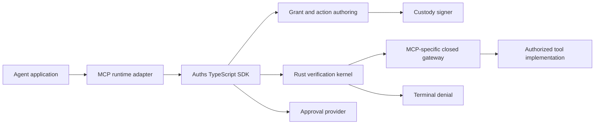
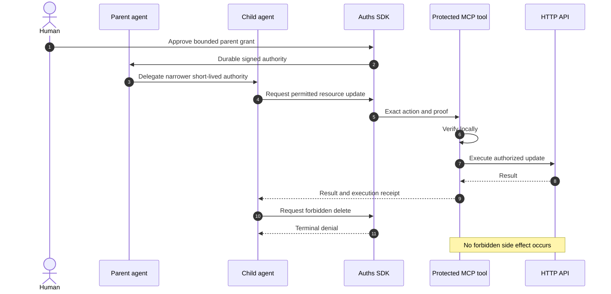

# Auths: Product and Go-to-Market Strategy

## Purpose

This document is the operating brief for turning Auths from a strong protocol
and proof kernel into an open-core, venture-scale product.

It is written so that another engineering agent can execute against it. It
separates decisions from hypotheses, defines the first product wedge, and
names the evidence required before expanding the product or committing to a
commercial model.

Auths is prelaunch and pre-audit. This strategy must not describe planned
features as shipped, formal models as full-system proofs, or market hypotheses
as customer facts.

## The ambition

Auths should become the standard way to attach bounded, delegable authority to
software actions.

The protocol remains open and useful without an Auths-operated service. A
company can be built around the operational products that make the protocol
easy to adopt, govern, observe, and integrate at scale. Hosted and on-premises
offerings are both part of the long-term opportunity, but neither may become a
runtime dependency of the open verifier.

The first market is not “all authorization.” It is developers building AI
agents—especially agent-framework builders and teams building internal
agents—who need those agents to take real actions without giving them ambient,
unbounded credentials.

The entry point is a polished SDK. Not a CLI.

## The problem

Authentication answers a useful question:

> Who or what is presenting this credential?

It does not, by itself, answer the question an executing system needs:

> Was this actor given authority for this exact action, under these exact
> constraints, through a valid chain of delegation?

Agents make that gap more visible. An agent may be authenticated, connected to
an MCP server, and holding a valid API credential while still having far more
authority than its current task requires. Conventional mitigations often put
the safety boundary in prompts, application conditionals, a remote policy
service, or a broadly scoped bearer token.

Auths makes authority an explicit object that can be narrowed, carried with an
action, and verified locally before a side effect occurs.

This is not an argument that identity systems, OAuth, API gateways, or cloud
IAM are badly designed. They solve important problems within a long and
complicated legacy. Auths addresses a different layer: proof that a particular
action falls within explicitly delegated authority.

## Product doctrine

These are product constraints, not optional positioning.

### 1. Authority is distinct from identity

Auths may use many ways to establish control of a principal: raw keys,
`did:key`, WebAuthn, KERI, SPIFFE, hardware-attested keys, or future methods.
No single identity method owns the protocol.

Identity establishes who controls a verification method. Authority establishes
what that principal may do. Product APIs, storage types, and user-facing
language must preserve this distinction.

### 2. Authority travels with the action

An action is accompanied by the proof material needed to evaluate its
authority. Any policy document that accompanies the action is not trusted
merely because it is present. Its identity or digest must be committed by a
signed grant or locally trusted context, and the verifier must confirm that the
received policy is exactly the committed policy.

### 3. Verification works locally

Core verification must not require an Auths-hosted service, network round trip,
or account. Headless and on-premises deployments are first-class.

Hosted products may distribute configuration, manage organizations, retain
receipts, and improve operations. They must not turn the open protocol into a
thin client for a mandatory control plane.

### 4. Delegation only narrows

A parent can give a child less authority, never more. The child cannot expand
permissions, resources, duration, audience, budgets, or remaining delegation
depth.

A process restart does not reset authority. An agent that retries an
out-of-scope action remains outside its grant and receives the same terminal
denial.

### 5. Human supervision is configurable inside the boundary

Some users want autonomous agents that can operate freely within a grant.
Regulated teams may require approval for every consequential action. Auths
must support both without confusing supervision with authority.

Approval policy determines when a human must sign off on an otherwise
authorized action. It cannot enlarge the agent's underlying authority.

### 6. Profiles remain vertically bounded

An MCP tool call, an HTTP request, a Stripe operation, and a database mutation
have different action semantics, credentials, gateways, and receipts. Shared
protocol machinery must not collapse them into a generic operation-tag
executor.

New profiles should be implemented vertically. A shared abstraction is earned
only after multiple completed profiles demonstrate the same invariant and
lifecycle.

### 7. Claims must match evidence

Lean, Charon, Aeneas, Kani, conformance corpora, fuzzing, unit tests, and
integration tests provide different kinds of evidence. They strengthen the
product together; none justifies claiming that the entire system is formally
verified or free of security defects.

The shipped Rust path, generated formal artifacts, fixtures, independent
implementations, and CI gates must remain connected so that semantic drift is
observable.

## The first product

The first product is a TypeScript SDK backed by the Rust Auths kernel.

It should let a developer attach an agent to Auths, give that agent bounded
authority, wrap an MCP tool surface, delegate a narrower grant to a child, and
receive an actionable authorization result before execution.

“Attach an agent to Auths” is the activation moment. It should be achievable
without first operating an Auths service or learning the wire format.



The TypeScript layer should be polished and idiomatic rather than exposing the
Rust ABI directly. Rust remains the semantic core. Additional SDKs are added
only after the first TypeScript integration demonstrates which concepts
developers actually need.

An illustrative API—not a frozen interface—might look like:

```ts
const securedAgent = await auths.attachAgent({
  agent,
  runtime: mcp(server),
  authority: signedGrant,
  approval: {
    mode: "risk-based",
    provider: macOSTouchId(),
  },
  identity: {
    lifecycle: "durable",
    custody: secureEnclave(),
  },
});
```

The SDK should expose a small number of comprehensible concepts:

- a principal and signer;
- a bounded grant;
- parent-to-child delegation;
- an exact action;
- an approval policy;
- an authorization decision;
- an execution receipt;
- an MCP-specific protected tool boundary.

The SDK must not make developers assemble CBOR, digest inputs, trusted context,
or registry commitments by hand for the normal path. Those details remain
inspectable and testable.

## Approval and key custody

Approval and custody are ports, not identity methods.

The SDK should define platform-neutral interfaces for:

- approving a grant or action;
- creating or loading a signer;
- signing without exporting private key material;
- reporting whether the signer is hardware-backed;
- representing cancellation, unavailable hardware, and failed user presence.

The first reference desktop integration should target macOS:

- a durable parent-agent key protected by the Secure Enclave where available;
- Touch ID or device authentication as user-presence approval;
- Keychain-backed or passphrase-protected software fallback;
- no private-key extraction from the Secure Enclave.

Touch ID is not the user's identity and a fingerprint does not become key
material. Touch ID authorizes the operating system to use a protected signing
key.

The default identity lifecycle should be:

- durable, hardware-backed identity for a named parent agent when supported;
- short-lived or ephemeral identity for a child or task-specific agent;
- configurable alternatives for headless servers, CI, containers, HSMs, and
  other operating systems.

Approval modes should include:

| Mode | Intended use | Behavior |
| --- | --- | --- |
| Grant-only | Hobbyists and trusted local automation | Human approves issuance; actions inside the grant proceed autonomously |
| Risk-based | General application use | Configured action classes require approval |
| Every-action | Regulated or high-consequence workflows | Every executable action requires fresh approval |
| Custom | Organization-specific controls | The host supplies a policy decision through the approval port |

All four modes operate inside the same cryptographic authority boundary.

## The flagship demonstration

Delegation is the central demonstration because it shows what Auths adds beyond
agent authentication or a conventional tool credential.

The first demo should use an MCP tool that performs a constrained HTTP API
operation:

1. A human creates or loads a durable parent-agent signer.
2. The human approves a bounded grant using Touch ID or a configured fallback.
3. The parent delegates a smaller, short-lived grant to a child agent.
4. The child calls an allowed MCP tool to read or update one specific resource.
5. The request carries the exact-action proof and committed policy material.
6. The MCP profile verifies the proof locally before the HTTP side effect.
7. The closed gateway executes the authorized request and emits a receipt.
8. The child attempts a delete or a request against a different resource.
9. Verification returns a terminal denial and the tool is not called.
10. Repeating or restarting the agent does not change the outcome.



The demo is complete only when a developer can inspect:

- the root authority;
- every delegation edge and attenuation;
- the exact action commitment;
- the approval event;
- the local verdict;
- whether execution occurred;
- the resulting receipt;
- the stable reason for denial.

The demo should work entirely on a laptop. A hosted account may later improve
sharing and observability, but cannot be required.

## Initial customer and distribution wedge

### Primary users

The initial users are:

1. maintainers of AI-agent frameworks and agent runtimes;
2. platform teams building internal agents that call MCP tools or HTTP APIs.

Framework builders provide distribution. Internal-agent teams provide
high-value operational feedback. Both experience the same core problem:
connecting an agent to tools is easier than expressing and enforcing exactly
what the agent may do.

### Initial message

The first message should be concrete:

> Attach an agent to Auths. Give it bounded authority, let it delegate less to
> child agents, and verify every real action before execution.

Supporting messages:

- authority, not just identity;
- local verification without a mandatory service;
- exact-action proofs rather than ambient permission;
- configurable human supervision;
- terminal denial that survives retries and restarts;
- inspectable delegation and execution receipts.

Avoid leading with formal methods, decentralized identity, crypto-agility, or
an exhaustive list of domains. They are important foundations, not the
developer's first job to be done.

### Distribution order

1. Publish the flagship MCP delegation demo.
2. Recruit a small number of framework maintainers and internal-agent teams as
   design partners.
3. Integrate the SDK into real agent applications with them.
4. Turn repeated integration work into stable TypeScript APIs and MCP helpers.
5. Publish reusable examples, adversarial fixtures, and conformance guidance.
6. Add framework-specific adapters only when actual integrations justify them.
7. Use observed operational pain to decide whether a CLI, visual inspector,
   hosted service, or on-premises control plane should be built.

There is no initial CLI workstream. CLI requirements should be discovered from
the SDK and demo work. A CLI may later become useful for inspection, policy
authoring, development fixtures, or operations, but none of those uses is
assumed yet.

## Open-core boundary

The current direction is:

### Open

- protocol specification and canonical encodings;
- verifier and formal models;
- core Rust implementation;
- TypeScript SDK needed to create and verify proofs locally;
- authoring libraries and signer interfaces;
- MCP profile and reference integration;
- fixtures, conformance suites, and adversarial examples;
- local approval and custody interfaces;
- enough tooling to build and operate Auths without an Auths-hosted service.

### Potential commercial products

- hosted organization and trust management;
- on-premises enterprise control plane;
- policy distribution and lifecycle operations;
- fleet-wide agent and grant inventory;
- durable receipt retention, search, and export;
- enterprise approval workflows;
- managed integrations with existing identity, KMS, HSM, SIEM, and workflow
  systems;
- compliance-oriented reporting and governance;
- support, deployment assistance, and assurance packages.

This boundary is a hypothesis. The company should charge for operational
coordination, governance, integration, and service—not for weakening the
standalone open protocol or placing an artificial toll on local verification.

Pricing, packaging, and the first economic buyer are deliberately unresolved.
They require evidence from design partners.

## What not to build yet

Do not build these merely because they appear plausible:

- a general-purpose CLI;
- a hosted verification dependency;
- a broad identity platform;
- a universal policy language;
- connectors for every identity provider and cloud;
- wrappers for every agent framework;
- generic profile dispatch driven by operation tags;
- a large visual control plane;
- compliance claims or predesigned compliance packages;
- speculative pricing tiers.

Build a candidate only after the SDK work exposes a repeated problem, a design
partner confirms its value, and its ownership boundary is clear.

## Execution program

The tracked
[Post-Milestone 6 Productization and Release Plan](../target-state/POST_MILESTONE_6_PRODUCTIZATION_AND_RELEASE_PLAN.md)
governs technical order. The specifications below are phase-aligned workstreams,
not a competing Stage 1–5 implementation sequence.

```text
Phase 7 RC -> Phase 8 exact claim -> Phase 9 independent review
                                           |
                                           v
                             Phase 10 SDK + local MCP preview
                                           |
                                           v
                         Phase 11 runtime + deployable custody
                                           |
                                           v
                       Phase 12 conformance -> Phase 13 flagship
                                           |
                                           v
                              Phases 14–15 workbench + public v1

Commercial discovery:  =========================================>
Partner recruitment:             =====>
Restricted integrations:               =========>
Customer-operated pilots:                            ===========>
```

### Phase 7 prerequisite: one Auths identity

[Specification: AP-SPEC-034, Auths public naming
consolidation](../specs/0034-auths-public-naming-consolidation.md)

Before release artifacts are frozen, align the product, package, documentation,
predecessor, website, and release identities under Auths. The proof protocol
remains an explicit component boundary; it is not a competing product name.

### Phases 7–8: reproducible candidate and exact claim

[Specification: AP-SPEC-032, Reproducible release candidate and exact
assurance claim](../specs/0032-reproducible-release-candidate-and-exact-assurance-claim.md)

Freeze semantic identities, prepare reproducible and attestable artifacts,
promote one immutable RC without rebuilding, and bind every public assurance
claim to its exact subjects, evidence, assumptions, and exclusions.

### Phase 9: independent review and remediation

[Specification: AP-SPEC-033, Independent review and remediation
gate](../specs/0033-independent-review-and-remediation-gate.md)

Submit the fixed RC and claim bundle to formal-methods, Rust/protocol-security,
and stateful-execution reviewers. Every finding receives an owner, affected
claim, regression obligation, remediation revision, and independent retest.
No unresolved critical finding may pass the gate.

### Phase 10: TypeScript and MCP developer preview

- [AP-SPEC-027: TypeScript SDK developer
  preview](../specs/0027-product-grade-typescript-sdk.md)
- [AP-SPEC-028: MCP delegation reference
  application](../specs/0028-mcp-delegation-reference-application.md)

The SDK is the first developer product, but its Phase 10 publication is an
explicit preview rather than GA. The MCP vertical is local, synthetic,
sandboxed, or demonstrably reversible and is not the Phase 13 production
flagship.

### Phases 10–11: approval and custody

[Specification: AP-SPEC-029, Human approval and platform
custody](../specs/0029-human-approval-and-custody.md)

Phase 10 defines provider-neutral contracts, committed supervision policy,
records, and deterministic fake providers. Phase 11 owns native helpers,
Secure Enclave, software and headless custody, packaging, recovery, and scoped
security assessment. Required and executed approval-policy commitments must
match before prompting, signing, credential acquisition, or provider I/O.

### Phases 9–13: design-partner program

[Specification: AP-SPEC-030, Design-partner integration
program](../specs/0030-design-partner-integrations.md)

Recruit three to five partners during Phase 9. Restrict early effects to the
review-preview boundary. Begin consequential customer-operated pilots only
after the applicable Phase 11 gates, and require at least two non-core
maintainers plus reviewed flagship evidence before program closure.

### Phase 7 onward: commercial discovery

[Specification: AP-SPEC-031, Commercial discovery and product
selection](../specs/0031-commercial-discovery.md)

Problem, buyer, workflow, deployment, procurement, and willingness-to-pay
discovery begins alongside Phase 7. Product selection waits for repeated
integration evidence, a credible buyer and pilot path, an approved commercial
boundary, and willingness-to-pay evidence. No ARR target belongs in the
engineering plan before this discovery.

### Later technical gates

Phase 11 production runtime, Phase 12 conformance, Phase 13 flagship operation,
Phase 14 workbench, and Phase 15 public-v1 release remain governed by the
tracked target-state plan and require their own execution-ready plans before
implementation. These specifications do not collapse or bypass those gates.

## Metrics

Early metrics should measure product truth rather than vanity.

### Activation

- time from installing the SDK to the first authorized tool call;
- percentage of developers who complete parent-to-child delegation;
- percentage who successfully diagnose the intentional denied call;
- number of concepts or manual artifacts required for the first integration.

### Product quality

- forbidden-side-effect tests passing across every protected gateway;
- conformance agreement across supported implementations;
- semantic or generated-artifact drift caught by CI;
- stability and usefulness of denial codes;
- percentage of examples reproducible from a clean checkout;
- number of security-critical escape hatches in the default API.

### Adoption

- externally maintained SDK integrations;
- active agent applications verifying exact actions;
- design partners using Auths without direct implementation support;
- repeat use across more than one tool or agent workflow.

### Commercial learning

- organizations requesting shared governance or operations;
- hosted versus on-premises preference;
- repeated integration categories;
- buyer, budget, and procurement evidence;
- willingness to pay for a specific operational outcome.

GitHub stars, downloads, and social reach may help distribution, but they are
not substitutes for these measures.

## Strategic risks

| Risk | Consequence | Response |
| --- | --- | --- |
| SDK exposes protocol complexity | Developers abandon the integration | Design around the attach/delegate/protect flow and test with external users |
| “Policy travels” becomes attacker-selected policy | Apparent authorization without trusted authority | Commit the policy identity or digest in signed authority or trusted context |
| Human approval becomes mandatory babysitting | Autonomous use cases become impractical | Keep approval configurable inside a fixed authority boundary |
| Biometrics become confused with identity | Platform coupling and misleading security claims | Treat user presence, custody, and identity as separate ports |
| MCP code leaks into the shared kernel | New domains destabilize existing ones | Preserve profile-specific vertical ownership and closed gateways |
| Formal-method language overclaims assurance | Loss of trust | State exactly what is modeled, translated, checked, and outside scope |
| Hosted product becomes required | Open-core credibility collapses | Maintain fully local, headless, and on-premises operation |
| Product expands before the wedge works | Many demos but no adoption loop | Gate expansion on design-partner evidence |
| A denied agent succeeds through retries | Authority is not actually bounded | Make denial deterministic for unchanged trusted inputs and test restart behavior |

## Durable decisions and open questions

### Decided

- Build an open protocol and a venture-scale company around tools and
  operations for the open core.
- Start with AI-agent framework builders and teams building internal agents.
- Lead with an SDK, not a CLI.
- Use Rust for the core and TypeScript for the first polished developer SDK.
- Make MCP the first runtime adapter and delegation the flagship demonstration.
- Support fully local, headless, hosted, and on-premises deployment models.
- Keep identity methods, approval, custody, networking, and profiles agnostic.
- Use durable parent identities and short-lived or ephemeral child identities
  by default.
- Support configurable human-approval modes.
- Make out-of-authority results terminal for unchanged inputs.
- Require policies traveling with actions to be cryptographically committed.

### Open and intentionally unresolved

- the first economic buyer;
- the first paid product;
- packaging and pricing;
- which hosted and on-premises capabilities customers value first;
- which agent frameworks deserve dedicated adapters;
- whether recurring SDK workflows eventually justify a CLI;
- the order of platforms after the macOS reference provider;
- the long-term identity representation used by default.

These questions should be answered by product evidence, not filled in for the
sake of a complete-looking roadmap.

## Instructions for the executing agent

When using this document to plan or implement work:

1. Inspect the current repository and classify every proposed capability as
   shipped, partial, or absent.
2. Preserve the kernel's offline, effect-free boundary.
3. Read the profile and domain abstraction boundary plan before modifying
   application architecture.
4. Implement one vertical slice at a time.
5. Do not introduce a CLI workstream.
6. Do not add hosted dependencies to the local verification path.
7. Implement custody from this repository's platform-neutral contracts without
   importing identity-method semantics into approval or key storage.
8. Test forbidden side effects, not merely denial return values.
9. Keep policy commitments, executed configuration, and received artifacts
    exact and reviewable.
10. Update claims and plans only when evidence changes.
11. Stop at each phase gate and record what was learned before widening
    scope.

The immediate execution program is AP-SPEC-034 followed by the remaining
AP-SPEC-032 work: establish one Auths identity, produce the reproducible release
candidate, and publish the exact claim bundle. AP-SPEC-033 independent review
follows. AP-SPEC-027 and AP-SPEC-028 remain blocked until that review gate
permits the explicitly labeled Phase 10 developer preview.

## Related architecture

- [Post-Milestone 6 Productization and Release Plan](../target-state/POST_MILESTONE_6_PRODUCTIZATION_AND_RELEASE_PLAN.md)
- [Post-Milestone-6 Technical and Go-to-Market Alignment](POST_MILESTONE_6_TECHNICAL_AND_GO_TO_MARKET_ALIGNMENT.md)
- [Profile and Domain Abstraction Boundary Plan](../target-state/PROFILE_AND_DOMAIN_ABSTRACTION_BOUNDARY_PLAN.md)
- [Greenfield Foundation](../target-state/AUTHS_PROOF_GREENFIELD_FOUNDATION.md)
- [Target Workspace Topology](../adr/0009-target-workspace-topology.md)
- [Production Authority Kernel with Aeneas](../adr/0011-rich-authority-rust-lean-link.md)
