# The Internet Knows Who You Are. Auths Wants It to Know What You’re Allowed to Do.

*For 30 years, online security has revolved around identity, passwords, tokens,
and possession. That model is beginning to break under AI. Auths imagines a
different internet—one where every consequential action can carry its own
precise, verifiable permission.*

> **Future-state note:** This essay imagines Auths after its planned product,
> proof-of-possession, independent-review, release, and usability work is
> complete. It describes the platform's intended destination, not the current
> availability or production-readiness of every capability discussed below.

At 2:17 in the morning, an automated security system notices that traffic is
pouring into a European data center from a botnet. Customers are beginning to
time out. The company that owns the service—call it Northstar—knows the attack
must be blocked quickly, but its own security team is overwhelmed. A specialist
company, Edgeshield, has an AI agent trained to diagnose exactly this kind of
incident.

In today's world, giving that agent the power to help is awkward at best and
reckless at worst. Northstar could create an account for Edgeshield inside its
cloud, negotiate a federation between the companies' identity systems, issue a
temporary API token, or place one of its own employees in front of a console to
approve each step. Every option takes time. Most give away too much authority.
The cloud role capable of changing one firewall rule may also be able to change
thousands of others. The token that is needed for ten minutes may remain useful
for hours. If it leaks, whoever possesses it may inherit its power.

Now imagine a different exchange. Northstar gives Edgeshield's agent permission
to perform two exact operations, in a fixed order, against two named resources,
in one region, before a deadline, once each. The permission cannot be widened.
It is valid only for the plan both companies approved. The agent never receives
Northstar's cloud credential. If it changes a target, substitutes a command,
waits too long, repeats a completed step, or tries to delegate more power than
it received, the request fails. When the work is done, both companies receive
evidence that can prove what was authorized and what happened—without spraying
the sensitive details of the incident across every log and dashboard.

This is the world Auths is designed for.

Auths begins from a deceptively simple observation: the internet has become
good at asking **who are you?**, but it remains surprisingly clumsy at
asking **why are you allowed to do this exact thing?**

That gap was tolerable when software mostly followed scripts written in
advance. It becomes dangerous when software is given goals.

## The credential problem hiding inside the AI boom

An ordinary software service behaves within a narrow corridor. A payroll job
runs the payroll queries its developers wrote. A deployment pipeline performs
the sequence encoded in its configuration. These systems often hold broad
credentials, but their behavior is constrained by code and operating
procedures.

An AI agent is different. It decides what to inspect, which tools to call, how
to sequence them, and when to revise its plan. That flexibility is the point.
Yet the agent usually enters the world through the same old doors: API keys,
OAuth tokens, cloud roles, database passwords, service accounts. Its behavior
is dynamic; its authority is ambient.

This mismatch is becoming one of the defining security problems of the agentic
era. A model asked to refund one customer may receive a credential capable of
refunding every customer. A coding agent asked to update one repository may
hold a token that can delete an organization. A cluster-management agent asked
to repair a failed node may inherit the ability to decommission a region. The
agent need not be malicious. It can be confused, prompt-injected, or wrong.

The usual response is to put a human in the loop. But “ask a person before
anything important” does not scale, and it often produces security theater. A
tired operator approves a vague intention while the system later constructs
the actual command.

The alternative is not unlimited autonomy. It is exact autonomy: freedom
inside boundaries that the agent cannot reinterpret.

That is the category Auths is trying to create. It is not primarily another
login system, another vault, another policy editor, or another gateway. It is
an authority layer between intention and effect.

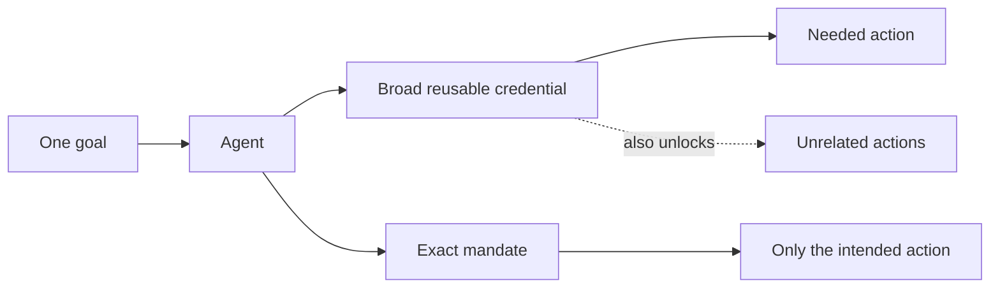

## A permission that travels with the action

Most digital permission is attached to an identity or a credential. Alice is
an administrator. This workload has a production role. This token has the
`write` scope. The system receives a request, looks up what the caller may do,
and decides whether the operation fits inside that standing power.

Auths turns the relationship around. Authority can travel with the exact action
it is meant to authorize.

Think of it less like a master key and more like a tamper-evident work order.
The work order names the job, the site, the time window, the permitted operator,
the number of uses, and any required countersignatures. It cannot open unrelated
doors. If someone edits the instructions, the seal no longer matches. If the
operator assigns part of the work to a subcontractor, the subcontractor's work
order can be narrower but never broader. When the job is complete, the work
order cannot simply be used again.

The digital version can be far more exact. Authority may be limited by
operation, resource, namespace, region, amount, expiry, use count, delegation
depth, approval threshold, or position inside an ordered plan. It can commit to
the exact bytes representing the action. The recipient can verify it locally,
without asking a central Auths server whether “allow” still means allow.

This model is sometimes described as proof-carrying authorization. The request
does not merely arrive with an identity and hope the recipient has assembled
the same context. It carries a verifiable explanation of its authority.

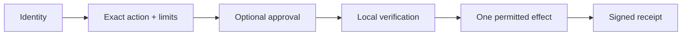

The distinction sounds subtle until something goes wrong. A signature proves
that a key signed bytes, not that the key was allowed to request the effect. An
encrypted connection protects communication, not permission. A human approval
confirms a transaction but does not create the requester's underlying power.

Auths keeps these facts separate, then binds them together for one effect.
Identity, authority, action, approval, and receipt are related, but none can
masquerade as another.

That separation is why the idea could extend beyond any one generation of AI
tools. Agents make the problem visible. The underlying problem belongs to all
software that acts.

## The ability to give away less

Security systems often describe delegation as a hierarchy. A company gives a
team a role; the team gives a service a credential; the service lets an agent
use it. At each hop, actual power can become hard to see. A child system may
inherit the broad authority of its parent even if it needs only a fraction.

Auths treats delegation as attenuation: authority may stay the same or become
narrower, but it must not expand.

If Northstar permits Edgeshield to block one malicious network range in one
region, Edgeshield cannot delegate permission to reconfigure Northstar's entire
edge. If a financial controller authorizes an agent to prepare a payment under
£5,000, the agent cannot create a child grant for £50,000. If a hospital allows
a research service to read de-identified records from one cohort for seven
days, a subcontracted model cannot quietly inherit access to identifiable
records or a different cohort.

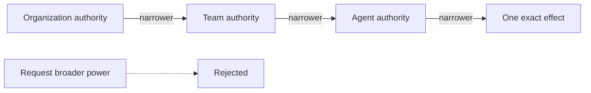

This goes beyond least privilege as commonly practiced: selecting the
least-powerful available role. Roles still describe categories of future
behavior. Exact authority moves the unit of permission closer to the unit of
intent: “what is the narrowest statement that permits this effect?”

This could produce a different kind of autonomy: not a binary choice between a
helpless assistant and an all-powerful bot, but a continuously adjustable
boundary around machine action.

## Liquid on the outside, solid at the point of consequence

Auths is built around another tension. The modern internet is heterogeneous.
Companies use different identity providers, clouds, key systems, networks,
databases, approval tools, and programming languages. Any authority layer that
requires them all to adopt one identity or one transport before they can
cooperate is unlikely to become infrastructure.

So the platform must be liquid at its edges.

One organization might use a cloud identity provider and hardware-held keys.
Another might use passkeys for people, P-256 on devices, Ed25519 for services,
and a post-quantum suite for archives. Requests could travel over HTTPS, Iroh,
a queue, or an offline transfer. Approval could come from an enterprise
workflow, a hardware key, or two organizations countersigning the same plan.

None of those components should receive privileged status. Transport must not
become permission. Identity must not become permission. A fashionable
cryptographic suite must not become the architecture.

But the platform must become solid at the point of consequence. Sending money
is not generically the same as changing a Kubernetes deployment. Applying an
infrastructure plan is not the same as updating a database row. Each has its
own meaning of “the exact action,” its own moment of irreversibility, its own
way of observing success, and its own dangerous ambiguities.

A payment processor may accept a charge even if the network times out before
the caller sees the response. A database can compare an expected value inside
a transaction. A cloud deployment may continue after the controlling process
crashes. A robot's physical action cannot be undone by rolling back a row.

Auths cannot preserve exactness by feeding all of these through a universal
box labelled `execute`. Each consequential domain needs a closed definition of
what may enter, what must be checked, what command may leave, and what can
truthfully be claimed afterward.

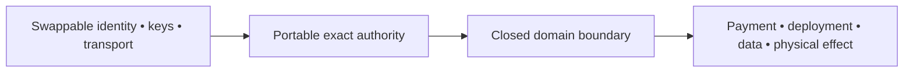

This is the deeper meaning of a liquid surface with hard edges. The identities,
keys, transports, and supporting infrastructure can flow. The meaning of an
effect cannot.

## Beyond “allow” and “deny”

The clean diagrams in security presentations usually end when a policy engine
returns “allow.” The messy world begins one millisecond later.

Two workers may race to use the final unit of authority. A process may crash.
A cloud provider may perform a change and then drop the connection. An agent
may treat a timeout as failure and retry an operation that already succeeded.
The outside world may also have changed since approval.

For low-consequence software, these are reliability bugs. For payments,
infrastructure, healthcare, industrial systems, and autonomous agents, they are
authorization bugs too.

Auths imagines authorization as a lifecycle rather than a moment. An exact
action is checked, durably reserved, executed through a constrained gateway,
observed, and committed. If the outside world returns an ambiguous result, the
system does not silently translate uncertainty into success, failure, or
permission to try again. It records that the outcome is unknown and provides a
way to resume or reconcile against reality.

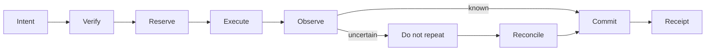

This matters because “fail closed” is often misunderstood. Refusing a malformed
request is easy. Failing closed after a remote system may already have changed
is harder. Sometimes the safe answer is not “denied.” It is “do not repeat this
until we know what happened.”

This becomes crucial in long plans across multiple systems. Moving a live
service between regions might involve reserving capacity, adjusting routing,
draining workloads, updating firewalls, verifying health, and releasing the
old cluster. An authority-aware workflow must know not only which steps ran,
but which were permitted, consumed, uncertain, and still safe to continue.

The future of machine authorization will be less about producing more “allow”
decisions and more about preserving meaning through time.

## The receipt problem

When software performs consequential work, people eventually ask what happened.
The answers they receive today are scattered across policy logs, identity logs,
cloud audit trails, application events, approval systems, and ticketing tools.
Reconstructing one action may require correlating timestamps and trusting that
every component described the same transaction.

Auths uses receipts to bind the story together. A receipt can connect the
authority, exact command, context, decision, observed effect, and position in a
larger plan. It can be verified after the fact and in another system. The
evidence is not merely “Alice was logged in” or “the API returned 200.” It is a
cryptographic account of why this action was permitted and what the execution
boundary observed.

Yet receipts create their own danger. A blob full of hashes may be verifiable
but useless to a human. A fully decoded receipt may expose customer names,
infrastructure topology, medical details, or incident indicators. Auditability
can become surveillance by accumulation.

A mature Auths platform therefore needs bounded disclosure. Someone without
permission may learn only that a valid receipt exists. An operator may see a
safe summary: the affected service, approved operation, time, and outcome. An
auditor with a separate purpose may receive a fuller view. Sensitive details
can remain encrypted and be disclosed according to explicit authority rather
than whatever a dashboard happens to render.

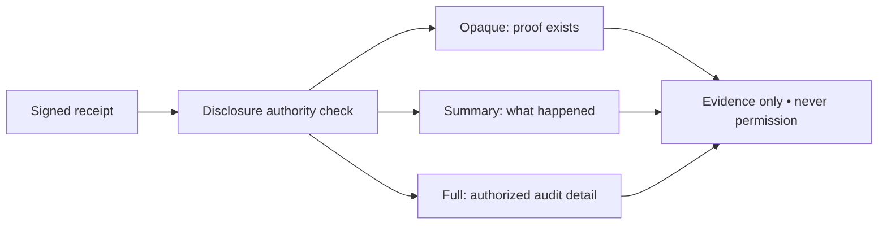

The key is that these views remain inert. Understanding a past action must
never grant the ability to perform it. A receipt is evidence, not a reusable
ticket.

This could become one of Auths' most consequential ideas. The same system that
makes authority precise can make accountability precise too—showing each
audience enough to establish trust without making universal transparency the
price of security.

## The first wave: agents acting on software

The obvious early market is AI agents operating digital systems.

A coding agent could receive authority to modify one repository, open a pull
request, and request a deployment, while the signing and production credentials
remain behind controlled gateways. The authority could bind to a branch, an
artifact digest, a test result, and a destination environment. Passing tests
would not themselves create deployment authority; they would be one fact in an
exact decision.

A support agent could issue one refund within a limit, update one customer's
record, or grant one service credit. It would not possess a bearer token that
works against every customer. An approval could bind to the actual refund
amount and account rather than a vague chat message saying “go ahead.”

A database agent could perform a bounded change only when an expected before-
state still holds. If the data changed after approval, the command would stop
instead of applying the old intention to a new reality.

A security agent could quarantine one host, rotate one exposed integration,
or block one indicator across a defined fleet. Its authority could expire with
the incident and be consumed by the remediation. A receipt could later show
why the action occurred without publishing the sensitive detection details to
every observer.

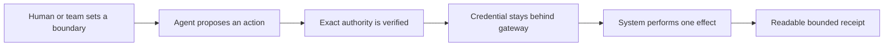

MCP and other agent-tool protocols are a natural starting point because they
make machine tool use explicit. But they are not the destination. Tool calls
are simply the first visible frontier of a much larger transition: software
will increasingly propose effects in every domain, and those effects will need
authority that is more precise than the credentials used to carry them out.

## Money that knows its mandate

Financial systems are built on carefully controlled credentials, limits,
approvals, and ledgers. Even so, authority is often represented as access to an
account or API plus policies enforced inside one institution.

Action-bound authority could make financial intent portable across systems.

An accounts-payable agent might receive permission to pay one invoice, to one
verified supplier, for no more than a committed amount, after two named roles
approve the identical transaction. It would not receive general access to the
company's bank account. A procurement agent might be allowed to negotiate and
place an order within a budget and category, but not change the delivery
destination or split the purchase to evade a threshold. A travel agent could
book a route within dates, carbon limits, refundability requirements, and a
total ceiling.

The same model could govern machine commerce. A vehicle could buy bounded
charging power; a data center, temporary capacity; a service, a dataset or
model call constrained by price, purpose, retention, and use.

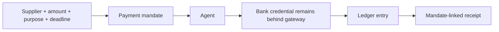

Receipts would not replace financial ledgers. They would explain the mandate
behind a ledger entry: which chain of delegated authority permitted the
transaction, which exact terms were approved, and whether the effect matched
them.

The hard problem is not signing a payment request. Banks already know how to
authenticate instructions. The hard problem is expressing and preserving
purpose across organizations without creating a new bearer instrument that is
as dangerous as the credential it replaces.

If Auths can solve that problem, agents could participate in commerce without
being handed something equivalent to a corporate credit card and a note saying
“be careful.”

## Healthcare without the universal clipboard

Healthcare illustrates both the promise and the risk of portable authority.

Medical data crosses hospitals, laboratories, insurers, research groups,
devices, and patients. Identity federation is difficult, consent is nuanced,
and access logs rarely communicate purpose cleanly. A person may consent to one
study using one category of de-identified data for a fixed period, but the
technical permission often becomes a broader account entitlement.

Auths could let consent and institutional authority travel with a specific data
operation. A research agent might be permitted to run one approved analysis
over one cohort without receiving raw records. A specialist at another hospital
might receive temporary authority to inspect a defined slice of a case. A home
device might transmit one class of measurement to one care team for one episode.
A billing agent might act on financial records without inheriting clinical
access.

The receipt layer would be crucial. Patients, clinicians, privacy officers, and
regulators do not need identical views. The patient may need a comprehensible
account of who used their data and why. A researcher may need proof that an
analysis was authorized without learning identities. An investigator may need
a fuller disclosure under separate authority.

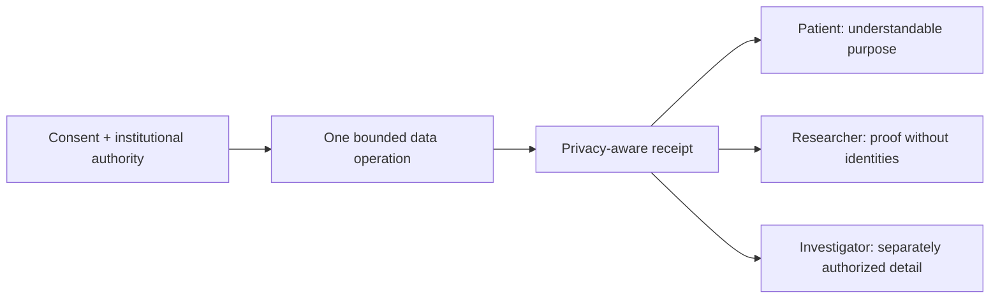

But the danger is equally clear. Encoding authority precisely does not make a
coercive consent process fair. Cryptographic evidence can prove that a policy
was followed while the policy itself remains unjust. A technically elegant
authority graph could also become an extraordinarily detailed map of sensitive
relationships.

Auths can make consent enforceable and inspectable. It cannot manufacture
meaningful consent, medical ethics, or good governance. In healthcare, its
success would depend as much on what it refuses to reveal as on what it proves.

## Infrastructure that can hire help

The Northstar and Edgeshield story points toward a broader transformation in
how organizations collaborate.

Today, cross-company operations usually bring the outsider inside the identity
perimeter. Contractors receive accounts, vendors receive tokens, and managed
services receive roles. The customer then struggles to constrain that access.

Portable authority offers another model: do not make the outside actor an
insider. Give it a cryptographically bounded work order.

A cloud specialist could tune a defined set of resources without receiving a
standing administrator account. An incident-response company could contain one
attack. A database vendor could run one diagnostic operation. A model provider
could process a dataset for one declared purpose. A logistics partner could
update one shipment handoff. A manufacturer could authorize a supplier's robot
to perform one maintenance routine on one machine.

Each organization could retain its identities, keys, approval rules, and
infrastructure. They would agree on the action and evidence needed to verify
it, not on one identity provider or shared root credential.

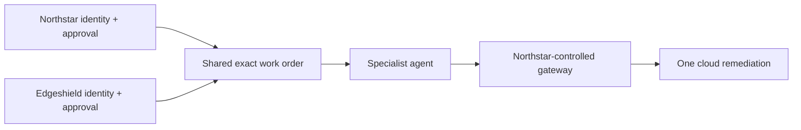

It could also create new markets for specialist agents. A company might hire an
agent for tax reconciliation, security response, cloud optimization, contract
analysis, scientific computation, or supply-chain recovery. The agent's
authority would arrive as part of the work agreement. It could prove that it
stayed within its mandate; the customer could prove which mandate it issued.

Trust would not disappear. It would become narrower and more inspectable.

## The physical world gets an authorization layer

The stakes rise when software leaves the screen.

Robots, vehicles, drones, factories, laboratories, power systems, and buildings
are becoming programmable. Their control systems typically rely on network
segmentation, device identity, operator roles, and safety interlocks. These are
essential, but agentic control introduces the same mismatch seen in software:
a flexible decision-maker receives a credential designed for a predictable
operator or program.

Imagine a maintenance robot authorized to inspect a turbine and replace one
specified component, during a shutdown window, while defined sensors confirm a
safe state. It cannot use the same mandate to operate another machine. A drone
might inspect one corridor below a height limit and before a deadline, without
receiving general fleet authority. A building agent could shed a bounded amount
of energy load during a grid event but not disable life-safety systems. A lab
agent could run one protocol with committed reagent limits and equipment steps.

In these settings, Auths would not replace physical safety systems. A proof is
not a collision detector. A signed receipt is not evidence that a robot's
camera saw everything. Local controllers must retain the ability to stop unsafe
motion regardless of digital authority.

What exact authority could add is a portable mandate above those controls. It
could answer not just whether the device was authenticated and technically
capable, but why this particular physical operation was permitted.

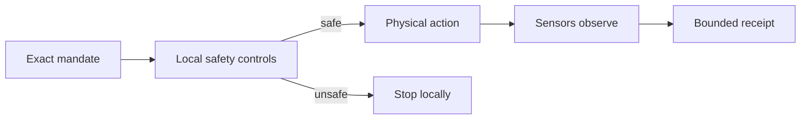

The most ambitious future use may be coordination among machines owned by
different parties: vehicles buying road or charging services, warehouses
accepting delivery robots, grid assets negotiating load, satellites sharing
observation tasks, scientific instruments lending capacity. These systems need
more than secure channels. They need constrained, composable reasons to act.

## Why the old systems are not enough—and why they are still necessary

Auths can sound like a replacement for OAuth, IAM, policy engines, signed
requests, secrets managers, or identity systems. That would be both inaccurate
and strategically foolish.

OAuth handles delegated application access and consent. IAM governs resources.
Policy engines evaluate rules. Workload identity proves which service calls.
KMS and HSM systems protect keys. Signed requests bind messages to signers.

Auths needs these systems. It changes how their facts compose.

An identity provider can establish the actor without defining the actor's
entire authority. IAM can keep the real provider credential behind a gateway
without handing it to the agent. A policy engine can contribute trusted facts
without becoming the portable proof. An approval system can record human
judgment over exact committed bytes. A secure transport can deliver the request
without being mistaken for permission. A hardware key can sign without knowing
the business meaning of every action.

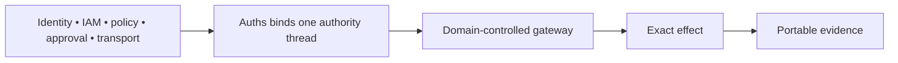

Auths tries to preserve one thread through them: the exact action, bounded
authority, conditions, and evidence afterward.

The internet did not replace databases when it standardized HTTP. It created a
layer through which many systems could communicate. Auths' opportunity is
similar in spirit. It can become connective tissue for authority precisely
because it does not insist on owning identity, transport, policy, custody, and
execution itself.

## An open standard, not a cloud oracle

Infrastructure becomes more valuable when adopters do not need permission from
its owner to trust it.

The strongest version of Auths would keep proof creation, verification, core
semantics, reference workflows, and conformance material open. An organization
could verify authority locally and offline. It could retain its own trust
configuration. A critical action would not wait for a round trip to an Auths
cloud service, and a service outage would not silently change the meaning of
“authorized.”

That does not eliminate a business. It defines a healthier one.

Organizations still need fleet-wide authority governance, approval routing,
trusted configuration, enterprise integrations, receipt investigation,
revocation, recovery, regulation, and operations across clouds or on premises.

The open primitive can be the adoption engine. The commercial platform can be
the operating system around it.

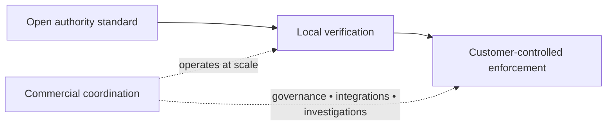

This alignment matters. A company that charges for every verification has an
incentive to make verification dependent on its service. A company that sells
organizational coordination has an incentive to make the underlying evidence
portable and trustworthy, because better evidence makes the coordination layer
more valuable.

Convenience could still recentralize the system. Auths would need to treat exit,
offline operation, and independently consumable evidence as product properties
rather than licensing slogans.

An authority layer for the internet cannot credibly begin by demanding
authority over the internet.

## The new dangers of making permission legible

Every technology that makes power easier to describe also makes it easier to
administer at scale. That is not automatically liberating.

Auths could help a worker understand exactly what an employer's agent is
allowed to do. It could also help the employer construct an exquisitely
detailed system of machine supervision. It could give patients proof of data
use, or give institutions a permanent graph of sensitive relationships. It
could make cross-company cooperation safer, or normalize a world in which
every action is cryptographically attributable and retained.

Bounded disclosure is therefore political architecture, not decoration. Who
may inspect a receipt or correlate it across contexts? How long does evidence
live? Can someone prove compliance without revealing every action? Can an
organization investigate abuse without creating a universal activity ledger?

There is also false certainty. Cryptography can prove that bytes were signed,
a rule evaluated a certain way, and a gateway observed a response. It cannot
prove that the business decision was wise, an agent's data was true, or a
remote provider behaved honestly. Formal proofs also live inside assumptions.

The danger is that a green “verified” badge acquires more social meaning than
the evidence warrants.

A mature Auths product would need to make uncertainty visible. Authorization,
provider acceptance, observed success, reconciliation, and disclosure are
different claims. The interface must resist collapsing them into one reassuring
verdict.

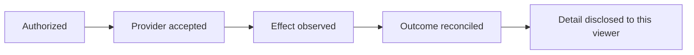

The platform's integrity will depend on saying “we do not know” with the same
precision that it says “authorized.”

## What would make it revolutionary

The components behind Auths are not new in isolation. Capability systems have
long explored delegable, attenuating authority. Cryptography can bind messages
and identities. Macaroons, object capabilities, signed exchanges, policy
engines, transaction systems, audit logs, and formal verification each contain
part of the story.

The possible revolution is product-shaped.

Auths would matter if it made these ideas accessible enough that ordinary
developers could protect one action without becoming capability theorists. It
would matter if the same authority meant the same thing in Rust, TypeScript,
and Python. It would matter if identity and transport remained swappable while
high-consequence effects remained exact. It would matter if agents could
receive narrow autonomy without receiving broad credentials. It would matter
if cross-company software could cooperate without first pretending to belong
to one company. It would matter if receipts became both understandable and
privacy-bounded. It would matter if failures and unknown outcomes remained
honest under crashes, retries, and network partitions.

Most of all, it would matter if exact authority became easier than ambient
authority.

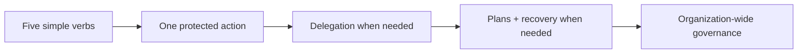

That is a high bar. Security products often fail not because their models are
weak, but because their safer path asks developers to do more work. If the
ten-minute tutorial becomes a two-day integration, teams will return to API
keys. If every useful action requires a bespoke ceremony, agents will be given
broad roles “temporarily.” If receipts cannot be understood, executives and
auditors will keep relying on screenshots and log exports. If independent
review reveals gaps between the formal model and shipping system, the claims
must narrow rather than the marketing expand.

Auths will also need production evidence: hardened custody, durable stores,
regional recovery, monitoring, provider reconciliation, measured performance,
incident response, upgrade governance, and years of adversarial use. Code and
green tests are beginnings, not social proof.

The market will decide whether the first wedge is agent tools, infrastructure,
credentialless APIs, cross-company response, finance, or something unimagined.
The discipline is keeping the first experience small while preserving the
depth underneath it.

## The internet after ambient authority

For decades, the dominant ritual of online power has been simple: establish an
identity, receive a credential, and use it until it expires or is revoked. The
credential is a container of potential. Whoever controls it can select from a
range of future actions.

Auths imagines a shift from potential to intent.

A request would arrive not merely saying “I am this actor” or “I possess this
token,” but “here is the exact action, here is the authority behind it, here is
how that authority narrowed as it travelled, here are the conditions that bind
it, and here is the evidence you can verify yourself.” The recipient would not
need to trust the transport, the caller's framework, or a hosted verdict to
upgrade the request into permission.

Afterward, the system could produce a receipt that answers a different set of
questions: What was allowed? What was attempted? What did the execution
boundary observe? What remains uncertain? What is this viewer entitled to
learn?

This would not end passwords, roles, tokens, policies, or credentials. It would
put a narrower layer in front of their power. The real cloud key, bank
credential, signing key, robot controller, or database account could stay
behind a boundary that accepts only an authorized exact command.

The deepest promise is not that software will gain more power. Software is
already gaining power. The promise is that organizations can give it more
freedom while surrendering less control.

An agent could be imaginative without being omnipotent. A contractor could be
useful without becoming an insider. A service could act without carrying a
reusable secret. A machine could buy, deploy, repair, analyze, or coordinate
under a mandate precise enough for another machine to verify. An auditor could
understand the result without receiving the underlying authority. Two
organizations could collaborate without sharing a root of trust or collapsing
their identities into one directory.

The internet already knows how to move information between strangers. It is
learning how to establish their identities. The next challenge is teaching it
how to move authority without turning authority into a secret someone can
steal.

If Auths succeeds, permission will no longer have to live mainly in accounts,
roles, and bearer tokens waiting to be exercised. It can become something
software carries for one purpose, narrows as it delegates, consumes as it acts,
and leaves behind as evidence.

That is not merely a better authorization API. It is a different grammar for
power on the internet.
