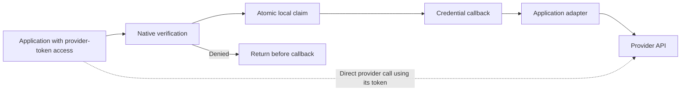
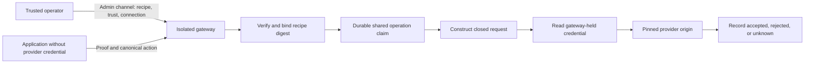
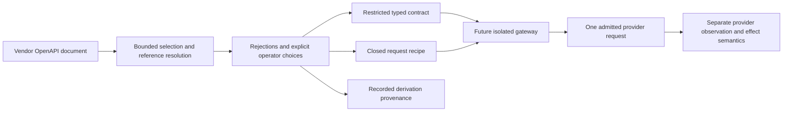
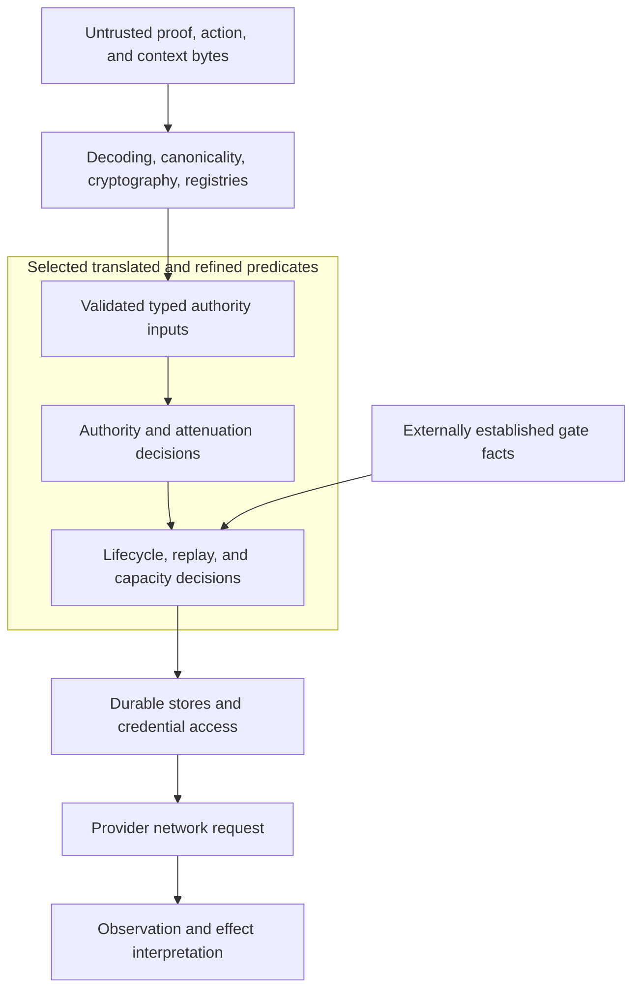

# How revolutionary is Auths Proof, really?

**Assessment date:** 21 September 2026. **Verdict:** a potentially valuable engineering synthesis of established authorization techniques, with meaningful implementation work, but not yet a demonstrated change in the security boundary of general agent tooling.

| Axis | Score | Reason |
| --- | ---: | --- |
| Novelty of mechanism | **3/10** | Exact request binding, attenuated delegation, offline verification, policy evaluation, replay state, and request mediation all have substantial prior art. The proposed combination and developer experience are more distinctive than any primitive. |
| Execution relative to claims | **6/10** | There is real native verification, checked command projection, conservative execution machinery, and substantive formal work. There are also reproduced SDK inconsistencies, a broken generated starter expression, and important products that remain specifications. |
| Strategic defensibility | **4/10** | Portable authority and independently verifiable evidence could become a useful standard. Most immediate buying reasons can also be addressed by incumbents adding argument-aware approval, credential mediation, and durable execution records. |

These are judgments about the reviewed evidence, not measurements of cryptographic strength or market demand. The strongest counterargument is that reliable composition is precisely the innovation: a cross-provider standard can matter without inventing a new cryptographic primitive. The missing evidence is adoption and enforcement outside application-controlled demonstrations.

## Scope, revisions, and evidence rules

The primary snapshot is auths-proof commit **862755f4f62b241085bc8e5529a0d0c6fb35f795**, on codex/self-hosted-developer-profiles. The companion auths-field-lab snapshot is **7c6414ca7b50deb01ec4cf6497e864174faab2f0**. The starting hypothesis is the [GTM thesis, lines 46–67][gtm-primitives].

**Concurrent specification change:** AP-SPEC-056 changed in the working tree during review. Section E distinguishes the committed draft from the revised draft, whose SHA-256 at inspection was **3b73e18af7247a8c6b3391ce5387dd61c85af1f0ac8336f5a60da3787437d638**. That revision adds several remedies for the GitHub case. It is specification evidence, not implementation evidence. It was not changed by this review.

Evidence labels used below:

- **Code inspected:** an implementation or theorem declaration was read; this does not mean it ran successfully.
- **Test present:** a test exercises the stated case in source. Unless explicitly identified as an executed probe, its current result was **not checked**.
- **Executed probe:** a small local experiment was run against current source; its scope and limitations are stated.
- **Recorded live evidence:** a repository claim or local outcome artifact exists. No live provider request was made during this review, and historical provider effects were not independently reverified.
- **Formal evidence:** theorem bodies, translation configuration, and the assurance inventory were inspected. No Lean/Aeneas build was attempted, as requested. Exact-revision hosted qualification results were **not checked**.

The distinction is essential: a valid proof, a successful adapter test, an adapter-reported acceptance, and an observed provider effect establish different things. The project's own [claim ledger, lines 8–18][ledger] makes this distinction more carefully than some of the GTM language.

## A. Lineage: established mechanisms, a potentially useful combination

| Claimed property | Prior art and what it already supplies | Auths-specific increment and remaining boundary |
| --- | --- | --- |
| Authority over an exact action | [AWS Signature Version 4](https://docs.aws.amazon.com/IAM/latest/UserGuide/reference_sigv.html) signs canonical requests. [Sigstore](https://docs.sigstore.dev/about/overview/) binds signatures to artifacts and signing identities. Neither reduces to authorizing an undifferentiated session. | Auths combines a canonical action with a delegated authority proof. In the self-hosted path, the canonical object is an MCP action, not necessarily the final HTTP request; the application still maps it to provider I/O. [AP-SPEC-051 §4][spec51-action]; [execution.py:114][exec-provider]. |
| Delegation and attenuation | [Object capabilities](https://erights.org/talks/myths/index.html), [SPKI/SDSI authorization certificates](https://www.rfc-editor.org/info/rfc2693/), [Macaroons](https://research.google/pubs/macaroons-cookies-with-contextual-caveats-for-decentralized-authorization-in-the-cloud/), [Biscuit](https://doc.biscuitsec.org/reference/specifications), and [UCAN](https://github.com/ucan-wg/spec) all precede this project. They differ in representation, trust, and verification mechanics. | A bounded, typed authority model with translated predicates is an engineering choice, not a new delegation primitive. The relevant refinement theorems are substantive; they assume valid representations. [Production.lean:2330][formal-author]; [Production.lean:2686][formal-delegation]. |
| Offline verification of carried authority | SPKI, Biscuit, UCAN, and [proof-carrying authorization](https://www.cs.princeton.edu/techreports/2001/638.pdf) establish the lineage. Auths should not be described as inventing proof-bearing access requests. | A portable verifier and explicit trusted context can reduce dependence on an online authorization service. The verifier consumes supplied context; offline operation cannot discover a later revocation that is absent from that context. [verifier/lib.rs:909][native-verify]; [verifier/lib.rs:1764][native-status]. |
| Revocable identities | SPKI validity mechanisms, credential status systems, and short-lived workload identities such as [SPIFFE](https://spiffe.io/docs/latest/spiffe-about/overview/) address related lifecycle problems. SPIFFE identity is not itself exact-action authority. | Auths checks status against supplied status/context and evaluation time. The operational task of obtaining sufficiently fresh evidence remains outside the offline theorem. [verifier/lib.rs:2379][native-principal-status]; [verifier/lib.rs:2418][native-grant-status]. |
| Exact arguments plus policy | [Cedar](https://docs.cedarpolicy.com/policies/syntax-policy.html) supports principal/action/resource/context conditions; [OPA](https://www.openpolicyagent.org/docs/security) can decide on structured request input. “Policy engine” does not imply “roles only.” | Signed portable delegation and canonical commitments can add a stronger artifact than an ordinary online policy answer. They do not eliminate the need to mediate execution. [self_hosted.py:423][py-verify]; [execution.py:94][exec-verify]. |
| One-use claim before credential access | Transactional uniqueness, compare-and-set, durable journals, and [provider idempotency keys](https://docs.stripe.com/api/idempotent_requests) are established techniques. | Auths puts the claim into an explicit execution order. Its local file store has a defined single-host scope; it is not a new distributed exactly-once primitive. [attempts.py:41][attempt-scope]; [attempts.py:63][attempt-claim]; AP-SPEC-051 §§3, 6. |
| Confirmed/rejected/unknown, with no blind retry | Distributed systems have long distinguished definite failure from ambiguous delivery. Provider idempotency reduces some ambiguity but does not prove arbitrary external effects occurred exactly once. | The SDK makes uncertainty visible and persists it. That is a useful discipline; the application adapter supplies the outcome classification. [execution.py:119][exec-outcomes]; [claim ledger:10][ledger-outcomes]. |
| Agent cannot obtain the provider credential | Credential brokers, request proxies, and capability-mediated services predate agent tooling. [Nango's proxy](https://nango.dev/platform/request-proxy) and [Arcade's tool authentication](https://docs.arcade.dev/en/build/create-tools/tool-basics/create-tool-auth) already illustrate credential mediation. | AP-SPEC-053 proposes binding a closed request recipe and its digest into authorization, with a separate credential-owning gateway. This is the stronger proposed boundary, and is explicitly unimplemented. [AP-SPEC-053 §§1, 3.1–3.3][spec53]. |
| Agent purchase mandates | [AP2 agent authorization](https://ap2-protocol.org/ap2/agent_authorization/) describes signed, constrained delegation and closed transaction authorization. Its model is broader than a payment receipt alone. | A reusable cross-provider execution and evidence system could differ from AP2 deployment profiles. “AP2 only signs intent; Auths alone binds a transaction” is not supported by the current AP2 specification. |
| Contracts generated from OpenAPI | API code generation and schema-to-type generation are established. | Deriving a deliberately restricted authorization contract and request recipe, with recorded omissions and overrides, could remove repetitive integration work. The restriction choices remain security decisions. [AP-SPEC-056 §§3.2–3.4][spec56-map]. |
| Formal assurance | Refinement proofs and verified policy kernels are established methods. | Translating shipping predicates and linking them to richer authority semantics is valuable execution work. This does not by itself establish a new authorization mechanism or prove the complete provider path. [qualification.toml:189][formal-translations]; Section G below. |

**Conclusion:** no individual mechanism reviewed establishes a new security category. The plausible novelty is a coherent, developer-accessible package combining portable delegated authority, exact command projection, conservative execution, and eventually credential isolation. **Strongest counterargument:** a package that makes previously impractical guarantees cheap can be revolutionary in practice. That case needs measured integration cost and independent deployments; the current adoption claim does not yet supply them. The claim should be narrowed in the [GTM thesis:46][gtm-primitives], rather than weakening the implementation's existing boundaries.

## B. Specified, built, tested, and demonstrated are different columns

“Present” means the particular evidence exists, not that the entire property has been proven. “Absent” means absent from the reviewed implementation/evidence set; uninspected deployments remain **not checked**.

| Property | Specification | Code path | Test that exercises it | Live evidence |
| --- | --- | --- | --- | --- |
| Native verification and command projection from verified bytes | **Present:** AP-SPEC-051 §§4–5; 054 §5.2 | **Present:** [Python projection:423][py-verify], [TS projection:373][ts-verify], [native MCP canonical decoder:100][mcp-decode] | **Present:** [Python exact projection/mutation:41][py-tests]; [TS integration:60][ts-tests]. Current suite result not checked. | **Present, limited:** ledger reports live provider read-backs using development authority; not independent production proof. [ledger:13][ledger-demo] |
| Explicit production authoring inputs and external signing | **Present:** AP-SPEC-052 §3, Epic 2 | **Present:** structural checks and signer-response binding in [authoring.py:46][author-inputs], [authoring.py:178][author-signing] | **Present:** [authoring tests:121][author-tests], including missing/invalid inputs | **Absent:** independent operator provisioning and custody deployment evidence in reviewed demos; they use self-trusting testkit authority. [ledger:13][ledger-demo] |
| Denial and replay before this runner's credential callback | **Present:** AP-SPEC-051 §6; 052 §3, Epic 3 | **Present:** [execution.py:94–114][exec-verify] | **Present:** [denial/replay counters:69][exec-test-denial] | **Absent:** no live trace independently checked. Demo runner wiring is present, not evidence that all application code obeys the gate. [Airtable runner:105][air-runner] |
| Durable one-use reservation | **Present:** AP-SPEC-051 §6 | **Present:** [FileAttemptStore:63][attempt-claim]; local POSIX scope | **Present:** [restart:22][attempt-test-restart], [competing claims:35][attempt-test-race], [recovery:43][attempt-test-recovery]. Competition test uses local threads. | **Absent:** distributed or fault-injected deployment evidence for this file store |
| Persist unknown and do not retry writes during reconciliation | **Present:** AP-SPEC-051 §6; 052 §3, Epic 3 | **Present:** [execution.py:119][exec-outcomes], [read-only reconciliation:143][exec-reconcile] | **Present:** [unknown persistence:105][exec-test-unknown] | **Absent:** an independently observed live ambiguous-delivery/crash case |
| Application cannot bypass authorization using the provider token | **Present as a future boundary:** AP-SPEC-053 §§1, 3.3; explicitly excluded by 051 §2.1 | **Absent:** self-hosted application owns adapter and credential. [execution.py:1][exec-boundary]; [Airtable provider:39][air-token] | **Absent:** hostile application versus isolated gateway test | **Absent:** gateway isolation deployment |
| Recipe digest binds exact outbound request construction | **Present:** AP-SPEC-053 §§3.1–3.3 | **Absent:** proposed gateway/compiler; current CLI dispatchers expose profile commands, not the specified gateway. [Python CLI:598][py-cli-dispatch]; [TS CLI:445][ts-cli-dispatch] | **Absent:** implementation-level hostile recipe/SSRF/credential-isolation qualification | **Absent** |
| Cross-language schema, enum, and canonical-action compatibility | **Present:** AP-SPEC-054 §5; 055 §§3–5 | **Present, incomplete agreement:** [Python fields:39][py-fields], [TS fields:87][ts-fields]; discrepancies reproduced in Section D | **Present:** [Python shared enum actions:285][py-enum-vectors], [Rust shared enum actions:596][rust-enum-vectors]. Two positive action vectors do not cover the reproduced cases. | **Absent:** independent cross-language deployment evidence |
| OpenAPI-derived contracts and recipes | **Present, draft:** AP-SPEC-056 §§3, 5 | **Absent:** no derive command in the reviewed [Python][py-cli-dispatch] or [TS][ts-cli-dispatch] dispatcher | **Absent:** executable vendor derivation corpus; Section E is a manual case study | **Absent** |
| Shared budget/capacity enforcement | **Present:** AP-SPEC-025 §§6, 8, 11, 13, 18; lifecycle formal inventory | **Present:** [bounded-policy kernel:28][bounded-kernel], [PostgreSQL lifecycle transaction:714][pg-transaction]. This is distinct from the self-hosted runner's file claim. | **Present:** [in-memory capacity concurrency test:1648][pg-tests]; this does not exercise PostgreSQL. Current result and throughput not checked | **Absent:** benchmark or production contention/failover evidence inspected |
| Formal authority and lifecycle refinement | **Present:** assurance manifest and qualification configuration | **Present:** [authority theorem:2330][formal-author], [lifecycle theorem:168][formal-lifecycle-proof] | **Present:** theorem sources and declared qualification gates. Proof replay/CI result **not checked**. | **Absent:** formal proofs do not constitute live provider evidence |
| Independent unfamiliar-developer adoption | **Present:** AP-SPEC-052 §3, Epic 4; 054 §9, Epic 5 | **Present:** packaged consumer and conformance tooling. [Python consumer:1][py-consumer]; [TS packed tests:10][ts-packed] | **Present:** maintainer-authored smoke tests; **absent:** a participant report in the reviewed adoption commit | **Absent:** disclosed trial report with elapsed time, interventions, and independently achieved provider integration |

The specs themselves are appropriately qualified: 051 and 052 say implementation is in progress; 053 and 054 are draft; 055 and 056 are also draft even though enum implementation is already present. Status labels alone therefore neither prove completion nor prove absence. Compare [051:3][spec51-status], [052:3][spec52-status], [053:3][spec53-status], [054:3][spec54-status], [055:3][spec55-status], and [056:3][spec56-status] with the code above.

### What would stronger evidence require?

1. **Exact-action correctness:** a hostile cross-language corpus covering contract parsing, typed projection, canonical action bytes, commitments, proof verification, and provider request equality. Generated profile vectors currently contain argument JSON; the richer shared enum fixtures only partially close the gap. [Python vector generator:390][py-vectors]; [TS vector generator:256][ts-vectors]; AP-SPEC-054 §5.2.
2. **Non-bypassable execution:** a deployed AP-SPEC-053 gateway, app and admin separation, credential access restrictions, stable replay scope, and a hostile application test that tries both direct provider calls and gateway request substitution. Fix ownership is the unimplemented gateway work in AP-SPEC-053 §6; present-tense claims belong in the [GTM gateway discussion:211][gtm-product4].
3. **One-use under failures:** crash tests around claim persistence, credential acquisition, provider entry, response loss, and restart, plus a shared transactional deployment test for multiple hosts. The [file-store scope:41][attempt-scope] explicitly excludes treating a local store as that distributed deployment.
4. **Independent adoption:** publish the report required by AP-SPEC-054 §9, Epic 5, including participant/agent identity, prior context, interventions, setup time, and outcome. Adding fake-provider scenarios is useful but is not evidence that such a trial happened. [054 adoption requirements:475][spec54-adoption]; [conformance implementation:1][py-conformance].

**Conclusion:** the implementation supports a narrower and more credible claim than “the full system is proven.” **Strongest counterargument:** the authors already say this in the claim ledger and draft status lines. That is correct; the criticism is the inconsistent compression of those boundaries in product claims and commit titles, not concealment in the technical specifications.

## C. The bypass question: enforced within the runner, voluntary at the application boundary

Inside run_once, the order is code-enforced: verify; reject a denied/indeterminate result; check the expected command; claim the action/operation; call the credential callback; invoke the adapter; persist the adapter outcome. There is no credential callback before the denial/replay returns in that function. The corresponding counter-based test exists. [execution.py:94][exec-verify]; [execution.py:111][exec-claim]; [test_self_hosted_execution.py:69][exec-test-denial].

But the application owns the function call, adapter, token source, and store. It can omit run_once and call its provider client directly. The Airtable adapter ultimately invokes the application's update method; the Todoist adapter invokes its create method. Neither direct provider method requires an Auths proof. [Airtable provider.py:121][air-adapter]; [Todoist provider.py:163][todo-adapter].



The demos preserve the intended runner ordering, using a per-run FileAttemptStore and the run identifier as operation key. That protects reuse within that configured scope; it is not a provider-wide logical-operation registry. [Airtable runner.py:105][air-runner]; [Todoist runner.py:101][todo-runner]. AP-SPEC-053 §3.1 separately requires a stable logical operation identifier so that obtaining a new challenge cannot reopen the same operation.

There is an even narrower counterexample to “the demo never obtains a credential before authorization”: Airtable's guided live flow loads the token, creates the provider, and reads fields before the later authorization/prepare/run steps. The lazy token callback in the execute subcommand does not change that earlier read path. This is consistent with the demo's documented scope, but defeats an application-wide reading of the slogan. [Airtable cli.py:83][air-cli-execute]; [Airtable cli.py:93][air-cli-live].

The local file store uses locking, exclusive file creation, restrictive file handling, and synchronization, rather than merely an in-memory seen-set. I looked for a claim-after-credential ordering error and a simple replay reopening path inside the inspected runner/store and did not find either. Its own scope warning and recovery rule are the relevant counterexamples to a stronger distributed claim. [attempts.py:63][attempt-claim]; [attempts.py:134][attempt-lock]; [attempts.py:211][attempt-write]; [attempts.py:41][attempt-scope]. This is at-most-one admission in the configured state domain, not proof of exactly one external effect.

### Would AP-SPEC-053 close the hole?

**For the gateway-held credential, yes in design.** The spec separates the application from the credential-owning process; accepts proof plus canonical action rather than application-supplied outbound requests; binds recipe identity; constructs the request from a restricted recipe; and claims before credential access. AP-SPEC-053 §§1, 3, 3.1–3.3. The deployment separation is partly explicit, so it is inaccurate to call every assumption “silent.”



| Deployment assumption | Why the promised boundary depends on it | Specification or fix owner |
| --- | --- | --- |
| The application cannot read the gateway secret, memory, or admin channel | A separate process with the same effective secret access is not meaningful isolation. | AP-SPEC-053 §3 explicitly calls for separate OS identity and application/admin channels; deployment tests in §6 must establish the effective permissions. |
| The operator, recipe, and trust configuration are outside attacker control | An attacker who can approve its own trust root or malicious recipe can authorize its own request. | AP-SPEC-053 §§3.1–3.2; production provisioning evidence is missing from the demos. [ledger:13][ledger-demo] |
| Every relevant instance shares the intended operation-claim scope | Separate stores or discarded state can allow a second admission. | AP-SPEC-053 §3 explicitly requires transactional shared storage for multi-host operation; [FileAttemptStore:41][attempt-scope] is not its substitute. |
| Outbound request construction stays closed | Redirects, arbitrary origins, dynamic credential headers, callbacks, or unsafe URL expansion can move the credential boundary. | AP-SPEC-053 §3.2 requires pinned HTTPS origins, typed segments, no arbitrary plugins, and redirect/SSRF restrictions. Implementation remains absent. |
| No other credential or access path gives the application the same power | A gateway cannot revoke an unrelated PAT, browser session, alternate integration, or administrator access. | AP-SPEC-053 §1 already limits its guarantee to the gateway-held credential. Organization-wide access inventory is outside that claim. |
| “Accepted” and observation are interpreted honestly | A valid request does not establish business effect or resolve ambiguous delivery. | AP-SPEC-053 §3.3 explicitly distinguishes attempt evidence from qualified provider effects. |

**Conclusion:** today's guarantee is an enforced ordering property of a voluntarily called SDK. The proposed gateway would make it an enforcement property for a specific credential, under meaningful deployment assumptions. **Strongest counterargument:** if only the model is hostile and a trusted host alone possesses the token, the current SDK may already sit inside an adequate system boundary. That is a valid threat model, but the trusted host—not this SDK alone—then supplies isolation. Fix the broad wording in [GTM product 4][gtm-product4] and preserve [execution.py's boundary warning][exec-boundary].

## D. Cross-language integrity: reproduced disagreements, without inventing a verifier exploit

Local probes used Python 3.13.5 and Node 22.23.1. Python imported the current pure-Python contract parser and field validators. TypeScript's current source was transpiled for the experiment; existing compiled dependencies satisfied imports, but the reported pure-helper cases did not call WASM. The input contract had one integer field, and the command name was left implicit.

| Input / experiment | Python result | TypeScript result | Meaning and expected fix location |
| --- | --- | --- | --- |
| Ordinary LF-delimited contract | Accept; command Probe | Accept; command Probe | Baseline agreement. |
| Same contract with CR-only line delimiters | Accept | Reject: invalid profile.toml line | Python splits a broader set of line endings; TS only splits LF/CRLF. Align the two parsers. [Python CLI:61][py-parse]; [TS CLI:22][ts-parse] |
| Same contract with U+2028 between lines | Accept | Reject: invalid profile.toml line | Another parser-language difference. Whether this syntax should be supported is secondary to agreeing on rejection. Same parser owners. |
| UTF-8 BOM represented as initial U+FEFF | Reject | Accept | JS trim removes it; Python strip does not. Specify the accepted input grammar and test both. Same parser owners. |
| Valid profile name probe--name, no explicit command name | Accept; ProbeName | Uncaught TypeError while reading toUpperCase | Both allow the name shape, but the TS default-name generator dereferences an empty segment. Fix [TS CLI:63][ts-command] and add a shared regression; compare [Python CLI:108][py-command]. |
| JSON numeric token 1.0 decoded and passed to integer-field validation | Reject: Python float | Accept as integer 1 | Host-language number representation differs. Fix/define the public projection boundary in [Python self_hosted.py:86][py-integer] and [TS self-hosted.ts:727][ts-integer]. This probe is not a signed-proof verification run. |
| JSON numeric token 1e0, same procedure | Reject | Accept as integer 1 | Same class of mismatch. |
| JSON numeric token -0, same procedure | Accept as integer 0 | Reject negative zero | Python's JSON decoding loses the sign when it produces int 0. AP-SPEC-054 §5.1 rejects negative zero; specify whether rejection is lexical, canonical-wire, or language-value level. Same projection owners. |
| Integer 9007199254740992; boolean true in integer field | Reject both | Reject both | Sought safe-integer and bool-as-int counterexamples; did not find one in these probes. |
| One emoji with max_bytes 3 / 4 | Reject / accept | Reject / accept | Both enforce UTF-8 byte size in these cases. [Python string validator:39][py-fields]; [TS string validator:719][ts-string] |
| Lone high surrogate | Reject | Reject | Sought a Unicode discrepancy; did not find one here. [TS surrogate check:611][ts-unicode]; [Python string validator:39][py-fields] |
| Enum variant with a trailing LF | Reject | Reject | Sought permissive regex/end-anchor behavior; did not find a disagreement. [Python enum:65][py-enum]; [TS enum:109][ts-enum] |

The baseline contract used for the parser probes was:

```toml
[profile]
name = "probe"
version = 1
service = "probe"
tool = "probe"
[arguments]
type = "object"
[arguments.fields.n]
type = "integer"
minimum = 0
maximum = 10
```

Reproduction operations are deliberately small: pass that string and each line-ending/BOM/name mutation to Python parse_contract and TS parseContract; then pass json.loads/JSON.parse results to the respective integer validators using the full safe-integer range. The observed error above comes from the current TS source, not from interpreting a type declaration. [Python parser:55][py-parse-start]; [TS parser:18][ts-parse-start].

**Additional executed finding:** the TS conformance generator emits a call to CONTRACT.decode with TextEncoder-produced bytes. The decode API expects a plain object. Calling that expression against current source rejected with “MCP arguments must be a closed object”; calling decode with the corresponding object succeeded. This fails before the intentional TODOs that ask the developer to supply proof artifacts and wire a fake provider. Fix the generated expression at [profile-cli.mjs:367][ts-conformance], and execute the generated starter in [packed-profile-cli.test.js:10][ts-packed] instead of relying on compilation alone. [decode implementation:183][ts-decode].

### What these probes do not establish

The Python native extension already installed in the local environment lacked canonicalize_mcp_arguments_json, although current Rust source defines and exports it. Attempts to run numeric/duplicate-key canonicalization probes therefore stopped at AttributeError. That is environment/version skew, not evidence that the current source lacks the function. [bindings/python/src/authoring.rs:747][py-native-canonical]; [export registration:1258][py-native-export]. A rebuilt native extension and full signed adversarial cross-language verification were **not checked**.

The native MCP decoder parses, validates, recanonicalizes, and compares bytes. Tests for noncanonical spacing and duplicate nested keys exist. That shared native boundary may reject a noncanonical numeric input before a language projection sees it. [MCP decoder:100][mcp-decode]; [canonical rejection tests:582][mcp-canonical-tests]. Consequently, “the two SDKs disagree, therefore signature verification is bypassable” would overstate these results.

**Conclusion:** the public authoring/parser surfaces do not yet provide the advertised uniform contract, and the generated starter has a concrete execution defect. **Strongest counterargument:** shared Rust canonical verification can preserve the actual security boundary despite helper discrepancies. That counterargument is credible and is why this review reports interoperability defects, not a demonstrated authorization exploit. The release corpus required by AP-SPEC-054 §5.2 should resolve the distinction with evidence.

## E. Scale claim: a real GitHub operation, and a moving draft

The source is GitHub's official [OpenAPI document at immutable revision 814de7ac96e215adeeec999308f41f98f94a15db](https://github.com/github/rest-api-description/blob/814de7ac96e215adeeec999308f41f98f94a15db/descriptions/api.github.com/api.github.com.json), dated 18 September 2026. The downloaded file contains **13,012,129 bytes**, OpenAPI **3.0.3**, and SHA-256 **4fbdc7d0102276803a07f9880d14ed543ba1afc10a4c9fd7bd3782408d9abaf7**. The mutable download and pinned revision were separately fetched and had matching hashes.

The selected operation is **issues/create**, **POST /repos/{owner}/{repo}/issues**. It has one HTTPS server and a required application/json request body. It has no declared root/operation security or securitySchemes. Its required title accepts a string-or-integer union; the root body omits additionalProperties. These are observations of the vendor document, not hypothetical hostile inputs.

### Committed draft versus revised draft

At the reviewed commit, AP-SPEC-056 §3.1 limited documents to 4 MiB, lacked a missing-security declaration override, and §3.2 rejected open-by-default objects and all unions without a repair override. The unchanged GitHub document therefore failed before derivation, and a smaller extraction would still fail on the required title/body/security structure. The revised working-tree §§3.1–3.2 raise the limit to 32 MiB, add a 256 KiB operation slice, and add explicit security-scheme, closed-object, and scalar-union selection overrides. Those changes materially improve this case. [Revised input rules][spec56-input]; [revised mapping rules][spec56-map].

A local expansion of all references reachable from the selected operation, including response schemas, produced **70,346 bytes** of compact UTF-8 JSON, **45 reference occurrences**, **29 distinct references**, and **no reference cycle**. That fits the revised size/reference caps under this measurement. This was a small inspection script, not the future mapper; safe-loader behavior and every parser-wide depth rule were **not checked**.

### Rejection list under revised AP-SPEC-056 §§3.1–3.3

The table continues after each rejection to show the complete mapping workload, rather than stopping at the first failure. Omission of a whole optional field avoids mapping its descendants; retaining it exposes the nested problems listed.

| Vendor construct | Default outcome | Explicit repair or remaining hard boundary |
| --- | --- | --- |
| 13 MB document | Pass revised byte limit; fail committed 4 MiB limit | Revised §3.1 addresses this. Operation-slice measurement above also fits. |
| operationId issues/create | Reject as tool identifier | Supply a compliant tool name, e.g. issues_create, under §3.1. |
| No declared security scheme | Reject | Revised §3.1 permits an explicit bearer declaration, recorded as an override. It cannot be inferred from this schema. |
| Required owner and repo path strings, neither with maxLength | Reject both | Set explicit max_bytes for each under §3.2; encoded path segments then fit §3.3. |
| Body object lacks additionalProperties: false | Reject | Revised §3.2 permits an explicit closed-object declaration. |
| Required title is oneOf string/integer, with no bounds | Reject | Revised §3.2 permits picking string, then supplying max_bytes; or picking integer with a range. The committed draft had no scalar-union override. |
| Optional body string | Reject implicit optionality and missing bound | Omit it, or require it and supply max_bytes. |
| Optional nullable assignee string | Reject implicit optionality and missing bound | Omit, or require a nullable bounded string. Null and absent remain different provider inputs. |
| Optional nullable milestone with string/integer union | Reject | Omit, or require it, explicitly pick a scalar branch, and bound that branch. |
| Optional labels array; no maxItems; items are string/object union | Reject | Omit the whole field. Retaining it still hits a **hard mixed-union rejection**; max_items does not resolve the object branch. |
| Optional assignees array; no maxItems; unbounded string items | Reject | Omit, or require plus max_items and per-item byte bounds. The future implementation must define the nested override path syntax consistently. |
| Optional issue_field_values array; unbounded count; field_id lacks integer bounds; value is string/number/array union | Reject | Omit the whole field. Retaining it encounters a **hard non-scalar union**, including a float branch, beyond merely missing bounds. |
| Optional nullable type string | Reject implicit optionality and missing bound | Omit, or require and bound. |
| Optional parent_issue_id integer with no minimum/maximum | Reject | Omit, or require and supply a safe-integer range. |
| Query/header/cookie parameters | No rejection on this operation: none declared | Their general prohibition is real, but must not be counted as a failure of this selected operation. |
| POST, single required JSON body, fixed HTTPS server | Pass §3.3 | These parts are compatible without rewriting the vendor operation. |
| Responses and provider postconditions | Not derived | §3.3 explicitly leaves responses unused. Successful mapping cannot establish that requested labels, assignees, or other effects occurred. |

A **plausible restricted contract** under the revised draft keeps owner, repo, and a string title; declares bearer authentication and a closed body; renames the tool; supplies small byte bounds; and explicitly omits the eight optional body fields. For example, bounds of 64, 128, and 256 bytes respectively leave substantial room within the 4 KiB worst-case action-arguments budget even after conservative JSON escaping. This is a hand-derived candidate, not output from an implemented command or validated recipe compiler. AP-SPEC-056 §§3.2–3.3 still require compiler acceptance.

That candidate creates an issue in a real API, so “only toy APIs” is too strong. But it buys coverage by narrowing a real operation to a fixed subset. The operator still chooses union branches, field omissions, limits, credential type, and trust. The vendor document also describes fields that can be silently dropped when permissions or features are missing; schema fidelity is not effect fidelity. [Pinned GitHub document](https://github.com/github/rest-api-description/blob/814de7ac96e215adeeec999308f41f98f94a15db/descriptions/api.github.com/api.github.com.json).

There is also a residual mapping problem worth making explicit in AP-SPEC-056 §3.2: assigning min_bytes = minLength does not preserve a character-count minimum. One “é” occupies two UTF-8 bytes but only one character, so it satisfies a byte minimum of two while violating a character minimum of two. The revised default maximum narrows multibyte strings; an explicit widened maximum can admit more ASCII characters than the vendor maximum unless a separate character constraint is retained. This is a specification-level semantic mismatch, not a measured bug in an unimplemented mapper. The fix belongs in [0056's string mapping rule][spec56-map].



**Conclusion:** scale without a bespoke Rust profile per simple request is plausible; scale without per-operation judgment or provider-specific effect knowledge is not demonstrated. **Strongest counterargument:** most useful internal automation may need only a small, fixed request subset, and recorded overrides are a feature rather than friction. That is a credible product hypothesis. AP-SPEC-056 §5's revised vendor corpus and measured rejection wall are the appropriate next evidence, followed by unfamiliar-user completion times—not a generalized coverage claim from this single sample.

## F. Reads: the brief's blanket premise is too broad

The repository does not exclusively govern writes. The records API has an implemented read path: its evaluator checks namespace/record constraints, allowed fields, response-byte limits, expiry, and audience; its service verifies the read proof and stops unauthorized execution. [decision.rs:127][records-evaluate]; [service.rs:357][records-read]. AP-SPEC-024 §§10 and 15 explicitly specify exact reads and their execution. That is a direct counterexample to “the whole stack governs only writes.” It is not evidence that arbitrary Airtable/Todoist reads are gated.

In the self-hosted provider demos, application-owned reads remain outside the exact-write runner: Airtable reads fields before authorization in the guided flow, and reconciliation reconstructs its target from local scope and performs observation. [Airtable cli.py:93][air-cli-live]; [Airtable runner.py:150][air-reconcile]; [Todoist runner.py:145][todo-reconcile]. AP-SPEC-053's first scope is one closed write plus bounded observation; AP-SPEC-056 §3.3 does not derive general response or query authorization.

With a read credential, an application can perform whatever reads that credential and the provider permit: retrieve records, enumerate accessible objects where listing is allowed, repeat those reads, and retain returned data. Whether it can export data to another destination depends on its separate output/network permissions; a write gate on the source provider does not itself constrain that. The actual breadth of these demo tokens was **not checked**. The reason this remains possible is concrete: the application owns the token-bearing provider object. [Airtable provider.py:39][air-token]; [Todoist provider.py:50][todo-token].

**Conclusion:** “agents cannot take unauthorized actions” survives only when “actions” is limited to the mediated operations and every relevant credential path is covered. It is not a confidentiality guarantee for an agent with independent read access. **Strongest counterargument:** exact read authorization is already a supported architectural pattern, as the records API shows. The gap is product coverage and deployment, not an inherent inability of the proof model. Narrow the generalization in [GTM product 4:245][gtm-reads]; broader read coverage needs its own declared operation/response contract, not an implication attached to write proofs.

## G. Formal assurance: substantive predicates, not a proved end-to-end verifier

The formal README states that codecs, cryptography, adapters, clocks, networking, storage, and the whole verifier are outside its boundary. Its later description of the richer production path as still an open gap understates the newer manifest and theorem sources. Both directions of overstatement matter: “only a Boolean toy” is too dismissive, while “the verifier is formally proved” is too broad. [formal/README.md:3][formal-readme]; [README's older scope summary:29][formal-readme-gap].

The parsed assurance manifest contains **158 claim entries: 155 marked proved and 3 marked qualified**. Those are declared inventory statuses, not 155 independent verification results obtained during this review. The qualified entries include rich author-scope, terminal-action coverage, and delegation claims with explicitly scoped assumptions. [manifest:6410][formal-rich054]; [manifest:6509][formal-rich055]; [manifest:6612][formal-rich056].

| Surface | Inspected formal evidence | What the evidence does not prove |
| --- | --- | --- |
| Model predicates | Translation inventory lists 67 local functions, including bounds, validity windows, set membership/subsets, budget coverage, and attenuation. [qualification.toml:190][formal-model] | Correctness of all parsing and cryptographic inputs that populate those values |
| Attenuation algebra | Two local functions in the translation inventory; root preservation and acceptance composition. [qualification.toml:228][formal-algebra] | Correct authority provenance merely because a Boolean gate is true |
| Rich authority evaluation | Eight translated local functions include author scope, grant evaluation, root linkage, and action coverage. Refinement theorems relate translated results to richer specifications under representation-validity assumptions. [qualification.toml:254][formal-authority]; [Production.lean:2330][formal-author]; [Production.lean:2500][formal-coverage]; [Production.lean:2686][formal-delegation] | Complete verification of untrusted proof bytes, cryptographic signatures, registry provenance, or every caller's construction of valid views |
| Lifecycle and replay decisions | Six translated local functions include transition_code, additive/exclusive capacity, and replay_code. Theorems refine transition and terminal behavior. [qualification.toml:240][formal-lifecycle]; [Lifecycle/Refinement.lean:168][formal-lifecycle-proof] | Linearizable filesystem/database execution, correct crash recovery, or actual provider delivery |
| Bounded-policy helpers | Five translated local functions cover configuration matching and checked arithmetic. [qualification.toml:299][formal-bounded]; [kernel.rs:28][bounded-kernel] | Every domain policy, live budget input, or operational allocation of scarce capacity |
| External model boundary | String equality/order/bytes and array comparison are listed external symbols; qualification describes how leaf models and dependencies are linked. [qualification.toml:220][formal-external]; [qualification.toml:123][formal-linking] | Independent verification in this review of the compiler, translator, Lean kernel, external-model correspondence, or qualification build |

The crucial distinction is between **proving how a gate is used** and **proving the truth of the fact supplied to it**. The lifecycle translation maps fields such as core_authorized, not_revoked, capacity_available, provider_call_entered, and definite_effect from input gates. Proving the transition function cannot establish that an external provider actually executed a request or that a status snapshot includes the latest revocation. [Lifecycle/Refinement.lean:35][formal-gates].



Canonical encoding matters but lies outside that displayed proof surface: the native MCP decoder enforces canonical byte equality through code and tests. The Python claim store implements locks and durable file operations; the product PostgreSQL store uses a transaction and a locked metadata row. None of those facts should be promoted into a theorem about distributed one-use execution. [MCP lib.rs:100][mcp-decode]; [attempts.py:63][attempt-claim]; [lifecycle.rs:714][pg-transaction]. The PostgreSQL singleton lock also creates a potential contention point; no throughput measurement was made, so a scalability failure is **not established**.

**Conclusion:** the translated surface includes important authorization and lifecycle logic; it is neither peripheral decoration nor the whole verifier. **Strongest counterargument:** excluding crypto primitives and storage is normal and often sensible for tractable formal assurance, and proving the difficult authority predicates can still remove substantial risk. Agreed. Correct the stale [formal README scope summary][formal-readme-gap] and qualify the phrase “formally translated verifier” in the [GTM primitive list][gtm-primitives]; do not discount the existing proofs because their scope is bounded.

## H. Incumbent response: cheaper than reproducing the whole protocol

The estimates below are strategic estimates, not vendor roadmaps or measured delivery commitments. Assume an incumbent already has the relevant customer integration and assigns a competent team of roughly 3–6 engineers. They estimate a narrow customer-visible response, not an independently verified cross-provider protocol. The response only has to remove a buyer's immediate reason to switch.

| GTM product / named competitors | Cheapest credible response | Estimated time | What remains distinctive for Auths; strongest counterargument |
| --- | --- | --- | --- |
| **1. Agent signing:** Sigstore/gitsign/GitHub | Combine existing artifact signatures and workload identity with a signed approval/delegation envelope carrying repository, branch, patch/artifact digest, expiry, and single-use approval ID; enforce it at merge/release. Sigstore already covers artifact binding and CI identities. [Sigstore overview](https://docs.sigstore.dev/about/overview/), [CI signing](https://docs.sigstore.dev/quickstart/quickstart-ci/) | **6–12 weeks** for a focused workflow; **2–3 quarters** for polished cross-host portability | Auths can offer a consistent delegated-authority artifact outside one platform. Counterargument: offline or local agents may lack convenient OIDC issuance. That is a useful segment, but “agents have no OIDC identity” is too broad. Fix the comparison in [GTM product 1:78][gtm-product1]. |
| **2. Agent spend controls:** Ramp/Brex/Stripe Issuing/AP2 | Add an agent identifier and action hash to transaction authorization, require a mandate/approval where needed, and combine existing limits with a durable consumption record. Stripe already has [spending controls](https://docs.stripe.com/issuing/controls/spending-controls) and [real-time authorization hooks](https://docs.stripe.com/issuing/controls/real-time-authorizations); AP2 already specifies constrained agent authorization. | **One quarter** for a narrow spend-approval feature; **2–4 quarters** for merchant/agent interoperability and operational hardening | Auths could govern non-payment provider effects and offline delegation in the same system. Counterargument: financial integration, liability, and settlement evidence take much longer than a UI feature. Exactly—and incumbents already own much of that infrastructure. Fix the broad AP2 contrast in [GTM product 2:117][gtm-product2]. |
| **3. Exact infrastructure approval:** Terraform Cloud/Spacelift, Argo/Gatekeeper/Kyverno, Bytebase | Bind approval to a saved plan, migration, or manifest digest plus environment/state version; keep the execution credential in the existing worker/controller; reject changed artifacts and record one admission. Terraform already supports applying the decisions in a [saved plan](https://developer.hashicorp.com/terraform/cli/commands/apply). | **6–12 weeks per established workflow**; **2–4 quarters** for a common multi-tool product | Auths can standardize portable delegation and evidence across these islands. Counterargument: stale state, provider side effects, and recovery are difficult. They are also difficult for Auths, and a shared proof format does not replace each vertical's semantics. Narrow the “container-level only” contrast in [GTM product 3:164][gtm-product3]. |
| **4. Agent tool gateway:** Composio/Arcade/Nango, Salesforce/Workday/ServiceNow | Add a fail-closed pre-execution policy/approval check over exact normalized arguments, bind it to an execution ID, and consume that ID in the credential-owning service. Arcade already exposes tool/version/inputs to [pre-execution hooks](https://docs.arcade.dev/en/operate/governance/contextual-access/build-your-own) and [injects credentials inside tools](https://docs.arcade.dev/en/build/create-tools/tool-basics/create-tool-auth); Composio has [before-execution modifiers](https://docs.composio.dev/docs/tools-direct/modify-tool-behavior/before-execution-modifiers); Nango offers a [credential proxy](https://nango.dev/platform/request-proxy). | **4–12 weeks** for one feature in an existing gateway; **1–2 quarters** for a hardened managed policy product | Auths's remaining distinction is independently verifiable delegation and a digest-bound, data-only recipe—not merely “inspect arguments before tool execution.” Counterargument: callbacks without durable state and canonical binding are weaker. True, but adding those may still cost less than a customer's migration. Current enterprise-suite equivalents were **not checked** individually. Fix the baseline comparison in [GTM product 4:211][gtm-product4]. |
| **5. API owner exact-request authorization:** OpenFGA/Cerbos, OAuth/API keys | Put the existing policy engine behind a credential-owning endpoint; include method/resource/body digest and request ID in the decision context; enforce expiry and durable consumption; issue a signed decision receipt if needed. [OpenFGA conditional tuples](https://openfga.dev/docs/modeling/conditions) and [Cerbos request attributes](https://docs.cerbos.dev/cerbos/latest/api/index.html) already exceed a static role check. | **One quarter** for one API and deployable middleware; **2–3 quarters** for a polished multi-language product | Auths can avoid an online central decision dependency and offer portable chains. Counterargument: implementing secure delegated offline authority is harder than adding a policy condition. Agreed, but many API owners may prefer their existing online control plane. The adoption case must show why portability matters enough to switch. [GTM product 5:259][gtm-product5] |

**Conclusion:** for much of the immediate customer value, the answer really is **one feature, one quarter**. An incumbent need not reproduce all of Auths to neutralize its initial sales pitch. **Strongest counterargument:** a shared authority protocol can become more valuable than any single gateway feature once independent parties rely on it. The evidence needed is multi-party adoption, stable interoperable artifacts, and verifiable execution boundaries—not a claim that incumbents are fundamentally limited to scopes.

## I. Verdict and the evidence that could change it

**The strongest case for “revolutionary.”** Agent systems expose a real mismatch between broad machine credentials and the narrow action a person or organization intended. Auths could make portable, attenuated authority over exact commands a normal application primitive, while an isolated gateway makes the authorization consequential and explicit unknown outcomes prevent unsafe retries. The code already contains verified-byte projection and ordered execution; I looked for trusting caller-supplied command fields or opening the runner's credential callback before denial and did not find those shortcuts in the inspected path. [self_hosted.py:423][py-verify]; [execution.py:94][exec-verify]. If independent developers can deploy this boundary cheaply across providers, the combination could change default engineering practice without new cryptography. The counterweight is that the decisive gateway and derivation components remain drafts: AP-SPEC-053 §§1, 6 and AP-SPEC-056 §5.

**The strongest case against “revolutionary.”** The ingredients have clear predecessors, several competitors already reason about exact artifacts or tool arguments, and the current general integration path leaves the token and provider call under application control. [execution.py:1][exec-boundary]; [Airtable provider.py:39][air-token]. The formal work proves selected predicates under explicit assumptions; it does not establish the complete claimed operational boundary. [formal/README.md:3][formal-readme]; [Lifecycle/Refinement.lean:35][formal-gates]. Reproduced parser/projection disagreements and the generated TS conformance expression show that even the developer contract is not yet uniformly delivered. [TS CLI:63][ts-command]; [TS CLI:367][ts-conformance]. The strongest counterargument is that these are fixable execution gaps, not a refutation of the architecture. That is true, but future fixes cannot serve as current evidence of a revolution.

**The case against the current revolutionary claim is more convincing.** The fair description today is **substantive incremental engineering with an ambitious integration thesis**. Mechanism novelty is low; execution is materially better than a marketing wrapper; defensibility is still conditional. The most promising positioning is a portable authority-and-evidence layer that integrates with existing credential owners, rather than a claim that every incumbent authorizes only scopes or sessions.

Three results would materially improve this assessment:

1. A released gateway survives a hostile-application test while the application demonstrably lacks alternate credential access, including restart and competing-instance cases. Evidence owner: AP-SPEC-053 §6.
2. A published vendor corpus and unfamiliar-user trials show which real operations derive, how many overrides are needed, and how often provider-specific work remains. Evidence owners: AP-SPEC-056 §5 and AP-SPEC-054 §9, Epic 5.
3. An adversarial corpus produces identical parser decisions, canonical bytes, commitments, and verification outcomes across packaged Python/TS/native consumers, including the cases in Section D. Fix owners: the two profile parsers, field projections, generated conformance template, and their existing test suites.

## Appendix: the last 15 commit titles against their changes

The full main..HEAD subject list contains 39 commits. The table covers the last 15 and their changed surfaces. This is a focused claim audit, not a second complete correctness review of every changed line. The two older long GTM essays introduced by 40ba0c9 were **not checked in full**; generated freeze/hash correctness and hosted CI were **not checked**. The merge was considered relative to its first parent.

| Commit and title | What the change supplies | Claim assessment and evidence owner |
| --- | --- | --- |
| 862755f — bind merged formal manifest in semantic freeze | Freeze identifiers/digests | Accurately scoped bookkeeping; not a new proof result. [semantic-freeze-versions.toml:1][freeze] |
| d6aadff — merge remote-tracking branch | Merged formal-manifest metadata relative to first parent | No separate capability claim; merged qualification success not checked. [assurance manifest:1][manifest] |
| 8d3364d — exercise closed enum from packed SDK consumers | Python/TS consumer coverage and TS conformance-template changes | Packed enum coverage is real source evidence. The same change introduces the byte-array decode expression described in D; compilation is not successful starter execution. [Python consumer:1][py-consumer]; [TS packed test:10][ts-packed]; [template:367][ts-conformance] |
| 40ba0c9 — gtm competitor wipeout | Three strategy essays | Rhetoric, not a delivered competitor displacement. The latest essay needs the narrower comparisons in A/H. [GTM thesis:46][gtm-primitives] |
| 40e6116 — specify OpenAPI-derived operation contracts | AP-SPEC-056 document | Accurate “specify”; no mapper implementation. [0056 §5][spec56-implementation] |
| 9b31882 — complete independent adapter adoption trial | Conformance scenarios, starter/CLI fixes, tests, quickstart/spec changes; no participant report added | **Overclaims the evidence in its diff.** A trial may have occurred elsewhere, but that was not checked. Publish the required report under AP-SPEC-054 §9, Epic 5, or retitle around the tooling actually added. [adoption requirements:475][spec54-adoption]; [conformance implementation:1][py-conformance] |
| 82dec20 — decide data-only gateway abstraction boundary | ADR, abstraction case, boundary/spec amendments | A design decision, not a built gateway. [ADR 0012:1][adr12]; AP-SPEC-053 §6 |
| f3a5757 — scope executor refusal to runtime-supplied requests | Boundary wording and draft gateway specification | Useful narrowing of the claim; no new isolated runtime. [0053 §1][spec53] |
| 8aa1bed — add closed enum fields | Validators, types, generator support, fixtures, tests | Substantive implementation. I sought unknown-variant and malformed-variant acceptance; inspected tests and the trailing-LF probe provide counterevidence. This still does not establish complete cross-language parity. [Python enum:65][py-enum]; [TS enum:109][ts-enum]; [Python enum tests:236][py-enum-tests] |
| 761ccc6 — explain profile changes and readiness diagnostics | CLI diff/doctor behavior and related tests/docs | Reasonable scope; diagnostics do not prove provider readiness. [Python CLI:598][py-cli-dispatch]; [TS CLI:445][ts-cli-dispatch] |
| 036a9e3 — add self-hosted adapter conformance kit | Scripted-provider harnesses and tests | Reasonable scope; conformance to fake-provider scenarios is not provider qualification. [Python conformance:1][py-conformance]; [TS conformance:1][ts-conformance-kit] |
| 3752db8 — generate typed provider adapter starters | Generated adapter/authoring/conformance scaffolding | Accurate “starters”; required developer wiring is explicit. Current starter defect belongs in the TS template, not in a complaint that scaffolding contains TODOs. [TS template:357][ts-conformance-start] |
| fe76e1f — complete bounded self-hosted profile schema | Nested bounded nodes, validators, CLI generation, native canonicalization helper, draft 054 | “Complete” is defensible for the intended vocabulary, not for semantic parity. The Section D cases belong in [Python parser:55][py-parse-start], [TS parser:18][ts-parse-start], and their shared corpus. |
| 7bef386 — regenerate qualification artifacts | Three source-closure hash updates in the assurance manifest | Metadata refresh, not independently checked proof replay. [manifest:1][manifest] |
| dc2ad2b — prove packaged self-hosted adoption path | External consumer smoke code, packaged tests, CI wiring, claim ledger | “Prove” means the scripted package path is exercised, not independent adoption or production isolation. Current exact-revision CI not checked. [Python consumer:1][py-consumer]; [TS packed tests:10][ts-packed]; [claim ledger:13][ledger-demo] |

## Appendix: live evidence and explicit limits

Five Airtable and five Todoist local outcome files were inspected only for outcome/observation fields; all reported confirmed. Representative files are [Airtable outcome.json:1][air-live-record] and [Todoist outcome.json:1][todo-live-record]. These are application-written records, not independently authenticated provider receipts. Credentials were not inspected and no new provider effects were requested. The ledger's claim of prior successful live read-backs is consistent with those records, but their provider provenance and complete signed transcripts were **not checked**. [claim ledger:13][ledger-demo].

The GTM document's separate agent-signing claim concerning auths#381 was **not independently checked**. [GTM product 1:78][gtm-product1]. The review does not establish absence of security vulnerabilities, prove global API coverage, measure throughput, verify every historical deployment claim, or establish buyer demand. It does establish a concrete set of source-backed boundaries, reproducible helper discrepancies, and a vendor-schema rejection analysis. Those support the verdict above without treating unbuilt specifications as shipped guarantees.

[adr12]: /Users/bordumb/workspace/repositories/auths-proof-base/auths-proof/docs/adr/0012-declarative-credential-isolated-gateway-boundary.md:1
[air-adapter]: /Users/bordumb/workspace/repositories/auths-proof-base/auths-field-lab/prototypes/airtable-cli/src/airtable_lab/provider.py:121
[air-cli-execute]: /Users/bordumb/workspace/repositories/auths-proof-base/auths-field-lab/prototypes/airtable-cli/src/airtable_lab/cli.py:83
[air-cli-live]: /Users/bordumb/workspace/repositories/auths-proof-base/auths-field-lab/prototypes/airtable-cli/src/airtable_lab/cli.py:93
[air-live-record]: /Users/bordumb/workspace/repositories/auths-proof-base/auths-field-lab/prototypes/airtable-cli/runs/airtable-6741f2ac-f9f2-4937-898e-399be1ed4713/outcome.json:1
[air-reconcile]: /Users/bordumb/workspace/repositories/auths-proof-base/auths-field-lab/prototypes/airtable-cli/src/airtable_lab/runner.py:150
[air-runner]: /Users/bordumb/workspace/repositories/auths-proof-base/auths-field-lab/prototypes/airtable-cli/src/airtable_lab/runner.py:105
[air-token]: /Users/bordumb/workspace/repositories/auths-proof-base/auths-field-lab/prototypes/airtable-cli/src/airtable_lab/provider.py:39
[attempt-claim]: /Users/bordumb/workspace/repositories/auths-proof-base/auths-proof/bindings/python/python/auths/attempts.py:63
[attempt-lock]: /Users/bordumb/workspace/repositories/auths-proof-base/auths-proof/bindings/python/python/auths/attempts.py:134
[attempt-scope]: /Users/bordumb/workspace/repositories/auths-proof-base/auths-proof/bindings/python/python/auths/attempts.py:41
[attempt-test-race]: /Users/bordumb/workspace/repositories/auths-proof-base/auths-proof/bindings/python/tests/test_self_hosted_attempts.py:35
[attempt-test-recovery]: /Users/bordumb/workspace/repositories/auths-proof-base/auths-proof/bindings/python/tests/test_self_hosted_attempts.py:43
[attempt-test-restart]: /Users/bordumb/workspace/repositories/auths-proof-base/auths-proof/bindings/python/tests/test_self_hosted_attempts.py:22
[attempt-write]: /Users/bordumb/workspace/repositories/auths-proof-base/auths-proof/bindings/python/python/auths/attempts.py:211
[author-inputs]: /Users/bordumb/workspace/repositories/auths-proof-base/auths-proof/bindings/python/python/auths/authoring.py:46
[author-signing]: /Users/bordumb/workspace/repositories/auths-proof-base/auths-proof/bindings/python/python/auths/authoring.py:178
[author-tests]: /Users/bordumb/workspace/repositories/auths-proof-base/auths-proof/bindings/python/tests/test_self_hosted_authoring.py:121
[bounded-kernel]: /Users/bordumb/workspace/repositories/auths-proof-base/auths-proof/product/policy/auths-bounded-policy/src/kernel.rs:28
[exec-boundary]: /Users/bordumb/workspace/repositories/auths-proof-base/auths-proof/bindings/python/python/auths/execution.py:1
[exec-claim]: /Users/bordumb/workspace/repositories/auths-proof-base/auths-proof/bindings/python/python/auths/execution.py:111
[exec-outcomes]: /Users/bordumb/workspace/repositories/auths-proof-base/auths-proof/bindings/python/python/auths/execution.py:119
[exec-provider]: /Users/bordumb/workspace/repositories/auths-proof-base/auths-proof/bindings/python/python/auths/execution.py:114
[exec-reconcile]: /Users/bordumb/workspace/repositories/auths-proof-base/auths-proof/bindings/python/python/auths/execution.py:143
[exec-test-denial]: /Users/bordumb/workspace/repositories/auths-proof-base/auths-proof/bindings/python/tests/test_self_hosted_execution.py:69
[exec-test-unknown]: /Users/bordumb/workspace/repositories/auths-proof-base/auths-proof/bindings/python/tests/test_self_hosted_execution.py:105
[exec-verify]: /Users/bordumb/workspace/repositories/auths-proof-base/auths-proof/bindings/python/python/auths/execution.py:94
[formal-algebra]: /Users/bordumb/workspace/repositories/auths-proof-base/auths-proof/formal/qualification/aeneas/qualification.toml:228
[formal-author]: /Users/bordumb/workspace/repositories/auths-proof-base/auths-proof/formal/Auths/Refinement/Production.lean:2330
[formal-authority]: /Users/bordumb/workspace/repositories/auths-proof-base/auths-proof/formal/qualification/aeneas/qualification.toml:254
[formal-bounded]: /Users/bordumb/workspace/repositories/auths-proof-base/auths-proof/formal/qualification/aeneas/qualification.toml:299
[formal-coverage]: /Users/bordumb/workspace/repositories/auths-proof-base/auths-proof/formal/Auths/Refinement/Production.lean:2500
[formal-delegation]: /Users/bordumb/workspace/repositories/auths-proof-base/auths-proof/formal/Auths/Refinement/Production.lean:2686
[formal-external]: /Users/bordumb/workspace/repositories/auths-proof-base/auths-proof/formal/qualification/aeneas/qualification.toml:220
[formal-gates]: /Users/bordumb/workspace/repositories/auths-proof-base/auths-proof/formal/Auths/Lifecycle/Refinement.lean:35
[formal-lifecycle]: /Users/bordumb/workspace/repositories/auths-proof-base/auths-proof/formal/qualification/aeneas/qualification.toml:240
[formal-lifecycle-proof]: /Users/bordumb/workspace/repositories/auths-proof-base/auths-proof/formal/Auths/Lifecycle/Refinement.lean:168
[formal-linking]: /Users/bordumb/workspace/repositories/auths-proof-base/auths-proof/formal/qualification/aeneas/qualification.toml:123
[formal-model]: /Users/bordumb/workspace/repositories/auths-proof-base/auths-proof/formal/qualification/aeneas/qualification.toml:190
[formal-readme]: /Users/bordumb/workspace/repositories/auths-proof-base/auths-proof/formal/README.md:3
[formal-readme-gap]: /Users/bordumb/workspace/repositories/auths-proof-base/auths-proof/formal/README.md:29
[formal-rich054]: /Users/bordumb/workspace/repositories/auths-proof-base/auths-proof/formal/assurance-manifest-v1.toml:6410
[formal-rich055]: /Users/bordumb/workspace/repositories/auths-proof-base/auths-proof/formal/assurance-manifest-v1.toml:6509
[formal-rich056]: /Users/bordumb/workspace/repositories/auths-proof-base/auths-proof/formal/assurance-manifest-v1.toml:6612
[formal-translations]: /Users/bordumb/workspace/repositories/auths-proof-base/auths-proof/formal/qualification/aeneas/qualification.toml:189
[freeze]: /Users/bordumb/workspace/repositories/auths-proof-base/auths-proof/release/semantic-freeze-versions.toml:1
[gtm-primitives]: /Users/bordumb/workspace/repositories/auths-proof-base/auths-proof/docs/research/gtm/2026-09-21-unseating-incumbents-by-authorization-unit.md:46
[gtm-product1]: /Users/bordumb/workspace/repositories/auths-proof-base/auths-proof/docs/research/gtm/2026-09-21-unseating-incumbents-by-authorization-unit.md:78
[gtm-product2]: /Users/bordumb/workspace/repositories/auths-proof-base/auths-proof/docs/research/gtm/2026-09-21-unseating-incumbents-by-authorization-unit.md:117
[gtm-product3]: /Users/bordumb/workspace/repositories/auths-proof-base/auths-proof/docs/research/gtm/2026-09-21-unseating-incumbents-by-authorization-unit.md:164
[gtm-product4]: /Users/bordumb/workspace/repositories/auths-proof-base/auths-proof/docs/research/gtm/2026-09-21-unseating-incumbents-by-authorization-unit.md:211
[gtm-product5]: /Users/bordumb/workspace/repositories/auths-proof-base/auths-proof/docs/research/gtm/2026-09-21-unseating-incumbents-by-authorization-unit.md:259
[gtm-reads]: /Users/bordumb/workspace/repositories/auths-proof-base/auths-proof/docs/research/gtm/2026-09-21-unseating-incumbents-by-authorization-unit.md:245
[ledger]: /Users/bordumb/workspace/repositories/auths-proof-base/auths-proof/docs/product/SELF_HOSTED_CLAIM_LEDGER.md:8
[ledger-demo]: /Users/bordumb/workspace/repositories/auths-proof-base/auths-proof/docs/product/SELF_HOSTED_CLAIM_LEDGER.md:13
[ledger-outcomes]: /Users/bordumb/workspace/repositories/auths-proof-base/auths-proof/docs/product/SELF_HOSTED_CLAIM_LEDGER.md:10
[manifest]: /Users/bordumb/workspace/repositories/auths-proof-base/auths-proof/formal/assurance-manifest-v1.toml:1
[mcp-canonical-tests]: /Users/bordumb/workspace/repositories/auths-proof-base/auths-proof/product/profiles/auths-profile-mcp/src/lib.rs:582
[mcp-decode]: /Users/bordumb/workspace/repositories/auths-proof-base/auths-proof/product/profiles/auths-profile-mcp/src/lib.rs:100
[native-grant-status]: /Users/bordumb/workspace/repositories/auths-proof-base/auths-proof/core/crates/auths-verifier/src/lib.rs:2418
[native-principal-status]: /Users/bordumb/workspace/repositories/auths-proof-base/auths-proof/core/crates/auths-verifier/src/lib.rs:2379
[native-status]: /Users/bordumb/workspace/repositories/auths-proof-base/auths-proof/core/crates/auths-verifier/src/lib.rs:1764
[native-verify]: /Users/bordumb/workspace/repositories/auths-proof-base/auths-proof/core/crates/auths-verifier/src/lib.rs:909
[pg-tests]: /Users/bordumb/workspace/repositories/auths-proof-base/auths-proof/product/stores/auths-stores/src/lifecycle.rs:1648
[pg-transaction]: /Users/bordumb/workspace/repositories/auths-proof-base/auths-proof/product/stores/auths-stores/src/lifecycle.rs:714
[py-cli-dispatch]: /Users/bordumb/workspace/repositories/auths-proof-base/auths-proof/bindings/python/python/auths/_profile_cli.py:598
[py-command]: /Users/bordumb/workspace/repositories/auths-proof-base/auths-proof/bindings/python/python/auths/_profile_cli.py:108
[py-conformance]: /Users/bordumb/workspace/repositories/auths-proof-base/auths-proof/bindings/python/python/auths/_adapter_conformance.py:1
[py-consumer]: /Users/bordumb/workspace/repositories/auths-proof-base/auths-proof/bindings/python/external/self_hosted_profile_consumer.py:1
[py-enum]: /Users/bordumb/workspace/repositories/auths-proof-base/auths-proof/bindings/python/python/auths/self_hosted.py:65
[py-enum-tests]: /Users/bordumb/workspace/repositories/auths-proof-base/auths-proof/bindings/python/tests/test_self_hosted.py:236
[py-enum-vectors]: /Users/bordumb/workspace/repositories/auths-proof-base/auths-proof/bindings/python/tests/test_self_hosted.py:285
[py-fields]: /Users/bordumb/workspace/repositories/auths-proof-base/auths-proof/bindings/python/python/auths/self_hosted.py:39
[py-integer]: /Users/bordumb/workspace/repositories/auths-proof-base/auths-proof/bindings/python/python/auths/self_hosted.py:86
[py-native-canonical]: /Users/bordumb/workspace/repositories/auths-proof-base/auths-proof/bindings/python/src/authoring.rs:747
[py-native-export]: /Users/bordumb/workspace/repositories/auths-proof-base/auths-proof/bindings/python/src/authoring.rs:1258
[py-parse]: /Users/bordumb/workspace/repositories/auths-proof-base/auths-proof/bindings/python/python/auths/_profile_cli.py:61
[py-parse-start]: /Users/bordumb/workspace/repositories/auths-proof-base/auths-proof/bindings/python/python/auths/_profile_cli.py:55
[py-tests]: /Users/bordumb/workspace/repositories/auths-proof-base/auths-proof/bindings/python/tests/test_self_hosted.py:41
[py-vectors]: /Users/bordumb/workspace/repositories/auths-proof-base/auths-proof/bindings/python/python/auths/_profile_cli.py:390
[py-verify]: /Users/bordumb/workspace/repositories/auths-proof-base/auths-proof/bindings/python/python/auths/self_hosted.py:423
[records-evaluate]: /Users/bordumb/workspace/repositories/auths-proof-base/auths-proof/product/integrations/auths-records-api/src/decision.rs:127
[records-read]: /Users/bordumb/workspace/repositories/auths-proof-base/auths-proof/product/integrations/auths-records-api/src/service.rs:357
[rust-enum-vectors]: /Users/bordumb/workspace/repositories/auths-proof-base/auths-proof/product/profiles/auths-profile-mcp/src/lib.rs:596
[spec51-action]: /Users/bordumb/workspace/repositories/auths-proof-base/auths-proof/docs/specs/0051-self-hosted-developer-profiles.md:145
[spec51-status]: /Users/bordumb/workspace/repositories/auths-proof-base/auths-proof/docs/specs/0051-self-hosted-developer-profiles.md:3
[spec52-status]: /Users/bordumb/workspace/repositories/auths-proof-base/auths-proof/docs/specs/0052-self-hosted-launch-hardening.md:3
[spec53]: /Users/bordumb/workspace/repositories/auths-proof-base/auths-proof/docs/specs/0053-declarative-credential-isolated-gateway.md:15
[spec53-status]: /Users/bordumb/workspace/repositories/auths-proof-base/auths-proof/docs/specs/0053-declarative-credential-isolated-gateway.md:3
[spec54-adoption]: /Users/bordumb/workspace/repositories/auths-proof-base/auths-proof/docs/specs/0054-self-hosted-adapter-developer-experience.md:475
[spec54-status]: /Users/bordumb/workspace/repositories/auths-proof-base/auths-proof/docs/specs/0054-self-hosted-adapter-developer-experience.md:3
[spec55-status]: /Users/bordumb/workspace/repositories/auths-proof-base/auths-proof/docs/specs/0055-closed-enumeration-fields.md:3
[spec56-implementation]: /Users/bordumb/workspace/repositories/auths-proof-base/auths-proof/docs/specs/0056-openapi-derived-operation-contracts.md:214
[spec56-input]: /Users/bordumb/workspace/repositories/auths-proof-base/auths-proof/docs/specs/0056-openapi-derived-operation-contracts.md:118
[spec56-map]: /Users/bordumb/workspace/repositories/auths-proof-base/auths-proof/docs/specs/0056-openapi-derived-operation-contracts.md:130
[spec56-status]: /Users/bordumb/workspace/repositories/auths-proof-base/auths-proof/docs/specs/0056-openapi-derived-operation-contracts.md:3
[todo-adapter]: /Users/bordumb/workspace/repositories/auths-proof-base/auths-field-lab/prototypes/todoist-cli/src/todoist_lab/provider.py:163
[todo-live-record]: /Users/bordumb/workspace/repositories/auths-proof-base/auths-field-lab/prototypes/todoist-cli/runs/todoist-f08426f2-d4c3-46af-9dda-d3cdd7fc9f76/outcome.json:1
[todo-reconcile]: /Users/bordumb/workspace/repositories/auths-proof-base/auths-field-lab/prototypes/todoist-cli/src/todoist_lab/runner.py:145
[todo-runner]: /Users/bordumb/workspace/repositories/auths-proof-base/auths-field-lab/prototypes/todoist-cli/src/todoist_lab/runner.py:101
[todo-token]: /Users/bordumb/workspace/repositories/auths-proof-base/auths-field-lab/prototypes/todoist-cli/src/todoist_lab/provider.py:50
[ts-cli-dispatch]: /Users/bordumb/workspace/repositories/auths-proof-base/auths-proof/bindings/typescript/tools/profile-cli.mjs:445
[ts-command]: /Users/bordumb/workspace/repositories/auths-proof-base/auths-proof/bindings/typescript/tools/profile-cli.mjs:63
[ts-conformance]: /Users/bordumb/workspace/repositories/auths-proof-base/auths-proof/bindings/typescript/tools/profile-cli.mjs:367
[ts-conformance-kit]: /Users/bordumb/workspace/repositories/auths-proof-base/auths-proof/bindings/typescript/src/testkit/self-hosted-conformance.ts:1
[ts-conformance-start]: /Users/bordumb/workspace/repositories/auths-proof-base/auths-proof/bindings/typescript/tools/profile-cli.mjs:357
[ts-decode]: /Users/bordumb/workspace/repositories/auths-proof-base/auths-proof/bindings/typescript/src/self-hosted.ts:183
[ts-enum]: /Users/bordumb/workspace/repositories/auths-proof-base/auths-proof/bindings/typescript/src/self-hosted.ts:109
[ts-fields]: /Users/bordumb/workspace/repositories/auths-proof-base/auths-proof/bindings/typescript/src/self-hosted.ts:87
[ts-integer]: /Users/bordumb/workspace/repositories/auths-proof-base/auths-proof/bindings/typescript/src/self-hosted.ts:727
[ts-packed]: /Users/bordumb/workspace/repositories/auths-proof-base/auths-proof/bindings/typescript/test/package/packed-profile-cli.test.js:10
[ts-parse]: /Users/bordumb/workspace/repositories/auths-proof-base/auths-proof/bindings/typescript/tools/profile-cli.mjs:22
[ts-parse-start]: /Users/bordumb/workspace/repositories/auths-proof-base/auths-proof/bindings/typescript/tools/profile-cli.mjs:18
[ts-string]: /Users/bordumb/workspace/repositories/auths-proof-base/auths-proof/bindings/typescript/src/self-hosted.ts:719
[ts-tests]: /Users/bordumb/workspace/repositories/auths-proof-base/auths-proof/bindings/typescript/test/integration/self-hosted.test.js:60
[ts-unicode]: /Users/bordumb/workspace/repositories/auths-proof-base/auths-proof/bindings/typescript/src/self-hosted.ts:611
[ts-vectors]: /Users/bordumb/workspace/repositories/auths-proof-base/auths-proof/bindings/typescript/tools/profile-cli.mjs:256
[ts-verify]: /Users/bordumb/workspace/repositories/auths-proof-base/auths-proof/bindings/typescript/src/self-hosted.ts:373
