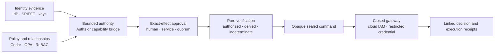

# Auths competitive and alternative-solution research

**Research snapshot:** 13 August 2026

**Purpose:** design-partner preparation

**Question:** Why not use the identity provider, scoped credential, policy engine, or capability-token system we already have?

## Executive answer

Often, a team should use the system it already has.

An identity provider or [SPIFFE](https://spiffe.io/docs/latest/spiffe/concepts/) can establish who or what is calling. [OAuth](https://www.rfc-editor.org/rfc/rfc6749), [GNAP](https://www.rfc-editor.org/rfc/rfc9635.html), [cloud IAM](https://docs.aws.amazon.com/IAM/latest/UserGuide/reference_policies_evaluation-logic.html), and [provider-specific credentials](https://docs.stripe.com/keys?locale=en-GB) can grant access to an API or cloud resource. [Cedar](https://docs.cedarpolicy.com/auth/authorization.html), [OPA](https://www.openpolicyagent.org/docs), and [relationship-based systems](https://research.google/pubs/zanzibar-googles-consistent-global-authorization-system/) can decide whether a request is allowed under centrally managed policy. [UCAN](https://github.com/ucan-wg/spec), [Biscuit](https://doc.biscuitsec.org/reference/specifications), [ZCAP-LD](https://w3c-ccg.github.io/zcap-spec/), and [macaroons](https://research.google/pubs/macaroons-cookies-with-contextual-caveats-for-decentralized-authorization-in-the-cloud/) can carry or attenuate delegated authority. [HTTP Message Signatures](https://www.rfc-editor.org/rfc/rfc9421.html) and [provider request-signing schemes](https://docs.aws.amazon.com/IAM/latest/UserGuide/reference_sigv-create-signed-request.html) can authenticate exact request material. [Deployment environments](https://docs.github.com/en/actions/reference/workflows-and-actions/deployments-and-environments) can require a human approval before a job runs.

Auths does not make those systems obsolete. Its proposed product boundary is narrower and more compositional:

> Carry bounded authority to an exact application effect, obtain approvals for that exact effect, verify it deterministically, turn success into an opaque command that ordinary application code cannot forge, consume it once through a closed provider gateway, and produce linked authorization and execution receipts—including an explicit outcome when the provider's result is unknown.

No reviewed alternative is incapable of participating in that sequence. Several can implement substantial parts of it, and UCAN is especially close. The defensible Auths claim is therefore not “nobody else can express restrictions.” It is that Auths intends to make the *whole high-consequence effect boundary* one portable, versioned, cross-language protocol and SDK workflow rather than a bespoke composition assembled separately by every application.

That claim is only compelling when the use case actually needs the whole chain. If a service only needs local authorization, use Cedar or OPA. If it needs relationship checks, use a Zanzibar-style system. If it needs workload identity, use SPIFFE. If it needs a scoped vendor API token, use the provider's credential system. If it needs offline attenuable bearer capabilities, Biscuit may be simpler. If it wants an open, local-first delegation and invocation protocol, UCAN may already fit.

Auths earns its additional layer when all or most of these are true:

- authority crosses an organization, agent, runtime, or provider boundary;
- the authorized effect must be narrower than an API scope or role;
- approval must bind to the exact transaction rather than to a reusable session or deployment environment;
- replay, use counts, budgets, revocation, and uncertain provider outcomes matter;
- the verifier and executor must not quietly disagree about the meaning of the request;
- an auditor needs portable proof of both the decision and the resulting execution state; and
- the same semantics must hold in Rust, TypeScript, and Python.

## 1. Method and interpretation rules

This paper uses primary specifications, standards, research papers, and official project or provider documentation. It compares the published core of each system, not every application that could be built around it.

That distinction matters. A general policy language can model an exact request hash. A capability can carry an approval identifier. An application can put a database and receipt service around almost any authorization mechanism. “Not built into the reviewed protocol” therefore does **not** mean “impossible.” This paper uses four labels:

- **Core:** the feature or semantic obligation is defined by the reviewed protocol or product.
- **Profile:** the system provides primitives from which an application-specific profile can define it.
- **Composition:** another system or application service supplies it.
- **Outside:** the reviewed system does not try to supply it.

Comparisons also separate three different forms of evidence:

1. **Identity evidence:** proof that a principal controls an identity or workload credential.
2. **Authority evidence:** proof or policy that the principal may request an action.
3. **Effect evidence:** proof of the exact action admitted and what happened when it reached the provider boundary.

Treating these as interchangeable creates false comparisons. A signed request can be authentic but unauthorized. A policy decision can be correct but detached from the bytes later executed. A provider may receive an authorized command yet return a timeout after committing it.

## 2. The Auths reference boundary

This comparison evaluates the architecture described by the repository, not an imagined all-in-one authorization platform.

The Auths kernel is a deterministic verifier over proof bytes, canonical action bytes, and trusted-context bytes. It performs no network or storage I/O and returns authorized, denied, or indeterminate. Successful verification produces an opaque `VerifiedAction` rather than a Python or TypeScript object that application code can mint. See [Architecture](../../architecture.md), [Assurance model](../../assurance-model.md), and [Trusted-context decision explanations](../../specs/0004-trusted-context-decision-explanations.md).

Attenuation and authority refinement are protocol concerns. Replay prevention, use and budget reservation, approvals, execution, reconciliation, and receipts are runtime or profile concerns. See [Formal attenuation and composition](../../specs/0001-formal-attenuation-and-composition.md), [Rich authority refinement](../../specs/0011-rich-authority-refinement-and-bounded-authorization.md), [Closed bounded authorization policy](../../specs/0025-closed-bounded-authorization-policy.md), [Reservation and execution state](../../specs/0026-reservation-and-execution-state-semantics.md), and [Human approval and custody](../../specs/0029-human-approval-and-custody.md).

Profiles, not the generic kernel, own the meaning of an exact effect and the provider state machine. Auths should not pretend that “delete database,” “transfer funds,” and “change firewall rule” share one useful generic execution abstraction. The relevant boundary is documented in [Profile and domain abstraction boundary plan](../../target-state/PROFILE_AND_DOMAIN_ABSTRACTION_BOUNDARY_PLAN.md).

Finally, Auths is prelaunch and pre-audit. Its formal models, generated-code checks, semantic fixtures, and cross-language differential tests are meaningful engineering evidence, not proof of deployment maturity or cryptographic review. The current assurance posture and explicit exclusions are documented in [The Auths Proof paper](../../papers/auths-proof.md) and [README](../../../README.md).

## 3. Decision summary

| Existing solution | Keep using it for | What Auths may add | Likely relationship |
|---|---|---|---|
| [UCAN](https://github.com/ucan-wg/spec) | Open, local-first delegated capabilities and invocations | A stricter exact-effect profile, opaque post-verification command, bounded runtime state, transaction approvals, linked decision/execution receipts | Closest substitute; possible protocol inspiration or bridge |
| [Biscuit](https://doc.biscuitsec.org/reference/specifications) | Compact offline authorization with append-only attenuation and Datalog policy | Uniform application-byte commitment, transaction-bound workflows, execution lifecycle and receipts | Substitute for token-only cases; possible input to a gateway |
| [ZCAP-LD](https://w3c-ccg.github.io/zcap-spec/) | Linked-data capability delegation/invocation in compatible ecosystems | Implementer-complete bounded effect/runtime profile and cross-language conformance | Substitute or bridge where the draft fits |
| [Macaroons](https://research.google/pubs/macaroons-cookies-with-contextual-caveats-for-decentralized-authorization-in-the-cloud/) | Decentralized bearer credentials with first- and third-party caveats | Publicly portable verification, exact-effect workflow, execution state and receipts | Simpler substitute for caveat-based access |
| [OAuth](https://www.rfc-editor.org/rfc/rfc6749) / [GNAP](https://www.rfc-editor.org/rfc/rfc9635.html) | User/client consent, token issuance, ecosystem integration, API access | Per-effect proof and transaction lifecycle at execution time | Compose; do not replace |
| [OIDC](https://openid.net/specs/openid-connect-core-1_0.html) / [SPIFFE](https://spiffe.io/docs/latest/spiffe/concepts/) | Human, client, and workload identity; SVID issuance and rotation; trust bundles | Delegated effect authority | Compose as identity evidence |
| [Cedar](https://docs.cedarpolicy.com/auth/authorization.html) / [OPA](https://www.openpolicyagent.org/docs) | Local or centralized policy decisions over application context | Proof-carrying delegation, byte/effect binding, sealed execution and receipts | Compose or choose one based on problem |
| [Zanzibar-style ReBAC](https://research.google/pubs/zanzibar-googles-consistent-global-authorization-system/) | Organization-scale relationship and entitlement graph | Portable authority and exact-effect lifecycle | Compose as relationship evidence |
| [Cloud IAM](https://docs.aws.amazon.com/IAM/latest/UserGuide/reference_policies_evaluation-logic.html) / [restricted credentials](https://docs.stripe.com/keys?locale=en-GB) | Provider-native final enforcement and least-privilege credentials | Cross-provider, cross-company transaction authority and receipts | Mandatory composition at provider gateway |
| [Signed requests](https://www.rfc-editor.org/rfc/rfc9421.html) / [approval workflows](https://docs.github.com/en/actions/reference/workflows-and-actions/deployments-and-environments) | Request integrity and platform-specific human gates | Delegable authority plus one coherent authorization-to-execution chain | Compose or use alone for narrow cases |

## 4. Direct capability alternatives

### 4.1 UCAN

UCAN is the closest direct alternative in this review.

The UCAN specification describes a public-key-verifiable, delegable capability system intended to be trustless, secure, local-first, user-originated, and distributed. Principals are represented with DIDs; capabilities can be delegated without an authorization server in the middle; and self-contained proofs are designed to remain usable during partitions. Its high-level specification also distinguishes structurally valid chains from semantically valid authority: an executor still has to establish facts such as resource ownership at execution time. [UCAN specification](https://github.com/ucan-wg/spec)

The newer UCAN delegation format is more expressive than a simplistic “resource plus verb” comparison suggests. A delegation includes issuer, audience, subject, a hierarchical command, policy constraints, validity bounds, nonce, and metadata. Policies can constrain invocation arguments, and a delegation can batch capabilities. [UCAN Delegation specification](https://github.com/ucan-wg/delegation)

UCAN Invocation binds a signed command, structured arguments, proofs, nonce, and expiry. Its task identifier is content-derived from subject, command, arguments, and nonce, and every applicable delegation policy must validate the invocation. That means UCAN can commit to exact structured application input and distinguish non-idempotent requests; it would be wrong to say it only carries broad reusable scopes. [UCAN Invocation specification](https://github.com/ucan-wg/invocation)

UCAN also defines a lifecycle vocabulary around delegation, invocation, promise, receipt, and revocation. Revocations are immutable, disseminated through revocation stores, and eventually consistent; the revocation work explicitly recommends short expirations where practical and notes that revocation cannot undo effects that already occurred. [UCAN lifecycle](https://github.com/ucan-wg/spec), [UCAN Revocation specification](https://github.com/ucan-wg/revocation)

**Overlap with Auths.** Both systems aim for portable, offline-verifiable, attenuable public-key authority with invocation material bound into signed content. Both recognize that resource facts and revocation state may live outside the proof. Both can separate transport from authorization.

**Potential Auths distinction.** This is an architectural assessment, not an incapability claim: UCAN lets command and argument schemas, policies, and executor semantics be defined by the application. Auths intends to add maintained profiles in which canonical application bytes, trusted context, effect identity, state transitions, and receipt relationships are versioned together. Auths also makes successful verification cross an opaque native type boundary before an effect-capable gateway can execute. A UCAN application could build equivalent controls, but the reviewed UCAN core does not prescribe that closed gateway pattern. This assessment follows from UCAN's executor-owned semantic validation and extensible command/policy model. [UCAN specification](https://github.com/ucan-wg/spec), [UCAN Invocation specification](https://github.com/ucan-wg/invocation)

**Where UCAN may be better.** UCAN is an open working-group protocol with an explicit local-first and decentralized worldview, DID-native principals, several mandatory cryptographic suites, and a direct capability ecosystem. Its delegation and invocation documents are compact and composable. A team that does not need Auths' stateful gateway and receipt model may prefer UCAN's smaller conceptual commitment. [UCAN specification](https://github.com/ucan-wg/spec)

**Composition.** A UCAN invocation could be accepted as identity/authority evidence at an Auths profile boundary, or an Auths receipt could refer to a UCAN task identifier. Such a bridge must define one canonical mapping and must never treat a valid UCAN signature as sufficient Auths authorization.

### 4.2 Biscuit

Biscuit is an offline authorization token based on public-key signatures, append-only attenuation blocks, and Datalog. The authority block is signed by a root key; each subsequent holder can append facts, rules, and checks that restrict use without removing earlier restrictions; and a token can be sealed to prevent further attenuation. Verification is local given the root public key and request facts. [Biscuit specification](https://doc.biscuitsec.org/reference/specifications), [Biscuit cryptography](https://doc.biscuitsec.org/reference/cryptography)

Biscuit's scoped logic prevents later blocks from manufacturing authority facts with the same provenance as the authority block. The authorizer combines token blocks, ambient request facts, checks, and policies before returning allow or deny. [Biscuit Datalog specification](https://doc.biscuitsec.org/reference/specifications)

Biscuit can be narrowed per request. Its official recipe shows operation, resource, and short-expiry attenuation and explicitly suggests adding covered HTTP headers or a cryptographic hash of the request body. Therefore exact-request binding is possible; it is simply application-profiled rather than a mandatory universal Biscuit field. [Biscuit per-request attenuation](https://doc.biscuitsec.org/recipes/per-request-attenuation.html)

**Overlap with Auths.** Strong local verification, holder attenuation, expressive restrictions, expiry, and sealing overlap materially with Auths. Biscuit can often solve “give this agent a token it may narrow but not widen” with less machinery.

**Potential Auths distinction.** Biscuit specifies a token and authorizer, not a transaction protocol from exact approval through durable reservation, provider execution, reconciliation, and linked receipts. Applications can add all of those pieces. Auths' proposition is that maintained profiles make them one interoperable boundary and that an authorized result becomes an opaque effect-capable value rather than a Boolean plus application data.

**Where Biscuit may be better.** Its Datalog model is flexible, its tokens are compact, its authorization story is already coherent without a stateful workflow, and its official implementations expose ordinary integration points such as revocation identifiers and authorizer queries. Teams needing local authorization rather than transaction execution should consider that simplicity a feature. [Biscuit Java usage](https://doc.biscuitsec.org/usage/java)

**Composition.** A closed Auths gateway could accept a Biscuit token as one trusted-context input after validating it with an application-owned policy. Conversely, a service could use Auths only for exceptional high-consequence effects and Biscuit for ordinary request authorization.

### 4.3 ZCAP-LD

ZCAP-LD specifies linked-data object capabilities represented as signed documents. Root and delegated capabilities identify controllers, invocation targets, allowed actions, expiration, and caveats; invocation and delegation proofs form a chain that a verifier validates. Delegated capabilities are intended to be supplied with the invocation rather than dereferenced across the network. [ZCAP-LD draft](https://w3c-ccg.github.io/zcap-spec/)

The draft is transport-independent. An invocation can be expressed through an HTTP signature or a Data Integrity proof, and additional invocation properties can carry action arguments. It also states that a valid invocation does not guarantee a successful result. [ZCAP-LD draft](https://w3c-ccg.github.io/zcap-spec/)

The document is a W3C Credentials Community Group work item rather than a W3C Recommendation, and the published draft still contains open work around areas including validation and revocation. That status is visible both in the draft and the community group's work-item register. [ZCAP-LD draft](https://w3c-ccg.github.io/zcap-spec/), [W3C CCG work items](https://w3c-ccg.github.io/community/work_items.html)

**Overlap with Auths.** ZCAP-LD has the same object-capability family resemblance: delegated chains, target/action attenuation, expiration, caveats, signed invocation, and local chain verification.

**Potential Auths distinction.** Auths aims for canonical binary semantics, parse-don't-validate SDK boundaries, a closed effect gateway, bounded lifecycle state, explicit indeterminate/provider-unknown outcomes, and equivalent Rust/TypeScript/Python behavior. ZCAP-LD's extensible linked-data representation and application-defined arguments/caveats offer flexibility, while the current draft leaves more integration semantics to implementers.

**Where ZCAP-LD may be better.** In ecosystems already using DIDs, Data Integrity, and linked-data documents, ZCAP-LD aligns with existing representations and proof tooling. Auths would add a new encoding and execution model.

**Composition.** A ZCAP-LD proof can establish delegated authority at an adapter boundary. The bridge would still need a precise mapping from invocation target, action, and arguments to one Auths profile action.

### 4.4 Macaroons

Macaroons are bearer credentials built from chained HMACs. Holders can add first-party caveats, while third-party caveats require discharge macaroons from another authority. Verification checks the signature chain and application-defined caveat predicates; the original work formalizes the construction in an authorization logic. [Google Research paper](https://research.google/pubs/macaroons-cookies-with-contextual-caveats-for-decentralized-authorization-in-the-cloud/), [libmacaroons documentation](https://github.com/rescrv/libmacaroons)

The construction supports decentralized delegation and contextual restriction without contacting the root issuer for every use. Third-party caveats are especially relevant to approvals because another party can provide a discharge only after its own checks. [Google Research paper](https://research.google/pubs/macaroons-cookies-with-contextual-caveats-for-decentralized-authorization-in-the-cloud/)

**Overlap with Auths.** Caveat attenuation, offline verification, and third-party evidence can model a meaningful portion of bounded delegated authority.

**Potential Auths distinction.** Macaroons deliberately leave caveat meaning to the application and use symmetric root secrets, so their verifier/key-distribution model differs from portable public-key proof verification. They do not by themselves define canonical effect bytes, an opaque authorized command, provider execution states, or authorization/execution receipts. Those can be built in the surrounding system.

**Where macaroons may be better.** They are conceptually small, well suited to services that already control a shared root secret, and flexible enough to add constraints without adopting an entire execution protocol.

**Composition.** A discharge can serve as approval evidence or a macaroon can be a credential acquired behind a closed gateway. Auths should not duplicate a macaroon deployment when caveat-checked bearer access is the whole problem.

## 5. OAuth, token exchange, DPoP, and GNAP

### 5.1 OAuth scopes and token exchange

OAuth 2.0 defines access tokens as credentials representing an authorization issued to a client. A token's scope is a space-delimited set of strings whose meaning is defined by the authorization server and protected service. This is intentionally an ecosystem framework, not a universal action algebra. [OAuth 2.0, RFC 6749](https://www.rfc-editor.org/rfc/rfc6749), [Bearer Token Usage, RFC 6750](https://www.rfc-editor.org/rfc/rfc6750)

OAuth Token Exchange adds a security-token service operation for exchanging subject and actor tokens, supporting delegation and impersonation. It can represent an actor chain, but the RFC leaves token syntax, trust, and much authorization policy to the participating services; it also says an exchange does not inherently invalidate the input token or create a tight linkage between input and output tokens. [OAuth Token Exchange, RFC 8693](https://www.rfc-editor.org/rfc/rfc8693)

**Overlap with Auths.** Scopes, audiences, expiration, token exchange, and actor chains can express delegated narrowing. The OAuth ecosystem is dramatically more mature for browser consent, federation, client registration, and API access.

**Potential Auths distinction.** A conventional scope normally authorizes a class of requests, not one canonical effect. Token exchange is issuance-time delegation, while Auths is trying to preserve a verifiable refinement chain through the execution boundary. An OAuth profile can make scopes extremely precise or put transaction data in another signed object; the distinction is default semantics and interoperability, not possibility.

**Composition.** OAuth should usually remain the user/client session and consent layer. An OAuth subject, actor chain, or token introspection result can become trusted identity/context evidence, while Auths controls an exceptional effect.

### 5.2 DPoP

DPoP sender-constrains OAuth tokens by requiring the client to sign a proof containing the HTTP method, URI, issuance time, unique identifier, optional server nonce, and—when used with an access token—a hash of that token. [DPoP, RFC 9449](https://www.rfc-editor.org/rfc/rfc9449.html)

The RFC is explicit that DPoP covers the method and URI, not the request body or general message integrity, and that it remains dependent on TLS. DPoP is also not an access-control policy; it proves possession of the key bound to the token. [DPoP, RFC 9449](https://www.rfc-editor.org/rfc/rfc9449.html)

**Assessment.** DPoP closes bearer-token replay risks and is valuable composition. It does not replace Auths' proposed exact application-byte commitment, attenuation proof, approval binding, or provider outcome model. If method-and-URI sender constraint is sufficient, Auths would be unnecessary overhead.

### 5.3 GNAP

GNAP is substantially richer than “OAuth with different names.” It defines negotiation between a client instance and authorization server for access to resources, supports interaction with a resource owner, binds access tokens to client keys, and provides continuation and token-management operations. Access requests can be strings or structured objects containing actions, locations, data types, identifiers, and application-specific fields. [GNAP Core Protocol, RFC 9635](https://www.rfc-editor.org/rfc/rfc9635.html)

Those structured access objects can describe a specific business transaction, including examples with transaction identifiers and financial attributes. The authorization server decides what access to grant and can return narrower access than requested. [GNAP Core Protocol, RFC 9635](https://www.rfc-editor.org/rfc/rfc9635.html)

**Overlap with Auths.** Rich structured authorization, key-bound tokens, interactive approval, continuation, narrowing, and token lifecycle overlap with important Auths product goals. GNAP is not fairly described as broad static scopes.

**Potential Auths distinction.** GNAP centers an online authorization-server negotiation and access-token relationship. Auths centers a portable proof refined to canonical effect bytes and locally verified at a closed executor, with an opaque post-verification command and explicit execution receipt relationship. A GNAP deployment can define transaction-bound access and receipts around its resource server; Auths proposes to standardize that downstream boundary across identity, transport, and provider choices.

**Where GNAP may be better.** When the main problem is dynamic client authorization, resource-owner interaction, token issuance, continuation, and internet-standard protocol interoperability, GNAP is the more natural foundation.

## 6. Identity providers and workload identity

### 6.1 OIDC and SAML identity providers

OpenID Connect is an identity layer over OAuth 2.0. An ID Token is a signed claim set about an authentication event and end user for a client; the protocol separately uses OAuth access tokens to reach protected resources. [OpenID Connect Core 1.0](https://openid.net/specs/openid-connect-core-1_0.html)

SAML 2.0 assertions can contain authentication, attribute, and authorization-decision statements. SAML is therefore capable of carrying more than a username, although relying parties still define how statements map into application access. [SAML 2.0 Core](https://docs.oasis-open.org/security/saml/v2.0/saml-core-2.0-os.pdf)

**Assessment.** An identity provider can authenticate a human, establish groups or attributes, and participate in consent or session policy. That evidence does not automatically prove that a downstream agent holds a delegable, once-only authorization for exact effect bytes. Conversely, Auths should not become a login protocol, directory, account-recovery service, federation broker, or source of employment status.

**Composition.** An OIDC authentication event, SAML assertion, or provider session can become principal-control or trusted-context evidence. The adapter must bind issuer, audience, subject, freshness, and other relied-on claims into the Auths decision rather than copying a display name into an authority object.

**When not to use Auths.** If the requirement is login, single sign-on, group-based application access, or ordinary API token issuance, the identity provider and its authorization integrations are the right product.

### 6.2 Workload identity: SPIFFE and SPIRE

SPIFFE standardizes workload identities as URI-form SPIFFE IDs and represents them in short-lived, automatically rotated SVIDs. The Workload API streams X.509-SVIDs, JWT-SVIDs, workload identity tokens, and trust bundles to workloads; SPIRE is a production implementation of the specifications. [SPIFFE specifications](https://spiffe.io/docs/latest/spiffe-specs/), [SPIFFE concepts](https://spiffe.io/docs/latest/spiffe/concepts/), [SPIFFE Workload API](https://spiffe.io/docs/latest/spiffe-specs/spiffe_workload_api/)

An X.509-SVID proves the workload's SPIFFE identity through the certificate's URI SAN. The SPIFFE ID path is assigned by administrative policy, and the SPIFFE ID specification warns that arbitrary semantic assertions encoded into a path have no interoperable behavior unless separately agreed. [SPIFFE ID specification](https://spiffe.io/docs/latest/spiffe-specs/spiffe-id/), [X.509-SVID specification](https://spiffe.io/docs/latest/spiffe-specs/x509-svid/)

**Assessment.** SPIFFE answers “which workload is this, and which trust domain attests it?” It does not standardize “may this workload perform these exact two effects once, after these approvals?” That is not a SPIFFE defect; it is a different layer.

**Composition.** SPIFFE/SPIRE is a strong source of Auths principal-control evidence and trust bundles. Auths should remain identity-provider agnostic and should not reimplement workload attestation, SVID issuance, or rotation.

**When not to use Auths.** If mutual authentication and service identity are the whole need, SPIFFE plus ordinary authorization is sufficient.

## 7. Policy engines and relationship authorization

### 7.1 Cedar

Cedar is a fine-grained authorization language and evaluator built around principal, action, resource, and context. Applications provide a request, policies, and entity data; the evaluator returns a decision and diagnostics. Schemas can validate policies against an application's entity and action model. [Cedar repository](https://github.com/cedar-policy/cedar), [Cedar authorization model](https://docs.cedarpolicy.com/auth/authorization.html), [Cedar validation](https://docs.cedarpolicy.com/policies/validation.html)

Cedar has unusually strong assurance evidence. Its specification repository includes a Lean formalization and proofs, and the project uses property-based and differential testing between the formal model and Rust implementation. [Cedar specification repository](https://github.com/cedar-policy/cedar-spec), [Cedar validation](https://docs.cedarpolicy.com/policies/validation.html)

**Overlap with Auths.** Deterministic local decisions, schema-checked application models, explainable denial, formalization, and differential testing are all meaningful overlap. Auths must not claim that formal or cross-implementation evidence is unique.

**Potential Auths distinction.** Cedar evaluates policy over data supplied by the application. It does not itself issue a carried delegation proof, cryptographically commit an approval to exact action bytes, or turn allow into an opaque one-use provider command. Those are surrounding application concerns. The Cedar security guidance explicitly places correct modeling and integration on the application. [Cedar security guidance](https://docs.cedarpolicy.com/other/security.html)

**Composition.** Cedar can decide organization policy or enrich trusted context before Auths verification. The integration must bind the policy version and relevant decision inputs so the authorization and execution phases cannot interpret different policy state.

### 7.2 Open Policy Agent

OPA decouples policy decision-making from enforcement. Services query policies written in Rego with structured input data, either through a local server or embedded evaluator. OPA can be distributed next to enforcement points, while its management documentation deliberately leaves the control plane to adopters or vendors. [OPA documentation](https://www.openpolicyagent.org/docs), [Rego policy language](https://www.openpolicyagent.org/docs/policy-language), [OPA management](https://www.openpolicyagent.org/docs/management-introduction)

OPA decision logs can record query input, result, policy metadata, and decision identifiers, and include masking facilities for sensitive data. [OPA decision logs](https://www.openpolicyagent.org/docs/management-decision-logs)

**Overlap with Auths.** OPA can evaluate exact request bodies, budgets, relationships, and approval facts if the application supplies them. It is a very flexible policy substrate.

**Potential Auths distinction.** OPA does not cryptographically bind the input supplied by one component to bytes later executed by another, and a decision log is not a cryptographically linked provider execution receipt. Applications can implement those bindings around OPA.

**Composition.** OPA can remain the organization's policy engine. Auths can carry and consume bounded authority at the high-consequence effect edge.

### 7.3 Relationship-based authorization

Google Zanzibar describes a globally distributed authorization system that stores relationships and answers access checks with external consistency at enormous scale. Its data model and consistency tokens inspired open systems including OpenFGA and SpiceDB. [Zanzibar paper](https://research.google/pubs/zanzibar-googles-consistent-global-authorization-system/)

OpenFGA evaluates authorization models plus relationship tuples to determine whether a subject has a relationship or permission on an object. [OpenFGA concepts](https://openfga.dev/docs/concepts)

SpiceDB similarly exposes permission checks and adds caveats that can yield conditional results when required context is missing, consistency controls carried in ZedTokens, and expiring relationships. Auths therefore cannot claim that a non-binary decision or time-bounded state is unprecedented. [SpiceDB querying](https://authzed.com/docs/spicedb/concepts/querying-data), [SpiceDB caveats](https://authzed.com/docs/spicedb/concepts/caveats), [SpiceDB consistency](https://authzed.com/docs/spicedb/concepts/consistency), [SpiceDB expiring relationships](https://authzed.com/docs/spicedb/concepts/expiring-relationships)

**Overlap with Auths.** Both can represent bounded organizational authority, context-dependent decisions, and explicit uncertainty. ReBAC systems are much stronger as shared sources of truth for changing organization graphs.

**Potential Auths distinction.** A relationship check is normally an online query against managed relationship state, not a proof carried and attenuated by an agent to one exact effect. It does not by itself bind the check to later provider execution or produce a portable execution receipt.

**Composition.** Use ReBAC for “who relates to what?” and Auths for “what exact effect did this actor receive and consume?” The relationship snapshot, consistency token, or decision identifier should be committed into trusted context where freshness matters.

## 8. Cloud IAM and provider-specific restricted credentials

### 8.1 Cloud IAM

AWS IAM evaluates identity policies, resource policies, permissions boundaries, session policies, organization controls, and explicit denies in a defined decision procedure. Role assumption supplies temporary credentials, including across accounts, and session policies can further restrict a session. [AWS policy evaluation](https://docs.aws.amazon.com/IAM/latest/UserGuide/reference_policies_evaluation-logic.html), [AWS deny/allow evaluation](https://docs.aws.amazon.com/IAM/latest/UserGuide/reference_policies_evaluation-logic_policy-eval-denyallow.html), [AWS cross-account evaluation](https://docs.aws.amazon.com/IAM/latest/UserGuide/reference_policies_evaluation-logic-cross-account.html)

Google Cloud supports short-lived service-account credentials and delegation chains. Its Credential Access Boundary mechanism can downscope short-lived OAuth access tokens, although the documented mechanism is limited to Cloud Storage. [Google Cloud short-lived delegated credentials](https://cloud.google.com/iam/docs/create-short-lived-credentials-delegated), [Google Cloud Credential Access Boundaries](https://cloud.google.com/iam/docs/downscoping-short-lived-credentials), [Google Cloud service-account permissions](https://docs.cloud.google.com/iam/docs/service-account-permissions)

**Overlap with Auths.** Cloud IAM already provides mature principal, resource, action, condition, delegation, temporary credential, deny, and audit mechanisms. It is the final authority the provider actually enforces.

**Potential Auths distinction.** Cloud credentials are provider-specific and usually reusable for every permitted action during their lifetime. They do not normally carry one portable cross-company approval and effect commitment across AWS, GCP, SaaS, and internal systems. Provider-native request APIs and conditions can narrow this substantially, so the comparison must be made per provider and operation.

**Composition.** Auths should never bypass cloud IAM. A closed gateway should hold or acquire the narrowest provider credential only after an Auths command is authorized and durably reserved. Cloud IAM remains defense in depth and the final enforcement boundary.

### 8.2 Provider-specific restricted credentials

Stripe restricted API keys can be configured with none, read, or write access per resource, and Stripe recommends least privilege and optional IP restrictions. [Stripe API keys](https://docs.stripe.com/keys?locale=en-GB), [Stripe key practices](https://docs.stripe.com/keys-best-practices)

GitHub fine-grained personal access tokens can be limited by owner, repositories, and permissions and may require organization approval, though the documentation lists feature and deployment limitations. [GitHub personal access tokens](https://docs.github.com/en/authentication/keeping-your-account-and-data-secure/managing-your-personal-access-tokens)

Cloudflare API tokens use account, zone, and user permission groups; its documentation notes that some permissions cannot be scoped to an individual subresource. [Cloudflare API token permissions](https://developers.cloudflare.com/fundamentals/api/reference/permissions/)

**Assessment.** Restricted provider credentials are usually the cheapest correct answer for a single integration. Their weakness is not “bad security”; it is that their semantics stop at one provider and frequently authorize a reusable class of operations. Auths adds value only if it can reduce cross-system coordination or bind a materially narrower transaction.

## 9. Application-specific signed requests and approval workflows

HTTP Message Signatures lets an application sign selected HTTP components. The application profile must decide which components are required; body integrity depends on signing a content-digest field, and the RFC warns that signatures do not provide confidentiality or replace TLS. [HTTP Message Signatures, RFC 9421](https://www.rfc-editor.org/rfc/rfc9421.html)

AWS Signature Version 4 constructs a canonical request including method, URI, query, canonical headers, signed headers, and a payload hash, then derives a signature scoped to date, region, service, and request. [AWS Signature Version 4](https://docs.aws.amazon.com/IAM/latest/UserGuide/reference_sigv-create-signed-request.html)

GitHub Actions environments can require reviewers before a deployment job proceeds, prevent self-review, and withhold environment secrets until protection rules pass. [GitHub deployment environments](https://docs.github.com/en/actions/reference/workflows-and-actions/deployments-and-environments)

**Overlap with Auths.** Application-specific signed envelopes can bind exact bytes more directly than many capability formats, while deployment approvals can provide effective human control and secret release. For one application, this may be the simplest robust design.

**Potential Auths distinction.** Authenticity is not authority: a correctly signed request still needs a rule saying what the signer may do. A platform approval is often bound to a workflow run or environment rather than a portable cross-provider effect object. Bespoke systems must also define attenuation, replay, reservation, retries, unknown outcomes, and receipts themselves.

**Composition.** Auths profiles may use HTTP Message Signatures, SigV4, or provider-specific signing at the transport/provider edge. An existing approval service can act as an approval provider if its response is cryptographically or durably bound to the exact Auths commitment.

## 10. Required-dimension comparison

The following tables are analytical summaries of the cited primary sources above. A **Profile** entry means the system supplies enough primitives for an application to implement the dimension; it does not imply that every deployment does so. “Outside” means the reviewed core assigns the concern elsewhere, not that an implementation cannot add it.

### 10.1 Direct capability systems

| Dimension | Auths target | [UCAN](https://github.com/ucan-wg/spec) | [Biscuit](https://doc.biscuitsec.org/reference/specifications) | [ZCAP-LD](https://w3c-ccg.github.io/zcap-spec/) | [Macaroons](https://research.google/pubs/macaroons-cookies-with-contextual-caveats-for-decentralized-authorization-in-the-cloud/) |
|---|---|---|---|---|---|
| Identity versus authority ownership | Identity adapters; Auths owns authority semantics | DID principal plus capability authority | Root public key plus token authority | Controller identity plus object capability | Root secret and bearer credential |
| Attenuation and delegation | Core refinement relation | Core delegation and policy constraints | Core append-only attenuation | Core delegation/caveats | Core caveat attenuation and discharge |
| Exact application-byte/effect commitment | Core canonical action; profile effect | Core structured invocation; application command semantics | Profile via facts/checks/body hash | Profile via invocation properties and proof suite | Profile via caveat predicates |
| Offline/local verification | Core | Core, subject to external semantic facts/revocation | Core | Core chain; external root/revocation state may apply | Core when discharges and predicates are available |
| Replay, use, budget, lifecycle | Profile runtime with durable reservation | Nonce/expiry/revocation core; richer counters/budgets external | Expiry and revocation identifiers; counters/budgets external | Expiry/nonce possible; state external | Caveats possible; state external |
| Transaction-bound approvals | Profile core concern | Profile through proof/policy/promise | Profile through facts/checks | Profile through caveat/proof | Strong building block through third-party discharge |
| Sealed command and closed gateway | Profile/native SDK boundary | Application composition | Token sealing differs; gateway external | External | External |
| Denied, indeterminate, provider-unknown | Three-way verification plus profile execution states | Validation errors and task lifecycle; provider state profile-specific | Allow/deny/error; execution state external | Validation separate from result; execution state external | Predicate verification; execution state external |
| Authorization and execution receipts | Profile links both | Invocation/task/receipt vocabulary; maturity varies by component | External | External | External |
| Crypto, identity, transport, provider agility | Adapter/profile objective | Multiple suites, DIDs, transport independence | Ed25519/P-256; application transport/provider | Data Integrity/HTTP-signature ecosystem; transport-independent | HMAC construction; application transport/provider |
| Formal and differential evidence | Formal model, generated semantic core, cross-language fixtures | Specification and test vectors; not assessed here as equivalent formal refinement | Cryptographic design and implementations; not assessed here as equivalent differential semantics | Draft algorithms and test suites vary | Authorization-logic formalization in original paper |
| Operational complexity | High when full runtime used; selectable profiles | Moderate; proof/revocation distribution and executor semantics | Low-to-moderate for token use | Moderate; linked-data proof stack and draft integration | Low-to-moderate; secret/discharge management |

### 10.2 Adjacent systems

| Dimension | OAuth / GNAP | IdPs / SPIFFE | Cedar / OPA | ReBAC | Cloud/provider IAM | Signed request + approval |
|---|---|---|---|---|---|---|
| Identity versus authority | Both; AS-centered grants | Primarily identity; SAML can carry authorization decisions | Policy decision | Relationship authority | Provider identity and authority | Signer identity plus app workflow authority |
| Attenuation/delegation | Scopes, exchange, GNAP narrowing | Outside | Policy can model it; no carried chain | Relationship changes; no carried chain | Roles, sessions, delegation, downscoping | Application-defined |
| Exact bytes/effect | Profile; DPoP does not cover body | Outside | Can evaluate supplied effect; no cryptographic binding by itself | Can check relationship to effect object | Provider/request dependent | Strong when profile signs all required components |
| Offline/local verification | JWT/profile dependent; GNAP commonly AS-mediated | Signed assertion/certificate verification can be local; issuance/rotation online | Strong local option | Usually service query | Provider-mediated | Strong signature verification; approval service varies |
| Replay/use/budget/lifecycle | Token lifetime/nonce; application extensions | Rotation/revocation | Policy/model plus external state | Relationship state/expiry/consistency | Mature provider state; exact counters vary | Application/workflow-defined |
| Transaction approval | OAuth consent; GNAP interaction can be transaction-rich | Outside | Can consume approval facts | Can model approver relationship | Provider-specific | Often core workflow feature |
| Closed gateway | Resource server pattern, not opaque effect type | Outside | Enforcement point external | Enforcement point external | Provider endpoint is final gate | Application-defined |
| Indeterminate/provider-unknown | Protocol errors; app execution state | Identity validation errors | Errors/undefined policies; OPA/Cedar decision semantics | Conditional/consistency states in some systems | Provider-specific | Application-defined |
| Decision/execution receipts | Token and audit systems; not one uniform model | Audit external | Decision diagnostics/logs; execution external | Check metadata/tokens; execution external | Mature audit logs; vendor-specific | Workflow logs/signatures; application-specific |
| Agility | Broad identity/API ecosystem; AS dependency | X.509/JWT/WIT and trust-domain model | Input/model agnostic | Data-model/service specific | Low across providers, high within provider | Crypto and transport profile dependent |
| Formal/differential evidence | Standards and security analysis vary by RFC | Conformance/specification ecosystem | Cedar notably strong; OPA test ecosystem | Zanzibar research/implementations | Provider assurance, generally closed implementation | Standard cryptography; app semantics usually bespoke |
| Operational complexity | Moderate-to-high AS ecosystem | High control-plane operations | Low embedded to high managed policy plane | Stateful distributed service | Already paid if using provider | Low for one app; bespoke complexity grows quickly |

## 11. The honest differentiation

Auths should not lead with “more granular permissions.” Every serious alternative can become granular.

It should lead with a boundary failure that teams currently solve through glue:

1. An identity system authenticates a person, workload, or agent.
2. A capability, token, IAM role, or policy engine says it may act.
3. An approval system records that somebody approved something.
4. Application code reconstructs or mutates the provider request.
5. A credentialed gateway calls the provider.
6. A timeout leaves the caller unsure whether it is safe to retry.
7. Logs from several systems are correlated later.

Each component can be excellent while the joins remain weak. Auths' intended invariant is that the *same commitment* crosses those joins: delegation narrows it, approval binds it, verification seals it, reservation consumes it, execution references it, and receipts make the state externally inspectable without automatically disclosing sensitive payloads.

That integrated invariant is the product. The individual ingredients are not novel in isolation.

### 11.1 Where Auths overlaps

- [UCAN](https://github.com/ucan-wg/spec), [Biscuit](https://doc.biscuitsec.org/reference/specifications), [ZCAP-LD](https://w3c-ccg.github.io/zcap-spec/), and [macaroons](https://research.google/pubs/macaroons-cookies-with-contextual-caveats-for-decentralized-authorization-in-the-cloud/) already establish that attenuable capabilities can move without a central online authorization decision.
- [UCAN invocations](https://github.com/ucan-wg/invocation) and [signed-request systems](https://www.rfc-editor.org/rfc/rfc9421.html) already demonstrate exact structured-request or byte-level binding.
- [Macaroon discharges](https://github.com/rescrv/libmacaroons), [GNAP interactions](https://www.rfc-editor.org/rfc/rfc9635.html), and [deployment gates](https://docs.github.com/en/actions/reference/workflows-and-actions/deployments-and-environments) already demonstrate third-party or human approval patterns.
- [Cedar](https://github.com/cedar-policy/cedar-spec) demonstrates that formal semantics and differential implementation checking are practical for authorization software.
- [SpiceDB](https://authzed.com/docs/spicedb/concepts/caveats) demonstrates context-dependent conditional answers rather than pretending every incomplete request is a clean deny.
- [Cloud IAM](https://docs.aws.amazon.com/IAM/latest/UserGuide/reference_policies_evaluation-logic.html) demonstrates robust least-privilege enforcement and provider audit at operational scale.

### 11.2 Where Auths composes

- Existing IdPs and SPIFFE prove principal control.
- OAuth or GNAP handles user/client authorization-server interactions.
- Cedar, OPA, or ReBAC supplies organization policy and relationship evidence.
- UCAN, Biscuit, ZCAP-LD, or macaroons may supply imported authority evidence where a profile defines an exact mapping.
- Cloud IAM and restricted provider credentials remain the final defense.
- Auths owns only the commitment/refinement/verification/execution continuity it can actually enforce.

### 11.3 Where Auths is disadvantaged

Auths currently has serious disadvantages:

- **Maturity:** it is prelaunch and pre-audit; mature alternatives have deployed ecosystems and established operators.
- **Complexity:** the full model introduces canonical encodings, proof chains, trusted context, state stores, approval adapters, gateways, reconciliation, and receipts.
- **Profile burden:** every useful domain needs an exact action algebra, canonical encoding, provider mapping, state machine, disclosure policy, and adversarial fixtures.
- **Integration surface:** teams still need identity, policy, cloud IAM, credential custody, storage, monitoring, and incident response.
- **Interoperability risk:** Auths is not yet an internet standard and has no broad independent implementation ecosystem.
- **Privacy risk:** portable receipts and commitments can become correlation handles or leak operational details unless disclosure is explicitly bounded.
- **Availability trade-off:** offline proof verification does not eliminate online freshness, revocation, budget, replay, approval, and provider-state requirements.
- **False confidence risk:** formalizing the verifier does not prove profile correctness, adapter correctness, provider behavior, key custody, or operational configuration.
- **Performance and packaging:** three language surfaces and native bindings increase release and compatibility work.

These are not cleanup items around an otherwise finished protocol. They determine whether Auths is a product or an impressive research codebase.

### 11.4 Relative disadvantages at a glance

These are disadvantages only relative to the full exact-effect lifecycle Auths is targeting. Several are advantages for narrower use cases because they keep the alternative smaller.

| System | Relative disadvantage for the target use case |
|---|---|
| Auths | Prelaunch maturity, additional state and profile machinery, no independent ecosystem, and a larger integration and assurance burden |
| [UCAN](https://github.com/ucan-wg/spec) | Executor-owned resource semantics and extensible command/policy profiles leave the closed effect gateway and its durable state to the application |
| [Biscuit](https://doc.biscuitsec.org/reference/specifications) | Exact request binding, transaction approval, provider lifecycle, and receipts are application conventions around the token and authorizer |
| [ZCAP-LD](https://w3c-ccg.github.io/zcap-spec/) | The reviewed community draft retains open specification work, while linked-data proof integration adds choices that Auths profiles intend to close |
| [Macaroons](https://research.google/pubs/macaroons-cookies-with-contextual-caveats-for-decentralized-authorization-in-the-cloud/) | Symmetric root-key distribution and application-defined caveat predicates complicate publicly portable verification and uniform cross-company semantics |
| [OAuth / GNAP](https://www.rfc-editor.org/rfc/rfc9635.html) | Authorization-server and token semantics do not alone close the downstream gap between granted access, exact provider effect, and execution outcome |
| [OIDC / SPIFFE](https://spiffe.io/docs/latest/spiffe-specs/) | They establish principal or workload identity; effect authority and execution state remain another layer |
| [Cedar / OPA](https://docs.cedarpolicy.com/auth/authorization.html) | They evaluate supplied policy inputs; proof carriage, approval-to-byte binding, and effect execution are enforcement-point responsibilities |
| [ReBAC](https://research.google/pubs/zanzibar-googles-consistent-global-authorization-system/) | It adds an online relationship-state dependency and does not make the check itself a delegated, portable, exact-effect command |
| [Cloud IAM](https://docs.aws.amazon.com/IAM/latest/UserGuide/reference_policies_evaluation-logic.html) | Semantics and evidence are provider-specific, and temporary credentials commonly remain reusable across a permitted set of calls |
| [Signed request / approval](https://www.rfc-editor.org/rfc/rfc9421.html) | Message authenticity and a human gate still require application-specific authority, attenuation, replay, reconciliation, and receipt semantics |

## 12. When the existing system is the right answer

Use the existing solution without Auths when:

- the authority stays inside one provider and its IAM conditions are adequate;
- a reusable scoped credential has an acceptable blast radius;
- the service can query Cedar, OPA, or ReBAC at the enforcement point and does not need portable delegation;
- a Biscuit or UCAN token plus application authorization completely describes the transaction;
- identity and mutual authentication are the actual requirements;
- one signed request format and one approval workflow cover the whole system;
- provider ambiguity is harmless or the provider already supplies idempotency and reconciliation; or
- the organization cannot operate the additional state and key boundaries safely.

The most credible design-partner conversation begins by trying to disqualify Auths. Adoption is justified only when the remaining integration gap is expensive, dangerous, or repeatedly rebuilt.

## 13. Design-partner evidence packet

Before the first formal design-partner packet is complete, it should include this paper plus a scenario-specific worksheet answering the following.

### 13.1 Existing stack

- Which IdP, workload identity, token, policy, relationship, IAM, approval, and audit systems already participate?
- Where is authority created, narrowed, and revoked?
- Which component constructs the final provider request?
- Which component owns provider credentials?
- What identifies one logical effect across retries and services?

### 13.2 Boundary failures

- Can an approved request be mutated before execution?
- Can a token be replayed for another effect inside its scope?
- Can an agent delegate a strict subset without returning to the issuer?
- Is a use count or budget reserved atomically before the provider call?
- What happens after a timeout when the provider may have committed?
- Can the system prove both the authorization decision and the execution outcome?
- Can it disclose an audit summary without revealing sensitive action bytes?

### 13.3 Alternative test

For each identified gap, test the smallest existing-system remedy first:

1. narrower cloud role or restricted key;
2. OAuth/GNAP access object or token exchange;
3. policy-engine rule and local enforcement;
4. relationship tuple or caveat;
5. signed request plus content digest;
6. idempotency key and provider reconciliation;
7. capability token such as UCAN or Biscuit;
8. only then, an Auths profile.

Record why each rejected option fails the scenario. “Auths is more secure” is not evidence. A defensible reason is specific, such as: “the provider credential authorizes 40 operations for 15 minutes, while the cross-company responder must receive two ordered operations, once each, and both firms must approve the identical plan bytes.”

## 14. Recommended competitive proof work

### 14.1 Build conformance bridges, not comparison slides

Create small, adversarial fixtures that express the same bounded operation in:

- UCAN Delegation plus Invocation;
- Biscuit attenuation plus request-body commitment;
- a macaroon with a third-party discharge;
- OAuth Token Exchange plus DPoP;
- a Cedar or OPA decision around a signed request; and
- provider IAM plus an idempotent signed API call.

For each, document which properties are supplied by the protocol, by an application profile, and by an external state service. The goal is to discover where Auths is redundant as aggressively as where it is differentiated.

### 14.2 Publish a composition guide

The first useful integration guides should be “Auths with,” not “Auths versus”:

- [Auths with SPIFFE workload identities](../../integrations/spiffe.md);
- [Auths with OAuth/OIDC user sessions](../../integrations/oauth-oidc.md);
- [Auths with Cedar or OPA context](../../integrations/cedar-opa.md);
- [Auths with OpenFGA, SpiceDB, or another ReBAC system](../../integrations/rebac.md);
- [Auths with cloud IAM and short-lived credentials](../../integrations/cloud-iam.md);
- [Auths with UCAN or Biscuit](../../integrations/ucan-biscuit.md); and
- [Auths with HTTP Message Signatures](../../integrations/http-message-signatures.md).

### 14.3 Quantify operational cost

Measure lines of application integration, number of stateful services, latency, proof size, cold-start cost, failure modes, and operator actions for both Auths and the best alternative composition. If Auths merely moves custom glue into a new framework without reducing risk or integration cost, the design-partner should not adopt it.

### 14.4 State the assurance claim precisely

Maintain an evidence map that separates:

- protocol properties proved in Lean or model checking;
- Rust implementation properties covered by generated-code or refinement checks;
- cross-language semantics covered by differential fixtures;
- profile invariants covered by adversarial tests;
- operational properties demonstrated only by integration tests; and
- unverified assumptions about providers, identity adapters, custody, and deployment.

This is particularly important when comparing with Cedar, which also publishes formal and differential evidence. The differentiator must be the property and boundary being assured, not the mere presence of formal methods.

## 15. Bottom line

The strongest answer to “why not use what we already have?” is:

> You should—unless the dangerous part of your system lives in the seams between identity, delegated authority, exact transaction approval, request construction, one-use execution, provider ambiguity, and audit evidence.

UCAN is the closest protocol-level alternative and already covers portable delegation and exact structured invocation. Biscuit is likely the better answer for compact offline attenuable authorization. ZCAP-LD is relevant where linked-data capabilities fit. Macaroons remain an elegant caveat mechanism. OAuth and GNAP own authorization-server interactions. SPIFFE owns workload identity. Cedar, OPA, and ReBAC own policy and relationship decisions. Cloud IAM owns provider enforcement. Signed requests own message integrity. Approval workflows own human gates.

Auths is justified only if it can make the continuity among those layers safer and simpler than a bespoke assembly: one bounded authority commitment, interpreted identically across languages, approved without substitution, verified without ambient effects, converted into an unforgeable command, consumed through a closed gateway, and closed out with privacy-bounded receipts.

That is a meaningful product thesis. It is not yet a market fact. The competitive workstream should be run as an attempt to falsify it.

## Primary-source register

### Capability systems

- [UCAN high-level specification](https://github.com/ucan-wg/spec)
- [UCAN Delegation specification](https://github.com/ucan-wg/delegation)
- [UCAN Invocation specification](https://github.com/ucan-wg/invocation)
- [UCAN Revocation specification](https://github.com/ucan-wg/revocation)
- [Biscuit specification](https://doc.biscuitsec.org/reference/specifications)
- [Biscuit cryptography](https://doc.biscuitsec.org/reference/cryptography)
- [Biscuit per-request attenuation](https://doc.biscuitsec.org/recipes/per-request-attenuation.html)
- [ZCAP-LD draft](https://w3c-ccg.github.io/zcap-spec/)
- [W3C Credentials Community Group work items](https://w3c-ccg.github.io/community/work_items.html)
- [Macaroons paper](https://research.google/pubs/macaroons-cookies-with-contextual-caveats-for-decentralized-authorization-in-the-cloud/)
- [libmacaroons](https://github.com/rescrv/libmacaroons)

### Authorization protocols and identity

- [OAuth 2.0, RFC 6749](https://www.rfc-editor.org/rfc/rfc6749)
- [Bearer Token Usage, RFC 6750](https://www.rfc-editor.org/rfc/rfc6750)
- [OAuth Token Exchange, RFC 8693](https://www.rfc-editor.org/rfc/rfc8693)
- [DPoP, RFC 9449](https://www.rfc-editor.org/rfc/rfc9449.html)
- [GNAP Core Protocol, RFC 9635](https://www.rfc-editor.org/rfc/rfc9635.html)
- [OpenID Connect Core 1.0](https://openid.net/specs/openid-connect-core-1_0.html)
- [SAML 2.0 Core](https://docs.oasis-open.org/security/saml/v2.0/saml-core-2.0-os.pdf)
- [SPIFFE specifications](https://spiffe.io/docs/latest/spiffe-specs/)
- [SPIFFE ID specification](https://spiffe.io/docs/latest/spiffe-specs/spiffe-id/)
- [X.509-SVID specification](https://spiffe.io/docs/latest/spiffe-specs/x509-svid/)
- [SPIFFE Workload API](https://spiffe.io/docs/latest/spiffe-specs/spiffe_workload_api/)

### Policy and relationship systems

- [Cedar repository](https://github.com/cedar-policy/cedar)
- [Cedar specification and formalization](https://github.com/cedar-policy/cedar-spec)
- [Cedar authorization model](https://docs.cedarpolicy.com/auth/authorization.html)
- [OPA documentation](https://www.openpolicyagent.org/docs)
- [OPA decision logs](https://www.openpolicyagent.org/docs/management-decision-logs)
- [Zanzibar paper](https://research.google/pubs/zanzibar-googles-consistent-global-authorization-system/)
- [OpenFGA concepts](https://openfga.dev/docs/concepts)
- [SpiceDB concepts](https://authzed.com/docs/spicedb/concepts/querying-data)

### Provider IAM, request signing, and approvals

- [AWS IAM policy evaluation](https://docs.aws.amazon.com/IAM/latest/UserGuide/reference_policies_evaluation-logic.html)
- [Google Cloud Credential Access Boundaries](https://cloud.google.com/iam/docs/downscoping-short-lived-credentials)
- [Stripe API keys](https://docs.stripe.com/keys?locale=en-GB)
- [GitHub fine-grained personal access tokens](https://docs.github.com/en/authentication/keeping-your-account-and-data-secure/managing-your-personal-access-tokens)
- [Cloudflare API token permissions](https://developers.cloudflare.com/fundamentals/api/reference/permissions/)
- [HTTP Message Signatures, RFC 9421](https://www.rfc-editor.org/rfc/rfc9421.html)
- [AWS Signature Version 4](https://docs.aws.amazon.com/IAM/latest/UserGuide/reference_sigv-create-signed-request.html)
- [GitHub deployment environments](https://docs.github.com/en/actions/reference/workflows-and-actions/deployments-and-environments)
